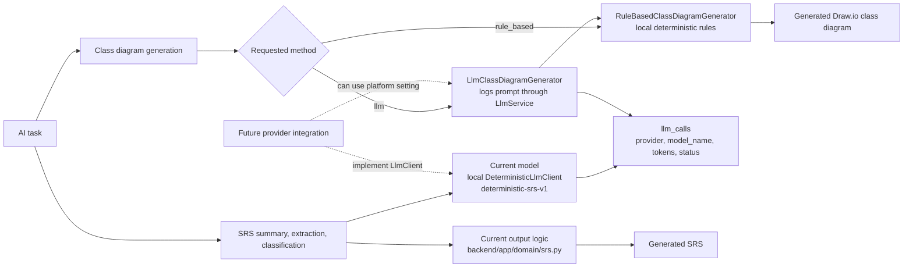
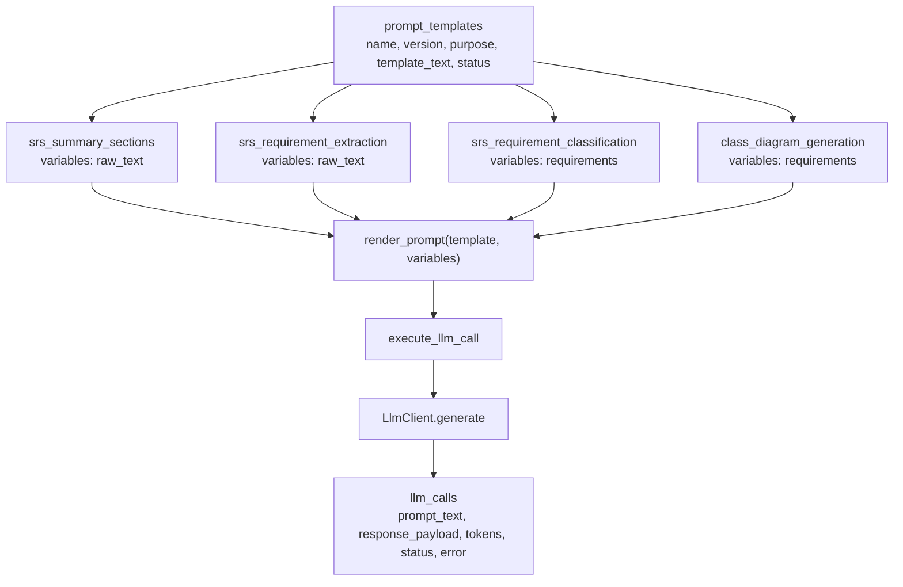

# 7. AI Engineering Design - AI Pipeline, Model Selection, and Prompt Design

The AI design uses a controlled pipeline instead of one unrestricted generation call. The current implementation logs prompt-template-backed LLM calls, uses a local deterministic client named `deterministic-srs-v1`, and applies local domain logic to build structured SRS and class diagram artifacts.

## AI Pipeline

```mermaid
flowchart TD
  UserInput["Raw requirement text<br/>title + raw_text"]
  Authz["Authenticate user<br/>verify workspace membership and role"]
  BillingGate["Billing gate<br/>active subscription, plan flag, usage limit"]
  RequirementInput["Persist requirement_inputs"]
  GenerationJob["Create generation_jobs<br/>pending -> running"]

  SummaryPrompt["Prompt template<br/>srs_summary_sections"]
  SummaryCall["Log llm_calls<br/>purpose summary"]
  SummaryDomain["SRS domain<br/>build_summary_sections"]

  ExtractPrompt["Prompt template<br/>srs_requirement_extraction"]
  ExtractCall["Log llm_calls<br/>purpose requirement_extraction"]
  ExtractDomain["SRS domain<br/>extract_requirement_drafts"]

  ClassifyPrompt["Prompt template<br/>srs_requirement_classification"]
  ClassifyCall["Log llm_calls<br/>purpose requirement_classification"]
  ClassifyDomain["SRS domain<br/>classify_requirement_drafts"]

  SrsBuilder["SRS builder<br/>markdown + content_json"]
  SrsStore["Persist srs_documents<br/>and extracted_requirements"]

  OptionalDiagram{"generate_class_diagram?"}
  MethodNormalize["Normalize methods<br/>llm, rule_based, both"]
  DiagramContext["Build diagram context<br/>from SRS document or input"]
  RuleBased["RuleBasedClassDiagramGenerator<br/>extract classes, methods, relationships"]
  LlmDiagram["LlmClassDiagramGenerator<br/>log class_diagram prompt"]
  MergeModel["Merge class diagram models"]
  DrawioXml["Build Draw.io XML<br/>and diagram_json"]
  DiagramStore["Persist diagrams, diagram_versions,<br/>diagram_requirement_links"]
  CompleteJob["Complete generation job<br/>completed or partially_completed"]

  UserInput --> Authz --> BillingGate --> RequirementInput --> GenerationJob
  GenerationJob --> SummaryPrompt --> SummaryCall --> SummaryDomain
  SummaryDomain --> ExtractPrompt --> ExtractCall --> ExtractDomain
  ExtractDomain --> ClassifyPrompt --> ClassifyCall --> ClassifyDomain
  ClassifyDomain --> SrsBuilder --> SrsStore --> OptionalDiagram
  OptionalDiagram -- no --> CompleteJob
  OptionalDiagram -- yes --> MethodNormalize --> DiagramContext
  MethodNormalize -- rule_based --> RuleBased
  MethodNormalize -- llm --> LlmDiagram --> RuleBased
  RuleBased --> MergeModel
  DiagramContext --> RuleBased
  MergeModel --> DrawioXml --> DiagramStore --> CompleteJob

  classDef gate fill:#fff6df,stroke:#b57f1a,color:#3f2a00
  classDef prompt fill:#eef6ff,stroke:#3867a8,color:#10233f
  classDef domain fill:#f4f0ff,stroke:#6b4fb3,color:#22153d
  classDef data fill:#eefaf0,stroke:#3d8b4f,color:#12351c

  class Authz,BillingGate gate
  class SummaryPrompt,ExtractPrompt,ClassifyPrompt,LlmDiagram prompt
  class SummaryDomain,ExtractDomain,ClassifyDomain,SrsBuilder,RuleBased,MergeModel,DrawioXml domain
  class RequirementInput,GenerationJob,SrsStore,DiagramStore,CompleteJob data
```

## Model Selection

| Decision area | Current selection | Reason | Extension point |
| --- | --- | --- | --- |
| SRS prompt execution | `DeterministicLlmClient`, provider `local`, model `deterministic-srs-v1` | Keeps generation predictable for MVP and tests while preserving LLM call audit data. | Implement another `LlmClient` and pass/select it in `execute_llm_call`. |
| SRS output construction | Local `backend/app/domain/srs.py` functions | Enforces structured requirements, repeatable classification, and trace fields. | Replace or augment summary/extraction/classification functions with provider output parsing. |
| Class diagram generation | `rule_based` by default; `llm` logs an LLM call then reuses rule-based model creation | Guarantees Draw.io XML output and stable tests while keeping an LLM method surface. | Add generators to `DiagramGeneratorRegistry` implementing `ClassDiagramGenerator`. |
| Prompt/version storage | `prompt_templates` table with `(name, version)` uniqueness | Prompts are auditable and reusable across calls. | Add version selection, activation workflow, and admin-managed templates. |

## Prompt Design

| Template name | Purpose | Variables | Current template text | Consumer |
| --- | --- | --- | --- | --- |
| `srs_summary_sections` | `summary` | `raw_text` | `Create SRS summary sections from: {raw_text}` | `generate_summary_sections` |
| `srs_requirement_extraction` | `requirement_extraction` | `raw_text` | `Extract atomic requirements from: {raw_text}` | `extract_structured_requirements` |
| `srs_requirement_classification` | `requirement_classification` | `requirements` | `Classify requirements: {requirements}` | `classify_requirements` |
| `class_diagram_generation` | `class_diagram` | `requirements` | `Extract class diagram nouns, verbs, and relationships from requirements: {requirements}` | `LlmClassDiagramGenerator` |

## Prompt Output Contract

| Pipeline stage | Required downstream shape |
| --- | --- |
| Summary | Introduction, stakeholders, use cases, glossary |
| Requirement extraction | `requirement_code`, `requirement_text`, `source_trace`, `extraction_reason`, `confidence_score` |
| Requirement classification | `requirement_type`, optional `nfr_subtype`, and original trace fields preserved |
| SRS builder | Markdown SRS, `content_json.requirements`, and `content_json.traceability` |
| Class diagram generation | Draw.io XML, diagram JSON classes/relationships, and requirement-to-element links |

