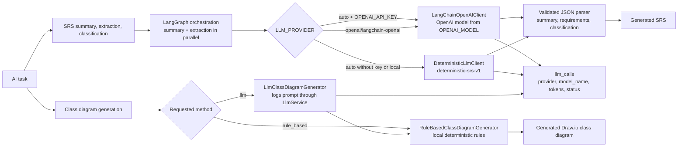
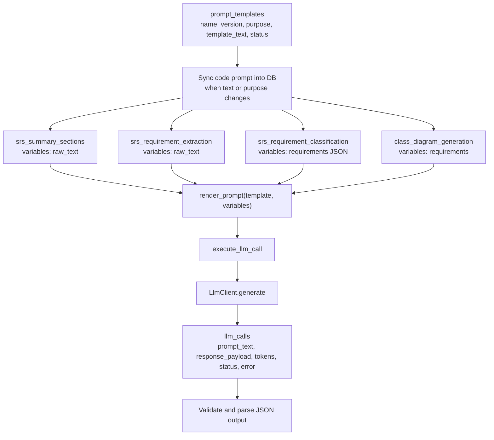

# 7. AI Engineering Design - AI Pipeline, Model Selection, and Prompt Design

The AI design uses a controlled multi-step pipeline instead of one unrestricted generation call. The current implementation logs prompt-template-backed LLM calls, selects the LLM provider through backend environment settings, runs independent SRS stages through a LangGraph fan-out/fan-in graph, parses JSON-only SRS outputs from the model, and then builds persisted SRS and diagram artifacts from validated structured data.

## AI Pipeline

```mermaid
flowchart TD
  UserInput["Raw requirement text<br/>title + raw_text"]
  Authz["Authenticate user<br/>verify workspace membership and role"]
  BillingGate["Billing gate<br/>active subscription, plan flag, usage limit"]
  RequirementInput["Persist requirement_inputs"]
  GenerationJob["Create generation_jobs<br/>pending -> running"]
  LangGraph["LangGraph StateGraph<br/>parallel summary + extraction"]

  SummaryPrompt["Prompt template<br/>srs_summary_sections"]
  SummaryCall["Execute + log llm_calls<br/>purpose summary"]
  SummaryParse["Parse LLM JSON summary<br/>introduction, stakeholders, use cases, glossary"]

  ExtractPrompt["Prompt template<br/>srs_requirement_extraction"]
  ExtractCall["Execute + log llm_calls<br/>purpose requirement_extraction"]
  ExtractParse["Parse LLM JSON requirements<br/>code, text, source trace, reason, confidence"]

  ClassifyPrompt["Prompt template<br/>srs_requirement_classification"]
  ClassifyCall["Execute + log llm_calls<br/>purpose requirement_classification"]
  ClassifyParse["Parse LLM JSON classifications<br/>functional or non_functional + subtype"]

  SrsBuilder["SRS builder<br/>waits for summary + classified requirements"]
  SrsStore["Persist srs_documents<br/>and extracted_requirements"]

  OptionalDiagram{"generate_class_diagram?"}
  MethodNormalize["Normalize methods<br/>llm, rule_based"]
  DiagramContext["Build diagram context<br/>from SRS document or input"]
  RuleBased["RuleBasedClassDiagramGenerator<br/>extract classes, methods, relationships"]
  LlmDiagram["LlmClassDiagramGenerator<br/>log class_diagram prompt"]
  MergeModel["Merge class diagram models"]
  DrawioXml["Build Draw.io XML<br/>and diagram_json"]
  DiagramStore["Persist diagrams, diagram_versions,<br/>diagram_requirement_links"]
  CompleteJob["Complete generation job<br/>completed or partially_completed"]
  FailJob["Mark generation job failed<br/>error_message + failed_stage"]

  UserInput --> Authz --> BillingGate --> RequirementInput --> GenerationJob --> LangGraph
  LangGraph --> SummaryPrompt --> SummaryCall --> SummaryParse
  LangGraph --> ExtractPrompt --> ExtractCall --> ExtractParse
  ExtractParse --> ClassifyPrompt --> ClassifyCall --> ClassifyParse
  SummaryParse --> SrsBuilder
  ClassifyParse --> SrsBuilder
  SrsBuilder --> SrsStore --> OptionalDiagram
  OptionalDiagram -- no --> CompleteJob
  OptionalDiagram -- yes --> MethodNormalize --> DiagramContext
  MethodNormalize -- rule_based --> RuleBased
  MethodNormalize -- llm --> LlmDiagram --> RuleBased
  RuleBased --> MergeModel
  DiagramContext --> RuleBased
  MergeModel --> DrawioXml --> DiagramStore --> CompleteJob
  SummaryCall -. LLM or JSON parse error .-> FailJob
  ExtractCall -. LLM or JSON parse error .-> FailJob
  ClassifyCall -. LLM or JSON parse error .-> FailJob

  classDef gate fill:#fff6df,stroke:#b57f1a,color:#3f2a00
  classDef prompt fill:#eef6ff,stroke:#3867a8,color:#10233f
  classDef domain fill:#f4f0ff,stroke:#6b4fb3,color:#22153d
  classDef data fill:#eefaf0,stroke:#3d8b4f,color:#12351c
  classDef failure fill:#fff0f0,stroke:#b94a48,color:#4a1010

  class Authz,BillingGate gate
  class SummaryPrompt,ExtractPrompt,ClassifyPrompt,LlmDiagram prompt
  class LangGraph,SummaryParse,ExtractParse,ClassifyParse,SrsBuilder,RuleBased,MergeModel,DrawioXml domain
  class RequirementInput,GenerationJob,SrsStore,DiagramStore,CompleteJob data
  class FailJob failure
```

## Model Selection

| Decision area | Current selection | Reason | Extension point |
| --- | --- | --- | --- |
| SRS orchestration | `LangGraph StateGraph`; `summary` and `requirement_extraction` start from `START` in parallel, while `requirement_classification` waits for extraction | Uses parallel LLM calls where stages are independent, while preserving the dependency between extraction and classification. SQLite test runs use `max_concurrency=1` to avoid shared-connection write collisions. | Add retries, chunking, review nodes, or human approval checkpoints to the graph. |
| SRS prompt execution | `LLM_PROVIDER=auto`; OpenAI through `LangChainOpenAIClient` when `OPENAI_API_KEY` exists, otherwise `DeterministicLlmClient` fallback | Allows production LLM generation while preserving deterministic local/test behavior. | Add another `LlmClient` implementation or extend `resolve_llm_provider`. |
| SRS output construction | LLM JSON output parsed by `generate_summary_sections`, `extract_structured_requirements`, and `classify_requirements`, then assembled by `build_srs_document` | Keeps the ReqInOne-style summary, extraction, and classification stages model-driven while validating downstream shape before persistence. | Add richer schemas, repair prompts, or stricter validation before persistence. |
| Class diagram generation | `rule_based` remains deterministic; `llm` logs an LLM call and then uses the current rule-based model creation path | Keeps diagram XML stable while preserving an LLM method surface and audit trail. | Add true LLM-to-diagram parsing in `DiagramGeneratorRegistry`. |
| Prompt/version storage | `prompt_templates` table with `(name, version)` uniqueness; code templates sync into DB when text changes | Prompts remain auditable while avoiding stale DB templates after code updates. | Add version selection, activation workflow, and admin-managed templates. |
| Failure handling | LLM execution or JSON contract failures mark the `generation_jobs` row as `failed` with `failed_stage` metadata | Keeps `/srs/generate`, `/srs/jobs`, and frontend job status synchronized. | Move generation to a background worker and expose async polling. |

## Prompt Design

| Template name | Purpose | Variables | Current prompt design | Consumer |
| --- | --- | --- | --- | --- |
| `srs_summary_sections` | `summary` | `raw_text` | ReqInOne Summary Task prompt. Requires JSON-only output with `introduction`, `stakeholders`, `use_cases`, and `glossary`. | `generate_summary_sections` through the LangGraph `summary` node |
| `srs_requirement_extraction` | `requirement_extraction` | `raw_text` | ReqInOne Requirement Extraction Task prompt. Requires JSON-only `requirements` with source trace, extraction reason, and confidence. | `extract_structured_requirements` through the LangGraph `requirement_extraction` node |
| `srs_requirement_classification` | `requirement_classification` | `requirements` | ReqInOne Requirement Classification Task prompt. Requires JSON-only classified requirements with `functional` or `non_functional` and allowed NFR subtype. | `classify_requirements` through the LangGraph `requirement_classification` node |
| `class_diagram_generation` | `class_diagram` | `requirements` | Extract class diagram nouns, verbs, and relationships from requirements. The current LLM method is logged, then the deterministic diagram model path is reused. | `LlmClassDiagramGenerator` |

## Prompt Output Contract

| Pipeline stage | Required downstream shape |
| --- | --- |
| Summary | JSON object with `introduction`, `stakeholders`, `use_cases`, and `glossary[{term, definition}]` |
| Requirement extraction | JSON object with `requirements[]`; each item has `requirement_code`, `requirement_text`, `source_trace`, `extraction_reason`, and numeric `confidence_score` |
| Requirement classification | JSON object with `requirements[]`; each item preserves extraction fields and adds `requirement_type`, nullable `nfr_subtype`, and classification rationale |
| LangGraph graph result | `summary`, `extracted`, and `classified` state keys must exist before SRS assembly |
| SRS builder | Markdown SRS, `content_json.summary`, `content_json.requirements`, `content_json.traceability`, and `generation_metadata` |
| Class diagram generation | Draw.io XML, diagram JSON classes/relationships, and requirement-to-element links |
| Failure path | Failed LLM call or invalid JSON contract sets `generation_jobs.status = failed`, stores `error_message`, and records `result_payload.failed_stage` |