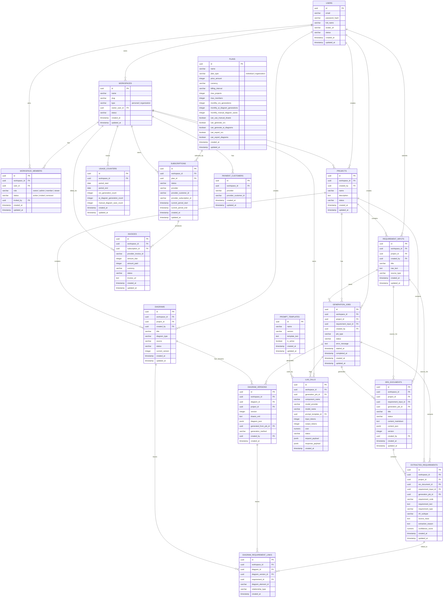

# ER Diagram

```mermaid
erDiagram

    USERS {
        uuid id PK
        varchar email
        varchar password_hash
        varchar full_name
        varchar avatar_url
        varchar status
        timestamp created_at
        timestamp updated_at
    }

    WORKSPACES {
        uuid id PK
        varchar name
        varchar slug
        varchar type "personal | organization"
        uuid owner_user_id FK
        varchar status
        timestamp created_at
        timestamp updated_at
    }

    WORKSPACE_MEMBERS {
        uuid id PK
        uuid workspace_id FK
        uuid user_id FK
        varchar role "owner | admin | member | viewer"
        varchar status "active | invited | removed"
        uuid invited_by FK
        timestamp created_at
        timestamp updated_at
    }

    PLANS {
        uuid id PK
        varchar name
        varchar plan_type "individual | organization"
        integer price_amount
        varchar currency
        varchar billing_interval
        integer max_projects
        integer max_members
        integer monthly_srs_generations
        integer monthly_ai_diagram_generations
        integer monthly_manual_diagram_saves
        boolean can_use_manual_drawio
        boolean can_generate_srs
        boolean can_generate_ai_diagrams
        boolean can_export_srs
        boolean can_export_diagrams
        timestamp created_at
        timestamp updated_at
    }

    SUBSCRIPTIONS {
        uuid id PK
        uuid workspace_id FK
        uuid plan_id FK
        varchar status
        varchar provider
        varchar provider_customer_id
        varchar provider_subscription_id
        timestamp current_period_start
        timestamp current_period_end
        timestamp created_at
        timestamp updated_at
    }

    USAGE_COUNTERS {
        uuid id PK
        uuid workspace_id FK
        date period_start
        date period_end
        integer srs_generation_count
        integer ai_diagram_generation_count
        integer manual_diagram_save_count
        timestamp created_at
        timestamp updated_at
    }

    PROJECTS {
        uuid id PK
        uuid workspace_id FK
        uuid created_by FK
        varchar name
        text description
        varchar status
        timestamp created_at
        timestamp updated_at
    }

    REQUIREMENT_INPUTS {
        uuid id PK
        uuid workspace_id FK
        uuid project_id FK
        uuid created_by FK
        varchar title
        text raw_text
        varchar source_type
        timestamp created_at
        timestamp updated_at
    }

    GENERATION_JOBS {
        uuid id PK
        uuid workspace_id FK
        uuid project_id FK
        uuid requirement_input_id FK
        uuid created_by FK
        varchar job_type
        varchar status
        text error_message
        timestamp started_at
        timestamp completed_at
        timestamp created_at
        timestamp updated_at
    }

    SRS_DOCUMENTS {
        uuid id PK
        uuid workspace_id FK
        uuid project_id FK
        uuid requirement_input_id FK
        uuid generation_job_id FK
        varchar title
        varchar status
        text content_markdown
        jsonb content_json
        integer version
        uuid created_by FK
        timestamp created_at
        timestamp updated_at
    }

    EXTRACTED_REQUIREMENTS {
        uuid id PK
        uuid workspace_id FK
        uuid project_id FK
        uuid srs_document_id FK
        uuid requirement_input_id FK
        uuid generation_job_id FK
        varchar requirement_code
        text requirement_text
        varchar requirement_type
        varchar nfr_subtype
        text source_trace
        text extraction_reason
        numeric confidence_score
        timestamp created_at
        timestamp updated_at
    }

    DIAGRAMS {
        uuid id PK
        uuid workspace_id FK
        uuid project_id FK
        uuid created_by FK
        varchar title
        varchar diagram_type
        varchar source
        varchar status
        integer current_version
        timestamp created_at
        timestamp updated_at
    }

    DIAGRAM_VERSIONS {
        uuid id PK
        uuid workspace_id FK
        uuid diagram_id FK
        uuid project_id FK
        integer version
        text drawio_xml
        jsonb diagram_json
        uuid generated_from_job_id FK
        varchar generation_method
        uuid created_by FK
        timestamp created_at
    }

    DIAGRAM_REQUIREMENT_LINKS {
        uuid id PK
        uuid workspace_id FK
        uuid diagram_id FK
        uuid diagram_version_id FK
        uuid requirement_id FK
        varchar diagram_element_id
        varchar relationship_type
        timestamp created_at
    }

    PROMPT_TEMPLATES {
        uuid id PK
        varchar name
        varchar version
        text template_text
        boolean is_active
        timestamp created_at
        timestamp updated_at
    }

    LLM_CALLS {
        uuid id PK
        uuid workspace_id FK
        uuid generation_job_id FK
        varchar component_name
        varchar model_provider
        varchar model_name
        uuid prompt_template_id FK
        integer input_tokens
        integer output_tokens
        numeric cost
        varchar status
        jsonb request_payload
        jsonb response_payload
        timestamp created_at
    }

    PAYMENT_CUSTOMERS {
        uuid id PK
        uuid workspace_id FK
        varchar provider
        varchar provider_customer_id
        timestamp created_at
        timestamp updated_at
    }

    INVOICES {
        uuid id PK
        uuid workspace_id FK
        uuid subscription_id FK
        varchar provider_invoice_id
        integer amount_due
        integer amount_paid
        varchar currency
        varchar status
        text invoice_url
        timestamp created_at
        timestamp updated_at
    }

    USERS ||--o{ WORKSPACES : owns
    USERS ||--o{ WORKSPACE_MEMBERS : joins
    WORKSPACES ||--o{ WORKSPACE_MEMBERS : has

    WORKSPACES ||--o{ SUBSCRIPTIONS : owns
    PLANS ||--o{ SUBSCRIPTIONS : selected_by
    WORKSPACES ||--o{ USAGE_COUNTERS : tracks

    WORKSPACES ||--o{ PROJECTS : owns
    USERS ||--o{ PROJECTS : creates

    PROJECTS ||--o{ REQUIREMENT_INPUTS : contains
    USERS ||--o{ REQUIREMENT_INPUTS : submits

    REQUIREMENT_INPUTS ||--o{ GENERATION_JOBS : starts
    PROJECTS ||--o{ GENERATION_JOBS : has
    USERS ||--o{ GENERATION_JOBS : creates

    GENERATION_JOBS ||--o{ SRS_DOCUMENTS : generates
    REQUIREMENT_INPUTS ||--o{ SRS_DOCUMENTS : source_for
    PROJECTS ||--o{ SRS_DOCUMENTS : contains

    SRS_DOCUMENTS ||--o{ EXTRACTED_REQUIREMENTS : contains
    REQUIREMENT_INPUTS ||--o{ EXTRACTED_REQUIREMENTS : source_for
    GENERATION_JOBS ||--o{ EXTRACTED_REQUIREMENTS : extracts

    PROJECTS ||--o{ DIAGRAMS : contains
    USERS ||--o{ DIAGRAMS : creates
    DIAGRAMS ||--o{ DIAGRAM_VERSIONS : has_versions
    GENERATION_JOBS ||--o{ DIAGRAM_VERSIONS : generates

    DIAGRAMS ||--o{ DIAGRAM_REQUIREMENT_LINKS : traces
    DIAGRAM_VERSIONS ||--o{ DIAGRAM_REQUIREMENT_LINKS : traces
    EXTRACTED_REQUIREMENTS ||--o{ DIAGRAM_REQUIREMENT_LINKS : linked_to

    PROMPT_TEMPLATES ||--o{ LLM_CALLS : used_by
    GENERATION_JOBS ||--o{ LLM_CALLS : logs
    WORKSPACES ||--o{ LLM_CALLS : owns

    WORKSPACES ||--o{ PAYMENT_CUSTOMERS : has
    WORKSPACES ||--o{ INVOICES : billed_for
    SUBSCRIPTIONS ||--o{ INVOICES : produces
```
