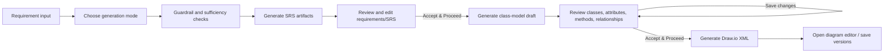

# Generation Modes, BYOK Provider Settings, and Editable Pipeline Review

- **Status:** Proposed
- **Created:** 2026-08-11
- **Scope:** Backend and frontend planning only; no implementation is included in this document
- **Feature type:** Enhancement and platform capability

## 1. Goal

Add three explicit generation modes to the SRS/class-diagram workflow:

1. **Rule Based** — run the deterministic local rule engine without an external LLM API key.
2. **SrsGen** — run the platform's server-managed custom generation model.
3. **AI API Key** — run the pipeline with the signed-in user's configured OpenAI, Anthropic, or Gemini credential and selected model.

The generated output must no longer jump directly from generation to a final class diagram. The user must be able to review and edit generated artifacts—especially classes, attributes, methods, and relationships—then choose **Accept & Proceed** before Draw.io XML is generated.

## 2. Working Assumptions

These assumptions make the requested behavior implementable without blocking this planning pass:

- API credentials are owned by an individual user, not shared by the workspace.
- A user can store one active credential per provider in the first version.
- Each configured provider has one selected default model.
- One configured provider/model is marked as the active BYOK choice used by the **AI API Key** mode.
- SrsGen credentials and endpoint configuration are managed by the platform through server environment settings; users do not enter the SrsGen secret.
- Provider API keys are encrypted at rest and are never returned to the browser after submission.
- Selecting **AI API Key** never silently falls back to SrsGen or Rule Based. Missing or invalid configuration produces an actionable error.
- “Edit pipeline” means editing generated business artifacts at review checkpoints, not allowing users to reorder security-critical execution nodes such as guardrails.

## 3. Current-State Findings

### 3.1 Provider support

- `backend/app/services/llm_service.py` currently implements only `LangChainOpenAIClient`.
- `resolve_llm_provider()` rejects all providers except OpenAI aliases.
- Provider, model, API key, temperature, timeout, and retry settings currently come from global environment configuration in `backend/app/core/config.py`.
- There is no user-level provider credential or selected-model persistence.
- `backend/requirements.txt` includes `langchain-openai`, but not `langchain-anthropic` or `langchain-google-genai`.
- The current `LlmClient` protocol is a useful extension point, but client resolution must become request/job-specific rather than process-global.

### 3.2 Class diagram generation

- The secured main API accepts only `llm` and `rule_based` diagram methods.
- The current `LlmClassDiagramGenerator` performs an LLM call but discards its output and then returns the rule-based model. Therefore, the existing `llm` option is not true LLM class-model generation.
- The secured main flow immediately builds Draw.io XML and persists a final diagram. There is no intermediate editable class-model draft.
- A separate `/api/rule/v1` implementation already contains class/relationship CRUD, stage approval, reopening, revision status, and XML generation concepts.
- `/api/rule/v1` uses separate `rule_projects` data and is not protected by the main workspace membership dependencies. It must not be exposed as the production user flow without tenancy and authorization changes.

### 3.3 Frontend

- `SrsGenerationFlow.tsx` hard-codes `diagram_methods: ['llm']` when class-diagram generation is enabled.
- The generation page shows pipeline status, but the rows are display-only.
- Generated SRS tabs are mostly read-only; several edit/regenerate buttons are visual placeholders.
- `SettingsProfile.tsx` already supplies a user settings page and local settings sub-navigation, but has no AI provider/API-key section.
- There is no class-model review editor or **Accept & Proceed** gate before diagram generation.

## 4. Target User Experience

### 4.1 Generation mode selector

Place a generation-method dropdown in the lower portion of the SRS generation input/options card:

- **Rule Based**
  - Helper text: “Uses local deterministic extraction. No API key required.”
- **SrsGen**
  - Helper text: “Uses the platform custom generation model.”
- **AI API Key**
  - Helper text shows the active provider and selected model, for example: “Anthropic · selected model”.
  - Disabled when no valid active credential/model is configured.
  - Disabled state includes a **Set up API key** link that opens Settings → AI Providers.

The chosen mode applies to the full generation execution. The backend records a snapshot of the mode, provider, and model on the generation job so changing settings later does not rewrite job history.

### 4.2 Settings → AI Providers

Add **AI Providers** to the existing settings sub-navigation. The page contains provider cards for:

- OpenAI
- Anthropic
- Google Gemini

Each provider card supports:

- Add or replace API key using a password-style input.
- Show only configured/unconfigured state, masked suffix, validation state, and last validation/use timestamps.
- Select a model from the backend-provided supported-model catalog.
- Test connection.
- Mark the provider/model as the active BYOK choice.
- Remove the stored credential after confirmation.

The browser must clear the plaintext key field immediately after a successful save. API responses must never include the ciphertext or full secret.

### 4.3 Review and edit flow

The target flow is:



Review checkpoints should distinguish system stages from editable artifacts:

| Stage | Editable | Approval behavior |
| --- | --- | --- |
| Input guardrail | No | Automatic pass/fail |
| Requirement sufficiency | No | Clarification flow remains user-driven |
| Summary | Yes | Save draft, then accept |
| Extracted requirements and classifications | Yes | Add, edit, disable, or delete; then accept |
| SRS document | Yes | Save a new revision; then accept |
| Class model | Yes | Edit classes and relationships; then accept |
| Draw.io XML | Editable in diagram editor | Versioned save |

At minimum, the first delivery must include the requirements/SRS review gate and the full class-model review gate. Security and sufficiency nodes remain non-editable.

### 4.4 Class-model editor

The class-model review screen must support:

- Add, rename, disable, or delete a class.
- Add, edit, disable, or delete class attributes.
- Add, edit, disable, or delete class methods and parameters.
- Add, edit, disable, or delete relationships.
- Select relationship type, source/target classes, direction, multiplicities, and label.
- Display source requirement IDs and warnings for traceability.
- Validate duplicate IDs/names, invalid type values, and relationships pointing to missing/disabled classes.
- Save draft changes without approval.
- **Accept & Proceed** only when validation succeeds.
- **Reopen** an approved model; reopening marks generated downstream XML/diagram artifacts stale.

## 5. Backend Design

### 5.1 Generation mode contract

Introduce one clear enum used consistently by SRS jobs and class-model generation:

- `rule_based`
- `srsgen`
- `byok`

Do not overload the existing diagram `methods` array for this decision. A generation request should contain a structured selection:

| Field | Required | Meaning |
| --- | --- | --- |
| `generation_mode` | Yes | One of `rule_based`, `srsgen`, `byok` |
| `provider` | For `byok` | `openai`, `anthropic`, or `gemini` |
| `model_name` | For `byok`; optional snapshot for `srsgen` | Server-validated model identifier |
| `generate_class_diagram` | Yes | Whether to continue to the class-model review stage |

For BYOK, the server must resolve the credential from the authenticated user. It must not accept an API key in a generation request.

### 5.2 Provider client architecture

Retain the existing `LlmClient` protocol and replace global provider resolution with a registry/factory:

```text
LlmProviderRegistry
├── OpenAI adapter       -> ChatOpenAI        (langchain-openai)
├── Anthropic adapter    -> ChatAnthropic     (langchain-anthropic)
├── Gemini adapter       -> ChatGoogleGenerativeAI (langchain-google-genai)
└── SrsGen adapter       -> internal HTTP/model client
```

Required backend modules:

- A provider-neutral request/response normalizer.
- One adapter file per provider so provider-specific constructor arguments, content shapes, usage metadata, and exceptions do not leak into pipeline code.
- `ProviderRegistry` for supported providers, model catalog, client construction, and capability metadata.
- `GenerationExecutionContext` containing mode, provider, model, and an already-resolved client reference.
- Request/job-scoped client injection into SRS LangGraph nodes and class-model generation.

Never place decrypted credentials in persisted LangGraph state, job payloads, logs, exceptions, audit events, or LLM response payloads.

Recommended dependencies:

- Keep `langchain-openai` for `ChatOpenAI`.
- Add `langchain-anthropic` for `ChatAnthropic`.
- Add `langchain-google-genai` for `ChatGoogleGenerativeAI` and use the Gemini Developer API path for user API keys.

Official LangChain references:

- [OpenAI integration](https://docs.langchain.com/oss/python/integrations/chat/openai)
- [Anthropic integration](https://docs.langchain.com/oss/python/integrations/chat/anthropic)
- [Google Gemini integration](https://docs.langchain.com/oss/python/integrations/chat/google_generative_ai)

### 5.3 SrsGen adapter

SrsGen is a separate server-managed provider and needs an explicit integration contract:

- Environment settings for endpoint/base URL, service credential, default model/version, timeout, and retries.
- Health/readiness validation at startup or through an admin-only diagnostic endpoint.
- A client adapter that returns the same normalized `LlmResponse` contract as external providers.
- Model/version stored on every job and `llm_calls` record.
- No SrsGen secret exposed to users or frontend APIs.

If SrsGen is not an HTTP model service, the adapter can call an in-process model runner, but it must preserve the same provider-neutral interface.

### 5.4 Credential storage and encryption

Add a `user_ai_provider_credentials` table with fields equivalent to:

| Field | Notes |
| --- | --- |
| `id` | UUID primary key |
| `user_id` | FK to `users`; unique together with provider |
| `provider` | `openai`, `anthropic`, `gemini` |
| `encrypted_api_key` | Authenticated encryption output; never serialized |
| `key_last_four` | Display-only masked suffix |
| `selected_model` | Validated against the provider registry |
| `is_default` | Only one credential can be the active BYOK choice per user |
| `status` | `configured`, `invalid`, `revoked`, `disabled` |
| `validated_at` | Last successful connection test |
| `last_used_at` | Last pipeline use |
| `created_at`, `updated_at` | Audit timestamps |

Encryption requirements:

- Use a dedicated credential-encryption master key, separate from JWT `secret_key`.
- Use authenticated encryption and support key versioning/rotation.
- Decrypt only immediately before constructing the provider client.
- Redact known credential values and provider authorization headers from logs and errors.
- Deleting a credential removes the encrypted secret; historical jobs retain provider/model metadata but not a usable credential.
- Never use browser local storage or session storage for provider secrets.

### 5.5 Model catalog and validation

Expose a backend-owned provider catalog. Do not hard-code model options in React.

- Each provider entry includes provider ID, label, enabled status, supported models, and default model.
- Model IDs are configuration/data so they can be updated without changing the generation UI.
- Saving a selected model validates it against the enabled catalog.
- Connection testing uses the selected model and a minimal bounded request; it reports success/failure without returning raw provider errors that may contain sensitive request details.
- Live provider model discovery can be added later; it is not required for the first delivery.

### 5.6 Settings APIs

Add authenticated user-level routes under `/api/v1/users/me/ai-settings` (exact naming may follow existing API conventions):

| Method and route | Purpose |
| --- | --- |
| `GET /providers` | Return supported provider/model catalog plus safe configured state |
| `PUT /credentials/{provider}` | Add or replace key and select a model |
| `PATCH /credentials/{provider}` | Change selected model, enabled state, or default status without resending the key |
| `POST /credentials/{provider}/test` | Validate the stored key with the selected model |
| `DELETE /credentials/{provider}` | Remove the user's stored credential |
| `GET /selection` | Return the active BYOK provider/model summary used by generation UI |

All routes use `get_current_user`; no workspace role is required for personal credentials. Generation still requires normal project/workspace authorization.

### 5.7 Pipeline execution changes

Refactor SRS generation so the selected execution context is resolved once at job start and passed to every model-driven node:

- `rule_based`: invoke deterministic/rule components only; do not create external LLM calls.
- `srsgen`: build the SrsGen client from server configuration.
- `byok`: load the authenticated job owner's credential, verify active/validated configuration, decrypt, and construct the selected provider client.

The job stores:

- `generation_mode`
- `provider`
- `model_name`
- nullable `provider_credential_id` with `ON DELETE SET NULL`
- review/current-stage status

Failure rules:

- Missing/revoked credential: fail before any provider call with a configuration error.
- Provider authentication failure: mark credential invalid and job failed at the exact stage.
- Rate limit or transient provider failure: apply bounded retry policy and record a safe normalized error.
- Invalid structured output: attempt one bounded repair/validation retry, then stop at the stage with editable partial output preserved where safe.
- No automatic cross-provider or cross-mode fallback.

### 5.8 True AI class-model generation

Replace the current behavior where the LLM response is discarded:

- Define a strict class-model schema for classes, attributes, methods, relationships, source requirement IDs, confidence, and warnings.
- Require the provider/SrsGen response to satisfy this schema.
- Parse and validate the response before persistence.
- Rule Based uses the existing deterministic `generate_class_model()` logic.
- SrsGen and BYOK use their selected model to produce the same normalized class-model schema.
- Optionally run deterministic validation/normalization after AI generation, but do not replace AI output with a rule-based output without telling the user.

### 5.9 Editable artifact revisions and approval

Introduce tenant-scoped review data rather than connecting the frontend directly to the unsecured `rule_*` project API.

Recommended primary table: `class_model_revisions` with:

- Main `workspace_id` and `project_id` foreign keys.
- Source SRS document/requirement input and generation job IDs.
- Version number and parent revision ID.
- Status: `draft`, `ready_for_review`, `approved`, `stale`.
- Normalized class-model JSON.
- Generation mode/provider/model snapshot.
- Created/updated/approved user and timestamps.

For SRS review, either add an `srs_document_revisions` table or extend the existing document model with immutable revisions. In-place edits should be avoided because traceability and audit history are already product requirements.

The existing Rule System's class/relationship mutation and stage approval concepts can be extracted into shared domain services, but its `rule_projects` persistence and unauthenticated routes should remain isolated until migrated.

### 5.10 Review APIs

Add secured workspace/project routes such as:

| Method and route | Purpose |
| --- | --- |
| `POST /class-models/generate` | Generate a draft only; do not generate XML |
| `GET /class-models/{id}` | Load the latest authorized draft/revision |
| `POST /class-models/{id}/revisions` | Save a complete validated draft revision |
| `POST /class-models/{id}/classes` | Add a class |
| `PATCH /class-models/{id}/classes/{class_id}` | Edit class metadata/attributes/methods |
| `DELETE /class-models/{id}/classes/{class_id}` | Delete/disable class and validate affected relationships |
| `POST /class-models/{id}/relationships` | Add relationship |
| `PATCH /class-models/{id}/relationships/{relationship_id}` | Edit relationship |
| `DELETE /class-models/{id}/relationships/{relationship_id}` | Delete/disable relationship |
| `POST /class-models/{id}/validate` | Return blocking errors and warnings |
| `POST /class-models/{id}/approve` | Accept the current draft version |
| `POST /class-models/{id}/reopen` | Reopen and mark downstream artifacts stale |
| `POST /class-models/{id}/diagram` | Generate Draw.io XML only from the approved version |

All routes must use the main workspace membership dependency and existing generation-role policy. The diagram endpoint must reject unapproved or stale class-model revisions.

### 5.11 State enforcement

Use a backend-enforced state machine rather than relying on disabled frontend buttons:

```text
draft -> running -> ready_for_review -> approved -> downstream generation
                       ^      |             |
                       |      v             v
                       +--- edited         reopened -> stale downstream output
```

Important rules:

- Editing an approved upstream artifact creates/reopens a draft and marks later artifacts stale.
- `Accept & Proceed` approves an exact version, not merely the latest row at request time.
- XML generation reads the approved class-model version recorded by the approval action.
- Concurrent edit/approve calls use revision numbers or optimistic locking to prevent lost updates.
- Every mutation and approval records the authenticated actor.

## 6. Frontend Design

### 6.1 New frontend domain module

Add an `aiSettings` domain containing:

- Provider/model/settings types.
- Safe credential status types; no `apiKey` field in response types.
- API methods for list, save/replace, test, select model/default, and delete.
- Query/loading/error state managed by the existing controller pattern or a focused hook.

### 6.2 Settings page changes

Update `SettingsProfile.tsx` and its styles:

- Add `AI Providers` to `settingsSections` with `KeyRound`.
- Render provider cards and model selectors.
- Separate “Save key” from “Test connection” so failures are understandable.
- Include inline validation, masked key status, last tested, and active-provider badge.
- Require confirmation before replacing/removing a key.
- Ensure organization admins still have a reachable personal AI Provider settings route; the current `App.tsx` sends organization-admin `settings` to billing/workspace settings, so account AI settings need an explicit route or section.

### 6.3 Generation page changes

Update `SrsGenerationFlow.tsx` and controller/API types:

- Replace hard-coded `['llm']` with the structured generation selection.
- Add the three-option dropdown and configuration summary.
- Disable BYOK when configuration is missing/invalid.
- Show mode/provider/model on job information and metadata using real backend values rather than hard-coded model labels.
- Split generation completion from class-diagram completion: an SRS can be completed while a class model is awaiting review.
- Make generated requirements/SRS review actions functional and persist revisions.

### 6.4 Class-model review component

Add a focused feature component, for example `features/classModelReview/`, with:

- Class list and selected-class editor.
- Attribute and method editors.
- Relationship table/editor.
- Warnings and source requirement traceability panel.
- Dirty/saving/saved state.
- Validation summary.
- `Save Draft`, `Accept & Proceed`, and `Reopen` actions.
- Confirmation before destructive class deletion when relationships are affected.

The component should use backend revision data as the source of truth. Local optimistic edits are acceptable, but approval must use the saved revision/version returned by the API.

## 7. Existing Files Expected to Change

### Backend

- `backend/requirements.txt`
- `backend/app/core/config.py`
- `backend/app/services/llm_service.py` (or split into a provider package)
- `backend/app/services/srs_service.py`
- `backend/app/services/diagram_generation_service.py`
- `backend/app/schemas/srs.py`
- `backend/app/schemas/diagram.py`
- `backend/app/api/v1/router.py`
- `backend/app/api/v1/routes/srs.py`
- `backend/app/api/v1/routes/diagrams.py`
- `backend/app/db/models/` exports and new credential/revision models
- New Alembic migration(s)
- Unit and integration tests for credentials, providers, pipeline selection, revisions, approvals, and tenant isolation

### Frontend

- `frontend/src/app/App.tsx`
- `frontend/src/app/useAppController.ts`
- `frontend/src/features/settings/SettingsProfile.tsx`
- `frontend/src/features/settings/SettingsProfile.css`
- `frontend/src/features/srs/SrsGenerationFlow.tsx`
- `frontend/src/features/srs/SrsGenerationFlow.css`
- `frontend/src/domains/srs/api.ts`
- `frontend/src/domains/srs/types.ts`
- New `frontend/src/domains/aiSettings/`
- New `frontend/src/domains/classModel/`
- New `frontend/src/features/classModelReview/`

## 8. Delivery Sequence

### Phase A — Provider foundation and secret storage

- Add encrypted user credentials, provider catalog, settings APIs, and OpenAI/Anthropic/Gemini/SrsGen adapters.
- Add provider contract tests with mocked LangChain clients; tests must never use real keys.

### Phase B — Generation-mode selection

- Extend request/job schemas and persistence.
- Inject request-scoped clients into all model-driven SRS stages.
- Add dropdown and BYOK readiness checks in the generation UI.

### Phase C — Editable SRS artifacts

- Add revision persistence and edit/approve APIs for generated requirements/SRS.
- Connect review controls and **Accept & Proceed** behavior.

### Phase D — Editable class-model checkpoint

- Add true AI class-model parsing.
- Add tenant-scoped class-model revisions, CRUD, validation, approval, and reopen behavior.
- Build the class-model review UI.

### Phase E — Approved-model diagram generation

- Generate XML only from the approved class-model version.
- Preserve traceability and stale downstream behavior.
- Connect the approved result to the existing Draw.io editor and diagram version storage.

## 9. Test and Acceptance Criteria

### Provider settings

- A signed-in user can save, replace, test, select a model for, and delete each supported provider credential.
- No settings endpoint or log exposes a full API key or encrypted value.
- One user's credentials cannot be listed, changed, tested, or used by another user.
- Invalid credentials cannot be selected for BYOK execution.
- Removing a credential prevents future jobs from using it without deleting historical provider/model audit metadata.

### Generation modes

- Rule Based runs with no external key and records `generation_mode=rule_based`.
- SrsGen uses only the server-managed adapter and records the SrsGen model/version.
- BYOK uses the authenticated user's selected provider/model and records both on the job and LLM calls.
- BYOK with missing, invalid, revoked, or non-owned credentials fails before generation with a safe actionable response.
- No mode silently falls back to another mode.

### Editable pipeline and class model

- Generated editable artifacts can be changed and saved as revisions.
- `Accept & Proceed` approves the exact saved revision.
- Invalid class references or relationships block approval and XML generation.
- Editing/reopening an approved upstream stage marks downstream output stale.
- Draw.io XML cannot be generated from a draft, stale, or unapproved class model.
- The final XML contains only enabled classes/relationships from the approved version.
- Requirement-to-class traceability survives user edits where references remain valid.

### Security and tenancy

- All new review APIs enforce main workspace membership and role checks.
- The production frontend does not depend directly on the unauthenticated `/api/rule/v1` route set.
- Credential plaintext is absent from database-readable fields, browser storage, job payloads, audit records, and exception responses.

## 10. Risks and Decisions Required Before Coding

1. **Credential ownership:** confirm personal user credentials versus workspace-shared credentials. This plan assumes personal ownership.
2. **SrsGen transport:** confirm whether SrsGen is an HTTP endpoint, hosted inference service, or in-process model.
3. **Review granularity:** confirm whether users must approve every editable SRS stage separately or only the final SRS plus class model. This plan supports stage checkpoints but recommends final-SRS and class-model approval as the first delivery.
4. **Model catalog policy:** decide whether only curated models are allowed or advanced users may enter a custom model ID.
5. **Credential validation cost:** provider connection tests may incur a small API charge; the UI should disclose this if a live generation call is used.
6. **Billing policy:** decide whether BYOK jobs consume platform AI generation quota, a reduced orchestration quota, or no model-token quota.
7. **Existing Rule System:** decide whether to migrate its reusable revision/approval logic into the main domain or keep it as an isolated experimental API. Direct frontend integration is not recommended in its current unauthenticated, separate-project form.

## 11. Definition of Ready for Implementation

Implementation can begin after the seven decisions above are confirmed. The first construction task should be the provider/credential foundation because generation-mode UI and pipeline execution both depend on its API contract.
