# 8. Preliminary Test Plan - Testing Objectives and Features to Be Tested

This plan reflects the MVP requirements in `.specsmd` and the current backend/frontend implementation.

## Mermaid Test Plan Overview

```mermaid
flowchart TB
  subgraph Objectives["Testing objectives"]
    O1["Validate authentication and role-based access"]
    O2["Prove workspace_id tenant isolation"]
    O3["Verify subscription gates and monthly limits"]
    O4["Confirm SRS pipeline output and traceability"]
    O5["Confirm Draw.io diagram storage, versioning, export, and generated links"]
    O6["Validate admin-only platform APIs and audit logging"]
    O7["Protect frontend dashboard workflows from regressions"]
    O8["Verify migration/data model integrity"]
  end

  subgraph Levels["Test levels"]
    Unit["Unit tests<br/>domain and services"]
    Integration["API integration tests<br/>FastAPI TestClient"]
    E2E["Frontend/E2E tests<br/>planned"]
    Migration["Migration/schema tests<br/>planned"]
  end

  subgraph Features["Features to be tested"]
    Auth["Auth"]
    Workspace["Workspaces and members"]
    Project["Projects"]
    Billing["Billing and subscription"]
    SRS["AI SRS generation"]
    Diagram["Manual and generated diagrams"]
    Export["SRS and diagram export"]
    Admin["Super admin"]
    Frontend["React dashboard panels"]
    Data["SQLAlchemy/Alembic data model"]
  end

  O1 --> Unit
  O1 --> Integration
  O2 --> Integration
  O3 --> Unit
  O3 --> Integration
  O4 --> Unit
  O4 --> Integration
  O5 --> Unit
  O5 --> Integration
  O6 --> Integration
  O7 --> E2E
  O8 --> Migration

  Unit --> SRS
  Unit --> Diagram
  Unit --> Billing
  Integration --> Auth
  Integration --> Workspace
  Integration --> Project
  Integration --> Billing
  Integration --> SRS
  Integration --> Diagram
  Integration --> Export
  Integration --> Admin
  E2E --> Frontend
  Migration --> Data

  classDef obj fill:#eef6ff,stroke:#3867a8,color:#10233f
  classDef level fill:#f4f0ff,stroke:#6b4fb3,color:#22153d
  classDef feature fill:#eefaf0,stroke:#3d8b4f,color:#12351c

  class O1,O2,O3,O4,O5,O6,O7,O8 obj
  class Unit,Integration,E2E,Migration level
  class Auth,Workspace,Project,Billing,SRS,Diagram,Export,Admin,Frontend,Data feature
```

## Testing Objectives

| Objective | Success criteria |
| --- | --- |
| Authentication and authorization | Invalid tokens are rejected; valid users can access only allowed APIs; role checks produce 403 when appropriate. |
| Tenant isolation | Workspace-scoped APIs always filter by `workspace_id`; cross-workspace project/SRS/diagram access fails. |
| Billing enforcement | Paid features check active subscription, plan capability flags, and monthly usage counters before mutation/export. |
| SRS quality and traceability | Generated SRS includes summary sections, functional/non-functional requirements, source traces, confidence scores, and generation metadata. |
| Diagram correctness | Manual diagrams persist Draw.io XML versions; generated class diagrams create Draw.io XML, diagram JSON, and requirement links. |
| Admin safety | `/api/v1/admin` is super-admin-only and important reads/settings writes produce audit logs. |
| Frontend workflow coverage | Auth, workspace switching, project selection, generation, diagram save/export, and upgrade states render and call expected APIs. |
| Data integrity | Alembic migrations create required workspace-scoped tables, indexes, relationships, and audit/LLM tables. |

## Features to Be Tested

| Feature | In scope scenarios | Existing coverage | Additional planned coverage |
| --- | --- | --- | --- |
| Auth | Register, login, current user, personal workspace creation, duplicate email, bad credentials. | `test_auth_api.py`, `test_user_model.py` | Password policy and token expiry edge cases. |
| Workspaces | List memberships, create organization workspace, get workspace, invite members, role restrictions. | `test_workspace_api.py` | Cross-workspace negative cases for every downstream feature. |
| Projects | Create, list, get, update, archive with workspace scoping and project capacity limits. | `test_project_api.py`, billing tests | Archive behavior against SRS/diagram child resources. |
| Billing/subscription | Seed/list plans, get subscription, usage counters, checkout stub, feature flags, limits. | `test_billing_api.py` | Plan downgrade behavior and period rollover. |
| AI SRS generation | Requirement input, generation job status, pipeline stages, extracted requirements, SRS document retrieval/export. | `test_srs_generation_api.py`, `test_srs_pipeline_service.py`, `test_srs_domain.py` | LLM provider integration tests when a real provider is added. |
| Manual diagrams | Create diagram, save version, list versions, get current detail, export gate. | `test_diagram_api.py` | Draw.io iframe browser/E2E behavior and malformed XML handling. |
| Class diagram generation | Rule-based and LLM method normalization, Draw.io XML output, SRS source lookup, requirement links. | `test_diagram_generation_service.py`, `test_full_generation_flow.py` | Additional diagram method plugins and richer relationship extraction. |
| Exports | SRS markdown export and Draw.io XML export only when plan allows. | SRS, diagram, and billing integration tests | Filename sanitization and large artifact export. |
| Super admin | Super-admin-only lists, platform settings upsert, audit log behavior. | `test_admin_api.py`, `test_user_model.py` | Support-admin reserved-role negative tests and audit metadata completeness. |
| Frontend dashboard | Login/register UI, panels, state reloads, upgrade prompts, generation review, diagram version controls. | No dedicated frontend tests found. | React component tests and Playwright E2E for critical user journeys. |
| Data model/migrations | Workspace-scoped tables, LLM call tables, generation tables, diagram links, admin audit/settings. | Models exercised through backend tests. | Alembic upgrade/downgrade checks against PostgreSQL. |

## Preliminary Entry and Exit Criteria

| Area | Entry criteria | Exit criteria |
| --- | --- | --- |
| Backend unit tests | Dependencies installed and test database/session fixture available. | Domain/service tests pass and cover happy path plus expected failures. |
| Backend integration tests | FastAPI app boots with overridden test DB session. | Auth, workspace, project, billing, SRS, diagram, admin, and full generation flows pass. |
| Frontend tests | Vite app builds and API fixtures/mocks are available. | Critical dashboard flows pass in component/E2E tests across plan states. |
| Release readiness | Migrations apply cleanly and seeded plans/admin setup are documented. | No critical auth, billing, tenant-isolation, generation, or export defects remain open. |

