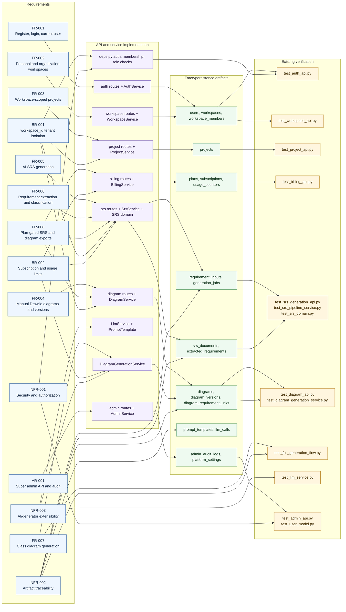

# 6. Software Architecture - Requirement Traceability Matrix

This traceability matrix ties `.specsmd` requirements to API/service modules, persisted artifacts, and the current backend test surface.

## Mermaid Traceability Diagram

## Requirement Traceability Matrix

| ID | Requirement | Source spec | Implementation | Persistence and trace data | Verification |
| --- | --- | --- | --- | --- | --- |
| FR-001 | Users can register, login, and fetch current user/session data. | `features/01-authentication.md`, `api/02-auth-api.md` | `routes/auth.py`, `auth_service.py`, `core/security.py` | `users`, personal `workspaces`, owner `workspace_members` | `test_auth_api.py`, `test_user_model.py` |
| FR-002 | Users have a personal workspace and can create/manage organization workspaces and members. | `features/02-workspaces.md`, `api/03-workspace-api.md` | `routes/workspaces.py`, `workspace_service.py` | `workspaces`, `workspace_members`, workspace roles | `test_workspace_api.py` |
| FR-003 | Projects belong to workspaces and are created, listed, updated, and archived by workspace members. | `features/03-projects.md`, `api/04-project-api.md` | `routes/projects.py`, `project_service.py` | `projects.workspace_id`, `projects.status` | `test_project_api.py` |
| FR-004 | Manual diagrams can be created in Draw.io, saved as XML versions, listed, opened, and exported when allowed. | `features/04-manual-drawio-diagrams.md`, `architecture/05-drawio-integration.md`, `api/06-diagram-api.md` | `DiagramPanels.tsx`, `routes/diagrams.py`, `diagram_service.py` | `diagrams`, `diagram_versions.drawio_xml` | `test_diagram_api.py` |
| FR-005 | Paid users can generate SRS documents from raw natural-language input. | `features/05-ai-srs-generation.md`, `architecture/04-srs-generation-pipeline.md`, `api/05-srs-api.md` | `SrsPanel.tsx`, `routes/srs.py`, `srs_service.py` | `requirement_inputs`, `generation_jobs`, `srs_documents` | `test_srs_generation_api.py`, `test_srs_pipeline_service.py`, `test_full_generation_flow.py` |
| FR-006 | SRS generation extracts, classifies, and stores functional/non-functional requirements with trace metadata. | `features/05-ai-srs-generation.md`, `architecture/04-srs-generation-pipeline.md` | `domain/srs.py`, `srs_service.py` | `extracted_requirements`, `SrsDocument.content_json.traceability` | `test_srs_domain.py`, `test_srs_pipeline_service.py` |
| FR-007 | Class diagram generation uses SRS/extracted requirements and stores editable Draw.io XML plus requirement links. | `features/06-class-diagram-generation.md`, `api/06-diagram-api.md` | `diagram_generation_service.py`, `routes/diagrams.py`, `SrsPanel.tsx` | `diagrams`, `diagram_versions`, `diagram_requirement_links` | `test_diagram_generation_service.py`, `test_full_generation_flow.py` |
| FR-008 | SRS and diagram exports are gated by subscription plan capabilities. | `features/05-ai-srs-generation.md`, `features/06-class-diagram-generation.md`, `features/07-billing-and-subscription.md` | `routes/srs.py`, `routes/diagrams.py`, `billing_service.py` | `plans.can_export_srs`, `plans.can_export_diagrams`, `subscriptions` | `test_billing_api.py`, `test_srs_generation_api.py`, `test_diagram_api.py` |
| BR-001 | All business data and queries must be scoped by `workspace_id`. | `PROJECT_CONTEXT_FOR_CODEX.md`, `architecture/03-multi-tenant-workspace-design.md`, `api/01-api-overview.md` | `deps.py`, `workspace_service.py`, service-layer workspace/project filters | `workspace_id` columns on sensitive business tables | Integration tests across workspace, project, SRS, diagram, billing APIs |
| BR-002 | Paid features require active subscription, plan flag, and monthly usage limit checks. | `product/04-subscription-and-billing-rules.md`, `features/07-billing-and-subscription.md` | `billing_service.py`, `srs_service.py`, `diagram_generation_service.py`, export routes | `plans`, `subscriptions`, `usage_counters` | `test_billing_api.py`, SRS/diagram integration tests |
| AR-001 | Platform super admins use separate `/api/v1/admin` APIs and audit important actions. | `Extended-Scopes/01-extended-scope-super-admin.md`, `api/01-api-overview.md` | `routes/admin.py`, `admin_service.py`, `deps.require_super_admin` | `users.platform_role`, `admin_audit_logs`, `platform_settings` | `test_admin_api.py`, `test_user_model.py` |
| NFR-001 | Protected APIs enforce JWT authentication, workspace membership, workspace roles, and super-admin role checks. | `api/01-api-overview.md`, security rules in feature specs | `deps.py`, route dependencies, service role checks | Access decisions use `users`, `workspace_members`, `platform_role` | Auth/workspace/admin integration tests |
| NFR-002 | Generated artifacts retain traceability from source text to SRS requirements to diagram elements and LLM calls. | `architecture/04-srs-generation-pipeline.md`, `features/06-class-diagram-generation.md` | `srs_service.py`, `diagram_generation_service.py`, `llm_service.py` | `source_trace`, `confidence_score`, `llm_calls`, `diagram_requirement_links` | `test_full_generation_flow.py`, `test_llm_service.py` |
| NFR-003 | AI and diagram generation are extensible through prompt templates, LLM client protocol, and generator registry. | `PROJECT_CONTEXT_FOR_CODEX.md`, `features/06-class-diagram-generation.md` | `llm_service.py`, `DiagramGeneratorRegistry`, `ClassDiagramGenerator` protocol | `prompt_templates`, `llm_calls`, diagram JSON metadata | `test_llm_service.py`, `test_diagram_generation_service.py` |

