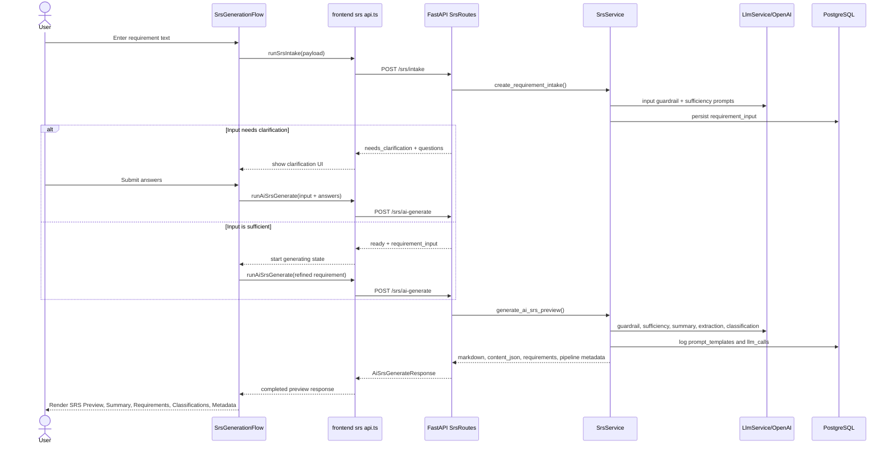

# 5. Software Design - Component Diagram

This component view is based on the `.specsmd` product, feature, API, and architecture documents plus the current React/FastAPI implementation. It reflects the current SRS generation flow: intake checks first, clarification when required, then the quick AI SRS generation endpoint for immediate frontend preview. The persisted job-based pipeline remains available for future background processing.

## Mermaid Component Diagram

```mermaid
flowchart TB
  User["User"]

  subgraph Browser["Browser / React frontend"]
    AuthView["AuthView<br/>register, login, password reset"]
    AppController["useAppController<br/>session, workspace, project, SRS orchestration"]
    AdminUI["Platform Admin UI<br/>dashboard, users, workspaces, plans"]
    PromptUI["PromptTemplatesPage<br/>prompt visibility and version reference"]
    SrsFlow["SrsGenerationFlow<br/>input, check, clarify, generate, preview"]
    SrsPreview["SRS Preview tabs<br/>markdown, summary, requirements pagination, classifications, metadata"]
    DiagramUI["DiagramPanels<br/>Draw.io iframe, XML editor, versions"]
    DomainApi["Domain API modules<br/>auth, workspace, billing, project, srs, diagram"]
    ApiClient["apiClient<br/>base URL, bearer headers, 401 handling, JSON parsing"]
    SessionStorage["sessionStorage/localStorage<br/>token and active IDs"]
  end

  subgraph Backend["FastAPI backend"]
    ApiRouter["api_router<br/>/api/v1"]
    Deps["Dependency layer<br/>DB session, JWT auth, workspace membership, roles, super admin"]
    AuthRoutes["auth routes"]
    WorkspaceRoutes["workspace routes"]
    ProjectRoutes["project routes"]
    BillingRoutes["billing routes"]
    SrsRoutes["srs routes<br/>/intake, /clarifications, /ai-generate, /generate, /generate/stream"]
    DiagramRoutes["diagram routes"]
    AdminRoutes["admin routes"]

    AuthService["AuthService<br/>registration, login, personal workspace"]
    WorkspaceService["WorkspaceService<br/>memberships, roles, invites"]
    ProjectService["ProjectService<br/>workspace-scoped projects"]
    BillingService["BillingService<br/>plans, subscription, usage gates"]
    SrsService["SrsService<br/>intake, guardrail, sufficiency, preview, jobs, documents"]
    PromptEngine["Prompt templates<br/>versioned files + prompt_templates table"]
    Guardrail["Input Guardrail<br/>prompt injection and unsafe instruction filter"]
    Sufficiency["Requirement Sufficiency<br/>asks clarification questions when input is vague"]
    QuickPreview["Quick AI SRS Preview<br/>summary, extraction, classification, markdown response"]
    JobPipeline["Job Pipeline<br/>persisted generation job, progress payloads, future Celery/Redis handoff"]
    LangGraphFlow["LangGraph StateGraph<br/>summary + extraction orchestration, classification dependency"]
    SrsDomain["SRS domain builder<br/>markdown + content_json assembly"]
    DiagramService["DiagramService<br/>manual diagrams, versions, exports"]
    DiagramGenService["DiagramGenerationService<br/>LLM class diagram + rule-based diagram merge"]
    LlmService["LlmService<br/>prompt rendering, OpenAI calls, LLM call log"]
    AdminService["AdminService<br/>platform lists, settings, audit logs"]
  end

  subgraph Data["PostgreSQL / SQLAlchemy data model"]
    IdentityData["users, workspaces, workspace_members"]
    ProjectData["projects"]
    BillingData["plans, subscriptions, usage_counters"]
    GenerationData["requirement_inputs, generation_jobs"]
    SrsData["srs_documents, extracted_requirements"]
    DiagramData["diagrams, diagram_versions, diagram_requirement_links"]
    LlmData["prompt_templates, llm_calls"]
    AdminData["admin_audit_logs, platform_settings"]
  end

  subgraph External["External or replaceable services"]
    OpenAI["OpenAI API<br/>current LLM provider"]
    Drawio["Draw.io / diagrams.net embed"]
    Payment["Payment provider<br/>checkout stub now, provider later"]
    RedisCelery["Redis + Celery<br/>future async worker runtime"]
  end

  User --> AuthView
  User --> AdminUI
  User --> SrsFlow
  AuthView --> DomainApi
  AppController --> AdminUI
  AppController --> PromptUI
  AppController --> SrsFlow
  AppController --> DiagramUI
  AppController --> SessionStorage
  SrsFlow --> SrsPreview
  SrsFlow --> DomainApi
  SrsPreview --> DomainApi
  DiagramUI --> DomainApi
  DiagramUI --> Drawio
  DomainApi --> ApiClient
  ApiClient --> ApiRouter

  ApiRouter --> AuthRoutes
  ApiRouter --> WorkspaceRoutes
  ApiRouter --> ProjectRoutes
  ApiRouter --> BillingRoutes
  ApiRouter --> SrsRoutes
  ApiRouter --> DiagramRoutes
  ApiRouter --> AdminRoutes

  AuthRoutes --> AuthService
  WorkspaceRoutes --> Deps
  ProjectRoutes --> Deps
  BillingRoutes --> Deps
  SrsRoutes --> Deps
  DiagramRoutes --> Deps
  AdminRoutes --> Deps

  WorkspaceRoutes --> WorkspaceService
  ProjectRoutes --> ProjectService
  BillingRoutes --> BillingService
  SrsRoutes --> SrsService
  DiagramRoutes --> DiagramService
  DiagramRoutes --> DiagramGenService
  AdminRoutes --> AdminService

  SrsService --> BillingService
  SrsService --> Guardrail
  SrsService --> Sufficiency
  SrsService --> QuickPreview
  SrsService --> JobPipeline
  SrsService --> SrsDomain
  Guardrail --> PromptEngine
  Sufficiency --> PromptEngine
  QuickPreview --> PromptEngine
  QuickPreview --> LlmService
  QuickPreview --> SrsDomain
  JobPipeline --> LangGraphFlow
  LangGraphFlow --> PromptEngine
  LangGraphFlow --> LlmService
  LangGraphFlow --> SrsDomain
  JobPipeline -. future worker dispatch .-> RedisCelery
  DiagramGenService --> LlmService
  DiagramGenService --> DiagramService
  BillingService -. future checkout .-> Payment
  LlmService --> OpenAI

  AuthService --> IdentityData
  WorkspaceService --> IdentityData
  ProjectService --> ProjectData
  BillingService --> BillingData
  SrsService --> GenerationData
  SrsService --> SrsData
  DiagramService --> DiagramData
  DiagramGenService --> DiagramData
  DiagramGenService --> SrsData
  LlmService --> LlmData
  PromptEngine --> LlmData
  AdminService --> AdminData
  AdminService --> IdentityData
  AdminService --> ProjectData
  AdminService --> BillingData
  AdminService --> GenerationData
  AdminService --> LlmData

  classDef frontend fill:#eef6ff,stroke:#3973b7,color:#10233f
  classDef backend fill:#f3f0ff,stroke:#6b4fb3,color:#22153d
  classDef ai fill:#fff1f8,stroke:#c2417b,color:#3d1025
  classDef data fill:#eefaf0,stroke:#3d8b4f,color:#12351c
  classDef external fill:#fff6df,stroke:#b57f1a,color:#3f2a00

  class AuthView,AppController,AdminUI,PromptUI,SrsFlow,SrsPreview,DiagramUI,DomainApi,ApiClient,SessionStorage frontend
  class ApiRouter,Deps,AuthRoutes,WorkspaceRoutes,ProjectRoutes,BillingRoutes,SrsRoutes,DiagramRoutes,AdminRoutes,AuthService,WorkspaceService,ProjectService,BillingService,SrsService,DiagramService,DiagramGenService,AdminService,SrsDomain backend
  class PromptEngine,Guardrail,Sufficiency,QuickPreview,JobPipeline,LangGraphFlow,LlmService ai
  class IdentityData,ProjectData,BillingData,GenerationData,SrsData,DiagramData,LlmData,AdminData data
  class OpenAI,Drawio,Payment,RedisCelery external
```

## SRS Generation Component Flow

## Implementation Anchors

| Component area | Primary implementation |
| --- | --- |
| Frontend shell and orchestration | `frontend/src/app/App.tsx`, `frontend/src/app/useAppController.ts` |
| Generate SRS UI and preview tabs | `frontend/src/features/srs/SrsGenerationFlow.tsx`, `frontend/src/features/srs/SrsGenerationFlow.css` |
| Frontend API adapters | `frontend/src/domains/*/api.ts`, `frontend/src/shared/apiClient.ts` |
| Route composition | `backend/app/main.py`, `backend/app/api/v1/router.py` |
| Auth, workspace, project, billing services | `backend/app/services/auth_service.py`, `workspace_service.py`, `project_service.py`, `billing_service.py` |
| SRS intake, preview, streaming, and job pipeline | `backend/app/api/v1/routes/srs.py`, `backend/app/services/srs_service.py`, `backend/app/domain/srs.py` |
| Prompt versioning and LLM call logging | `backend/app/prompts/srs/*.md`, `backend/app/services/llm_service.py`, `prompt_templates`, `llm_calls` |
| Diagram generation | `backend/app/services/diagram_generation_service.py`, `diagram_service.py`, Draw.io frontend embed |
| Data model | `backend/app/db/models/*.py`, `backend/alembic/versions/*.py` |