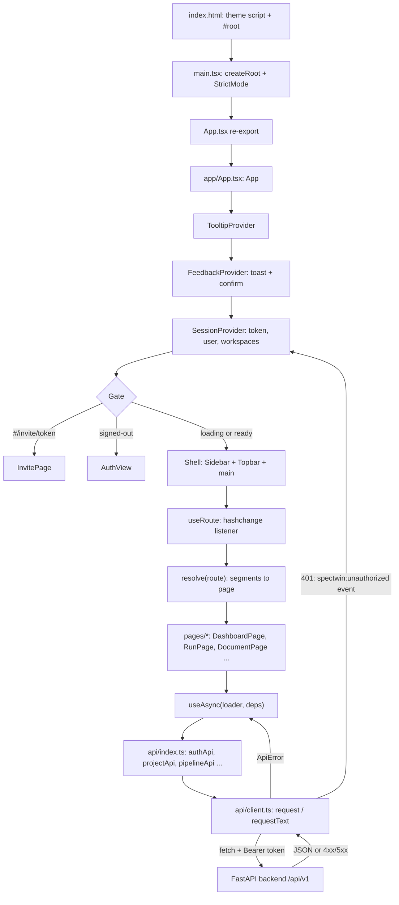

# SpecTwin Frontend — সম্পূর্ণ ব্যাখ্যা (বাংলায়)

এই ডকুমেন্টে `frontend/` ফোল্ডারের প্রতিটা ফাইল, component, hook আর API function বাংলায় ব্যাখ্যা করা হয়েছে। প্রতিটা জিনিস কী করে আর কেন এভাবে বানানো হয়েছে, দুটোই বলা আছে। Frontend বানানো হয়েছে React 19, Vite আর TypeScript দিয়ে। Backend-এর ব্যাখ্যা আছে [`backend-bangla.md`](./backend-bangla.md) ফাইলে।

## সূচিপত্র

1. Frontend: ভিত্তি (সেটআপ, API client, routing, session, shared UI)
2. Frontend: Features ও Pages (শেষে পুরো ইউজার ফ্লো দেওয়া আছে)

---

## Frontend: ভিত্তি — সেটআপ, API client, routing, session, shared UI

এই অংশে SpecTwin-এর frontend-এর "ভিত্তি" ব্যাখ্যা করা হয়েছে: কোন tooling দিয়ে project build ও serve হয়, folder গুলো কীভাবে সাজানো, backend-এর সাথে কথা বলার API client, hash-based router, login session ও workspace নির্বাচন, app shell (Sidebar/Topbar), এবং সব page-এ ব্যবহৃত shared UI component।

---

### Tooling ও কনফিগারেশন

#### `frontend/package.json`

Project-টি `"type": "module"` (ES Module), `"private": true` (npm-এ publish হবে না)। Package manager হিসেবে **Yarn** ব্যবহৃত হয় (`yarn.lock` আছে, Dockerfile-এ `yarn install --frozen-lockfile`)।

**Scripts:**

| Script | Command | কাজ ও কারণ |
|---|---|---|
| `dev` | `vite` | Development server চালায় (HMR সহ)। `vite.config.ts`-এর proxy দিয়ে `/api/v1` request backend-এ (`127.0.0.1:8000`) পাঠায়, তাই dev-এ CORS ঝামেলা থাকে না। |
| `build` | `tsc -b && vite build` | আগে TypeScript project references (`tsconfig.json` → app + node) type-check করে (`-b` = build mode; `noEmit` থাকায় কোনো JS লেখে না), তারপর Vite production bundle `dist/`-এ তৈরি করে। Type error থাকলে build fail হয় — ভুল code deploy হওয়া ঠেকাতে। |
| `lint` | `eslint .` | `eslint.config.js` অনুযায়ী সব `.ts/.tsx` lint করে। |
| `preview` | `vite preview` | Build করা `dist/` locally serve করে production build যাচাই করার জন্য। |

**Runtime dependencies:**

| Package | কেন ব্যবহৃত |
|---|---|
| `react`, `react-dom` (^19.2) | UI library ও DOM renderer। `main.tsx`-এ `createRoot` দিয়ে mount হয়। |
| `@radix-ui/react-dialog` | Accessible dialog primitive — `Modal`, `Sheet` (`shared/ui/radix.tsx`) এবং `FeedbackProvider`-এর confirm dialog এর উপর তৈরি। Focus trap, Esc-এ বন্ধ, ARIA নিজে থেকেই পাওয়া যায়। |
| `@radix-ui/react-dropdown-menu` | `DropdownMenu*` wrapper — Sidebar-এর workspace switcher, account menu, run list-এর action menu। Keyboard navigation built-in। |
| `@radix-ui/react-popover` | `Popover`/`PopoverContent` wrapper। |
| `@radix-ui/react-switch` | `Switch` toggle component। |
| `@radix-ui/react-tabs` | `Tabs`, `TabsList`, `TabsTrigger` (pill-style tab switcher)। |
| `@radix-ui/react-tooltip` | `Tooltip` ও `TooltipProvider` (App-এর root-এ `delayDuration={200}`)। |
| `@xyflow/react` | React Flow — class modeler-এর interactive UML class diagram canvas-এর জন্য (`features/classModeler/diagram/*`)। |
| `lucide-react` | SVG icon set (Sidebar/Topbar/সব জায়গার icon, `LucideIcon` type)। |
| `react-markdown` | SRS document-এর Markdown কে React element হিসেবে render করে (`features/srs/Markdown.tsx`)। |
| `remark-gfm` | `react-markdown`-এর plugin — GitHub Flavored Markdown (table, strikethrough ইত্যাদি) সমর্থন; SRS-এ requirement table থাকে বলে দরকার। |

Radix "headless" primitive বেছে নেওয়ার কারণ: accessibility ও behavior library দেয়, কিন্তু styling সম্পূর্ণ নিজের Tailwind class দিয়ে করা যায় — তাই একটা নিজস্ব design system (`shared/ui`) বানানো সহজ।

**Dev dependencies:**

| Package | কেন ব্যবহৃত |
|---|---|
| `vite` (^8) | Dev server ও bundler। |
| `@vitejs/plugin-react` | Vite-এ React JSX transform ও Fast Refresh (HMR)। |
| `tailwindcss` (^4), `@tailwindcss/vite` | Tailwind CSS v4 — utility-first styling। v4-এ আলাদা `tailwind.config.js` লাগে না; `index.css`-এর `@theme` block-এ design token define হয় এবং Vite plugin সরাসরি compile করে। |
| `typescript` (~6.0) | Type checking (`tsc -b`)। |
| `@types/react`, `@types/react-dom` | React-এর type definition। |
| `@types/node` | `vite.config.ts`-এ `process.cwd()` ইত্যাদি Node API-এর type (`tsconfig.node.json`-এ `types: ["node"]`)। |
| `eslint` (^10), `@eslint/js` | Linter ও JS-এর recommended rule set। |
| `typescript-eslint` | TypeScript-aware lint rule। |
| `eslint-plugin-react-hooks` | Hooks-এর নিয়ম (dependency array, set-state-in-effect ইত্যাদি) যাচাই। Code-এ কয়েক জায়গায় `eslint-disable-next-line react-hooks/...` দেখা যায় — ইচ্ছাকৃত ব্যতিক্রম। |
| `eslint-plugin-react-refresh` | Fast Refresh ভাঙে এমন export (একই file থেকে component ও non-component export) সম্পর্কে সতর্ক করে। এজন্যই `session.tsx`, `feedback.tsx`, `radix.tsx`-এ `react-refresh/only-export-components` disable comment আছে। |
| `globals` | ESLint-কে browser global (`window`, `document`) চেনায়। |

#### `frontend/vite.config.ts`

- `loadEnv(mode, process.cwd(), '')` দিয়ে `.env` ফাইল পড়ে।
- `normalizeApiPrefix()`: `VITE_API_PREFIX` (বা legacy `VITE_API_BASE_URL` যদি `/` দিয়ে শুরু হয়) নিয়ে শুরুতে `/` নিশ্চিত করে ও শেষের `/` বাদ দেয়; ফাঁকা হলে default `/api/v1`।
- `apiProxyTarget` = `VITE_API_PROXY_TARGET` অথবা `http://127.0.0.1:8000`।
- `plugins: [react(), tailwindcss()]`।
- `server.proxy`: `[apiPrefix]` path-এর সব request `apiProxyTarget`-এ forward করে, `changeOrigin: true`।

**কেন এভাবে:** Development-এ browser frontend (Vite port) ও backend (8000) আলাদা origin-এ থাকে। Proxy থাকায় frontend relative path `/api/v1/...` call করতে পারে — CORS configuration ছাড়াই এবং production-এর মতো একই URL shape রেখে। Prefix normalize করা হয় যাতে `.env`-এ `api/v1/` বা `/api/v1` যেভাবেই লেখা হোক কাজ করে; legacy variable support পুরনো `.env` ফাইল ভাঙে না।

#### `tsconfig.json`, `tsconfig.app.json`, `tsconfig.node.json`

- **`tsconfig.json`**: নিজে কোনো file compile করে না (`"files": []`); শুধু দুটি project reference দেয় — `tsconfig.app.json` ও `tsconfig.node.json`। এতে browser code ও Node-এ চলা config file আলাদা environment (lib/types) পায়।
- **`tsconfig.app.json`** (`include: ["src"]`): `target`/`lib` ES2023 + `DOM`, `types: ["vite/client"]` (`import.meta.env` type পাওয়ার জন্য), `jsx: "react-jsx"`।
  - Bundler mode: `moduleResolution: "bundler"`, `allowImportingTsExtensions` (যেমন `main.tsx`-এ `import App from './App.tsx'`), `verbatimModuleSyntax` (type-only import অবশ্যই `import type` দিয়ে লিখতে হয় — code-এ সর্বত্র তাই দেখা যায়), `moduleDetection: "force"`, `noEmit: true` (JS emit করে Vite, tsc শুধু check করে)।
  - Linting: `noUnusedLocals`, `noUnusedParameters`, `erasableSyntaxOnly` (enum/namespace-এর মতো runtime-generating TS syntax নিষেধ — তাই project-এ সব জায়গায় union type ও `as const` object ব্যবহৃত), `noFallthroughCasesInSwitch`।
  - `tsBuildInfoFile` `node_modules/.tmp`-এ — incremental build cache।
- **`tsconfig.node.json`** (`include: ["vite.config.ts"]`): একই strictness, কিন্তু `lib: ["ES2023"]` (DOM নেই) ও `types: ["node"]`।

#### `frontend/eslint.config.js`

ESLint flat config (`defineConfig`)। `dist` ignore করে; `**/*.{ts,tsx}` file-এ `js.configs.recommended`, `tseslint.configs.recommended`, `reactHooks.configs.flat.recommended`, `reactRefresh.configs.vite` extend করে এবং `globals.browser` set করে। এটি Vite-এর React-TS template-এর standard setup — hooks-এর ভুল ও HMR-ভাঙা export ধরা প্রধান উদ্দেশ্য।

#### `frontend/index.html`

- `<div id="root">` — React mount point; `<script type="module" src="/src/main.tsx">` entry।
- Favicon `/favicon.svg` (`public/` folder থেকে)।
- Google Fonts preconnect ও load: **Inter** (body text), **Plus Jakarta Sans** (heading/`font-display`), **JetBrains Mono** (code/mono) — এগুলো `index.css`-এর `--font-*` token-এ ব্যবহৃত।
- `theme-color` meta (`#0f1222`, sidebar রঙ) ও description meta।
- **Inline theme script:** React load হওয়ার আগেই `localStorage['spectwin.theme']` (না থাকলে `prefers-color-scheme`) পড়ে `<html data-theme="dark|light">` set করে; `try/catch` দিয়ে storage-block হলেও ভাঙে না।
  **কেন:** এতে page প্রথম paint-এই সঠিক theme পায় — dark mode user-দের সাদা ঝলক (flash of wrong theme) দেখা যায় না। `shared/theme.ts` পরে এই attribute-ই পড়ে।

#### `frontend/Dockerfile`

দুই-stage build:
1. **`build` stage** (`node:22-alpine`): build-arg `VITE_API_ORIGIN` (default `http://localhost:8000`) ও `VITE_API_PREFIX` (default `/api/v1`) ENV-এ set করে, `package.json` + `yarn.lock` আগে copy করে `yarn install --frozen-lockfile` (dependency layer cache হয়), তারপর বাকি source copy করে `yarn build`।
2. **`runtime` stage** (`nginx:1.27-alpine`): `nginx.conf` → `/etc/nginx/conf.d/default.conf`, `dist/` → `/usr/share/nginx/html`; nginx log stdout/stderr-এ symlink (যাতে `docker compose logs`-এ দেখা যায়); `EXPOSE 80`; `wget` দিয়ে `HEALTHCHECK`; `nginx -g "daemon off;"`।

**কেন এভাবে:** Vite-এর `VITE_*` variable build time-এ bundle-এ বসে যায়, তাই সেগুলো build-arg হিসেবে দিতে হয়। Container-এ browser সরাসরি `VITE_API_ORIGIN` (host-এ publish করা backend) কে call করে — অর্থাৎ production image-এ Vite proxy নেই। Final image-এ Node বা `node_modules` থাকে না — শুধু static file ও nginx, তাই ছোট ও নিরাপদ।

`.dockerignore` `node_modules/`, `dist/`, `.env*` (শুধু `.env.example` বাদে), `.git/`, `*.log` বাদ দেয় — যাতে local secret বা build artifact image-এ না ঢোকে।

#### `frontend/nginx.conf`

- `listen 80`, root `/usr/share/nginx/html`।
- `location /` → `try_files $uri $uri/ /index.html` — SPA fallback (অজানা path-এও `index.html`)।
- `location = /index.html` → `Cache-Control: no-cache` — নতুন deploy সাথে সাথে পাওয়া যায়।
- `location /assets/` → `expires 1y` + `Cache-Control: public, immutable` — Vite-এর hashed asset file নাম বদলায় বলে চিরদিন cache করা নিরাপদ।

#### `frontend/.env.example`

```
VITE_API_ORIGIN=
VITE_API_PREFIX=/api/v1
VITE_API_PROXY_TARGET=http://127.0.0.1:8000
```

- `VITE_API_ORIGIN` — ফাঁকা থাকলে API call একই origin-এ relative `/api/v1` হয় (dev-এ Vite proxy ধরে)। Production-এ backend-এর পূর্ণ origin দেওয়া যায়।
- `VITE_API_PREFIX` — backend API prefix।
- `VITE_API_PROXY_TARGET` — শুধু `vite.config.ts`-এর dev proxy-র target।

---

### সামগ্রিক আর্কিটেকচার

#### Folder structure

```
frontend/src/
├── main.tsx            # entry: React root mount
├── App.tsx             # re-export: app/App
├── index.css           # Tailwind v4 + design tokens + SRS typography
├── api/                # backend HTTP layer (client, typed endpoints, types)
├── app/                # app shell: App, Sidebar, Topbar
│   ├── core/           # router, session, useAsync — অ্যাপ-জুড়ে infrastructure
│   └── components/     # একাধিক page-এ ব্যবহৃত app-specific component
├── features/           # domain feature module (auth, srs, classModeler, diagram, ...)
├── pages/              # route-level page component (DashboardPage, RunPage, ...)
└── shared/             # domain-নিরপেক্ষ utility ও UI kit
    └── ui/             # design system primitive (Button, Card, Modal, ...)
```

**কেন এভাবে ভাগ করা:**
- **`api/`** — শুধু network ও data type। কোনো React নেই। সব page একই `request()` ব্যবহার করে, তাই auth header, error message, 401 handling এক জায়গায়।
- **`app/`** — অ্যাপ-এর কাঠামো: কোন URL-এ কোন page, login অবস্থা, sidebar/topbar। `core/` এ framework-ধরনের জিনিস (নিজস্ব router, session context, data-loading hook)।
- **`pages/`** — প্রতিটি route-এর একটি component; data load করে এবং `features/` ও `app/components/` জুড়ে দেয়।
- **`features/`** — বড় domain logic (SRS pipeline editor, class modeler, draw.io embed, auth view ইত্যাদি), যা একাধিক page reuse করতে পারে।
- **`shared/`** — কোনো domain জানে না (formatting, download, theme, UI kit)। Dependency দিক এক-মুখী: `pages → features/app → api/shared`; `shared` কখনো `app` বা `pages` import করে না (ব্যতিক্রম: `shared/format.ts` শুধু `GenerationMode` type import করে)।

#### Data flow (mermaid)



---

### `frontend/src/main.tsx`

Entry point। `document.getElementById('root')!`-এ `createRoot` করে `<StrictMode><App /></StrictMode>` render করে এবং `./index.css` import করে (Tailwind ও design token load হয়)। `StrictMode` development-এ effect দুবার চালিয়ে side-effect bug ধরতে সাহায্য করে — এজন্যই `useAsync` ও `session`-এর effect-গুলোতে `cancelled`/generation guard আছে।

### `frontend/src/App.tsx`

এক লাইন: `export { App as default } from './app/App'`। Vite template-এর default-export convention (`main.tsx` `import App from './App.tsx'`) রক্ষা করে, কিন্তু আসল code `app/` folder-এ রাখে।

### `frontend/src/index.css` (সারাংশ)

- `@import 'tailwindcss'` — Tailwind v4।
- `@custom-variant dark (&:where([data-theme='dark'], [data-theme='dark'] *))` — Tailwind-এর `dark:` variant OS setting নয়, `<html data-theme="dark">` attribute দেখে কাজ করে; তাই user-এর manual toggle সম্মান পায়।
- `@theme { ... }` — design token: `--color-bg/surface/surface-2/surface-3/border/border-strong`, text রঙ `--color-fg/fg-2/fg-3/fg-invert`, `--color-accent` (indigo), `--color-accent2` (violet), `danger/warning/success/sky`, sidebar-এর আলাদা গাঢ় palette (`--color-sidebar*`), legacy `brand-*`/`ink`/`muted`/`canvas`, font (`--font-sans` Inter, `--font-display` Plus Jakarta Sans, `--font-mono` JetBrains Mono), radius, এবং animation `animate-fade-in`, `animate-rise-in` (keyframes সহ)। এগুলো থেকে Tailwind utility (`bg-surface`, `text-fg-2`, `font-display` …) তৈরি হয়।
- `:root` — theme-aware shadow `--elev-1/2/3`, `--ring-accent`, ও background glow `--app-glow` (utility-তে `shadow-[var(--elev-1)]` হিসেবে ব্যবহৃত)।
- `:root[data-theme='dark']` — একই token-এর dark মান override; ফলে component-এ আলাদা dark class খুব কম লাগে।
- `@layer base` — box-sizing, body font/size (14px)/রঙ, selection ও `:focus-visible` outline, checkbox/radio accent, custom scrollbar, এবং `prefers-reduced-motion`-এ animation প্রায় বন্ধ।
- `@layer components` → `.srs-prose` — SRS Markdown document-এর typography (heading, list, blockquote, code, `.srs-table-wrap` table; প্রথম কলাম mono font — requirement ID-র জন্য)।
- `@media print` — print-এ light token জোর করে, sidebar (`aside[aria-label='Primary navigation']`), sticky header ও `.print-hidden` লুকায়, `.print-area`-র border/shadow সরায়; table row/blockquote ভাঙা আটকায়। **কেন:** SRS document browser থেকে সরাসরি PDF/print করা যায়।

---

### `frontend/src/api/` — Backend HTTP layer

#### `api/client.ts`

##### `resolveApiBaseUrl()` ও `API_BASE_URL`
`import.meta.env` থেকে base URL বানায়:
1. `VITE_API_ORIGIN` বা `VITE_API_PREFIX` থাকলে → `origin (trailing slash বাদ) + /prefix` (prefix না থাকলে `/api/v1`)।
2. না থাকলে legacy `VITE_API_BASE_URL` — valid URL-এর path `/` বা ফাঁকা হলে শেষে `/api/v1` যোগ করে; না হলে যেমন আছে (slash ছাঁটা)।
3. কিছুই না থাকলে `/api/v1` (relative — dev proxy বা same-origin deploy)।

`API_BASE_URL` module load-এ একবার হিসাব হয়।

##### `UNAUTHORIZED_EVENT`
String `'spectwin:unauthorized'` — 401 পেলে `window`-এ dispatch হওয়া CustomEvent-এর নাম।

##### `setAccessToken(token)`
Module-scoped `accessToken` variable set করে। **কেন:** Token React state-এ নয়, module variable-এ রাখা হয় যাতে `request()` কোনো hook/context ছাড়াই যেকোনো জায়গা থেকে call করা যায়; `SessionProvider` login/logout-এ এটি update করে।

##### `class ApiError extends Error`
`status: number` ও `detail: unknown` (backend-এর raw error body) রাখে। `status 0` মানে network failure।

##### `detailMessage(body, status)` (internal)
FastAPI error body থেকে মানুষের পড়ার মতো message বের করে:
- `detail` string হলে সেটাই।
- `detail` array (Pydantic validation error) হলে প্রথমটির `loc` (`'body'` বাদ দিয়ে `.` দিয়ে join) + `msg` → যেমন `email: value is not a valid email`।
- `status 0` → "Cannot reach the server. Check that the backend is running."; `>= 500` → "The server hit an error. Please try again."; অন্যথায় "Request failed"।

**কেন:** প্রতিটি page আলাদা করে error parse না করে, `ApiError.message` সরাসরি UI-তে দেখানো যায়।

##### `RequestOptions` type
`method` (`GET|POST|PUT|PATCH|DELETE`, default `GET`), `body` (JSON-serialize হয়), `query` (`undefined` মান বাদ যায়), `auth` (default `true`)।

##### `send(path, options)` (internal)
- `new URL(API_BASE_URL + path, window.location.origin)` — relative ও absolute base দুটোই সামলায়।
- `body` থাকলে `Content-Type: application/json`; `auth && accessToken` হলে `Authorization: Bearer <token>`।
- `fetch` throw করলে (network error) `ApiError(status 0)`।
- `401` ও `auth=true` হলে `UNAUTHORIZED_EVENT` dispatch — session শুনে sign-out করে। (`auth:false` request, যেমন login-এর ভুল password-এর 401, logout ঘটায় না।)
- `!response.ok` হলে body JSON parse চেষ্টা করে `ApiError` throw।

##### `request<T>(path, options)`
`send` করে; `204 No Content` হলে `undefined`, নাহলে `response.json()` কে `T` হিসেবে ফেরত দেয়। প্রায় সব endpoint এটি ব্যবহার করে।

##### `requestText(path, options)`
File export-এর জন্য: `{ text, filename }` ফেরত দেয়; `filename` আসে `Content-Disposition` header-এর `filename="..."` regex থেকে (না থাকলে `null`)।

##### `errorMessage(caught, fallback = 'Something went wrong')`
`catch` block-এর unknown value থেকে message — `Error` হলে তার `message`, নাহলে fallback। সর্বত্র toast/error state-এ ব্যবহৃত।

#### `api/types.ts`

Backend response-এর TypeScript mirror (snake_case field — backend JSON যেমন, তেমনই রাখা হয়েছে যাতে mapping layer না লাগে):

| Type | বর্ণনা |
|---|---|
| `AuthUser` | `id, email, full_name, avatar_url, status, platform_role?, is_platform_admin?, created_at, updated_at` |
| `AuthSession` | `access_token, token_type, user: AuthUser` — login/verify-এর ফল, localStorage-এ save হয় |
| `WorkspaceRole` | `'owner' \| 'admin' \| 'member' \| 'viewer'` |
| `Workspace` | `id, name, slug, type ('personal' \| 'organization'), owner_user_id, status, ...` |
| `WorkspaceMembership` | `{ workspace, role, status }` |
| `CurrentUserResponse` | `{ user, workspaces }` — `/auth/me`-এর ফল |
| `WorkspaceMember` | member row, nested `user` (nullable) সহ |
| `InvitationStatus` / `WorkspaceInvitation` | invitation; `invite_url?` শুধু local dev-এ (backend email console-এ print করলে) |
| `InvitationPreview` | token দিয়ে public preview: workspace/inviter নাম, `account_exists` |
| `Project` | `id, workspace_id, name, description, status, ...` |
| `GenerationMode` | `'rule_based' \| 'srsgen' \| 'byok' \| 'ollama' \| 'ai'` |
| `PipelineStage` | `'input' \| 'clarifications' \| 'final-story' \| 'requirements' \| 'class-model' \| 'xml'` |
| `PipelineStageRevision` | stage-এর একটি version: `version_number, status, payload, approved_*` |
| `PipelineRunSummary` | list view-এর run: `title, generation_mode, provider, model_name, current_stage, status, srs_document_id, project_name?` |
| `PipelineRun` | Summary (`project_name` বাদে) + `raw_text` + `stages[]` |
| `SrsRequirement` | `id, type ('functional' \| 'non_functional'), statement, actor, category, source` |
| `SrsDocument` | `content_markdown` + structured `content_json` (`requirements`, `generationMode`, `classCount`, `relationshipCount`, `editedManually`, index signature) |
| `Diagram`, `DiagramVersion`, `DiagramDetail` | diagram metadata, versioned `drawio_xml`/`diagram_json`; Detail = Diagram + `current` version |
| `SearchHit`, `SearchResults` | global search: `projects, documents, runs, diagrams` |
| `AiProviderId` | `'openai' \| 'anthropic' \| 'gemini'` |
| `AiCredential`, `AiProviderSetting` | BYOK API key metadata (শুধু `key_last_four`, পুরো key কখনো ফেরত আসে না) |
| `PromptTemplate` | `name, version, purpose, template_text, status` |
| `AdminOverview`, `AdminUser`, `AdminLlmCall`, `AdminAuditLog` | Admin console-এর data |

#### `api/classModelerTypes.ts`

Class modeler endpoint-এর camelCase type (এই endpoint-এর response camelCase):

| Type | বর্ণনা |
|---|---|
| `ClassModelerMode` | `'rule_based' \| 'llm' \| 'ai'` |
| `ModelAttribute`, `ModelParameter`, `ModelMethod` | UML class-এর attribute/method (visibility সহ) |
| `ModelClass` | `id, name, stereotype ('entity' \| 'abstract' \| 'interface' \| string), attributes, methods, sourceSentences` |
| `ModelRelationship` | `type` ছয় ধরনের (`association, aggregation, composition, inheritance, dependency, realization`), দুই দিকের multiplicity, `multiplicityAssumed` |
| `ModelEnum` | `name, literals, owner?` |
| `SentenceStep`, `NounDecision`, `VerbStep` | rule-based analysis-এর ধাপ: কোন noun class/attribute/rejected হলো ও কেন, কোন verb কোন class-এর method হলো |
| `ClassModelerResult` | `mode, provider, modelName, model {classes, relationships, enums}, drawioXml, validation {valid, errors}, analysis {...}` |
| `LlmProvider` | `'ollama' \| 'byok' \| 'ai'` |
| `OllamaModels` | `reachable, installed[], suggested[], defaultModel, error` |

#### `api/index.ts`

`client`, `types`, `classModelerTypes` সব re-export করে (`export *`, `export type *`) — যাতে বাকি code শুধু `'../api'` থেকে import করে। দুটি helper: `ws(id)` → `/workspaces/{id}`, `project(wsId, pId)` → `/workspaces/{wsId}/projects/{pId}`। **কেন:** backend-এর resource গুলো workspace → project অনুযায়ী nested (multi-tenant), তাই path তৈরির পুনরাবৃত্তি এড়াতে।

Endpoint গুলো domain অনুযায়ী object-এ group করা (`authApi`, `projectApi` …) — call site-এ `pipelineApi.next(...)` পড়তে স্পষ্ট এবং প্রতিটি function-এর return type generic দিয়ে নির্দিষ্ট। নিচের সব path `API_BASE_URL` (default `/api/v1`)-এর পরে যুক্ত হয়। `{ws}` = `/workspaces/{workspaceId}`, `{proj}` = `{ws}/projects/{projectId}`।

| Function | Method | Endpoint | Auth | Return |
|---|---|---|---|---|
| `authApi.login(payload)` | POST | `/auth/login` | না | `AuthSession` |
| `authApi.register(payload)` | POST | `/auth/register` | না | `{ message, verification_code }` |
| `authApi.verifyEmail(payload)` | POST | `/auth/verify-email` | না | `AuthSession` |
| `authApi.resendVerification(email)` | POST | `/auth/resend-verification-code` | না | `{ message, verification_code }` |
| `authApi.forgotPassword(email)` | POST | `/auth/forgot-password` | না | `{ message, reset_token }` |
| `authApi.resetPassword(payload)` | POST | `/auth/reset-password` | না | `{ message }` |
| `authApi.me()` | GET | `/auth/me` | হ্যাঁ | `CurrentUserResponse` |
| `workspaceApi.list()` | GET | `/workspaces` | হ্যাঁ | `WorkspaceMembership[]` |
| `workspaceApi.createOrganization(payload)` | POST | `/workspaces` (body-তে `type: 'organization'` যোগ হয়) | হ্যাঁ | `WorkspaceMembership` |
| `workspaceApi.members(wsId)` | GET | `{ws}/members` | হ্যাঁ | `WorkspaceMember[]` |
| `workspaceApi.invite(wsId, payload)` | POST | `{ws}/members/invite` | হ্যাঁ | `WorkspaceInvitation` |
| `workspaceApi.invitations(wsId)` | GET | `{ws}/invitations` | হ্যাঁ | `WorkspaceInvitation[]` |
| `workspaceApi.revokeInvitation(wsId, invId)` | DELETE | `{ws}/invitations/{invitationId}` | হ্যাঁ | `void` |
| `workspaceApi.updateRole(wsId, memberId, role)` | PATCH | `{ws}/members/{memberId}` | হ্যাঁ | `WorkspaceMember` |
| `workspaceApi.removeMember(wsId, memberId)` | DELETE | `{ws}/members/{memberId}` | হ্যাঁ | `void` |
| `workspaceApi.search(wsId, q)` | GET | `{ws}/search?q=...` | হ্যাঁ | `SearchResults` |
| `invitationApi.preview(token)` | GET | `/invitations/{token}` | না | `InvitationPreview` |
| `invitationApi.accept(token)` | POST | `/invitations/{token}/accept` | হ্যাঁ | `WorkspaceMembership` |
| `projectApi.list(wsId)` | GET | `{ws}/projects` | হ্যাঁ | `Project[]` |
| `projectApi.get(wsId, pId)` | GET | `{proj}` | হ্যাঁ | `Project` |
| `projectApi.create(wsId, payload)` | POST | `{ws}/projects` | হ্যাঁ | `Project` |
| `projectApi.update(wsId, pId, payload)` | PATCH | `{proj}` | হ্যাঁ | `Project` |
| `projectApi.archive(wsId, pId)` | POST | `{proj}/archive` | হ্যাঁ | `Project` |
| `pipelineApi.listWorkspace(wsId)` | GET | `{ws}/generation-pipelines` | হ্যাঁ | `PipelineRunSummary[]` |
| `pipelineApi.listProject(wsId, pId)` | GET | `{proj}/generation-pipelines` | হ্যাঁ | `PipelineRunSummary[]` |
| `pipelineApi.get(wsId, pId, runId)` | GET | `{proj}/generation-pipelines/{runId}` | হ্যাঁ | `PipelineRun` |
| `pipelineApi.create(wsId, pId, payload)` | POST | `{proj}/generation-pipelines` (`title, raw_text, generation_mode`) | হ্যাঁ | `PipelineRun` |
| `pipelineApi.rename(wsId, pId, runId, title)` | PATCH | `{proj}/generation-pipelines/{runId}` | হ্যাঁ | `PipelineRun` |
| `pipelineApi.remove(wsId, pId, runId)` | DELETE | `{proj}/generation-pipelines/{runId}` | হ্যাঁ | `void` |
| `pipelineApi.saveStage(wsId, pId, runId, stage, payload, expectedVersion?)` | POST | `{proj}/generation-pipelines/{runId}/stages/{stage}/revisions` (`payload, expected_version`) | হ্যাঁ | `PipelineStageRevision` |
| `pipelineApi.approveStage(wsId, pId, runId, stage, versionNumber)` | POST | `{proj}/generation-pipelines/{runId}/stages/{stage}/approve` (`version_number, proceed: true`) | হ্যাঁ | `PipelineRun` |
| `pipelineApi.next(wsId, pId, runId)` | POST | `{proj}/generation-pipelines/{runId}/next` | হ্যাঁ | `PipelineRun` |
| `pipelineApi.reopenStage(wsId, pId, runId, stage)` | POST | `{proj}/generation-pipelines/{runId}/stages/{stage}/reopen` | হ্যাঁ | `PipelineStageRevision` |
| `srsApi.listWorkspace(wsId)` | GET | `{ws}/srs-documents` | হ্যাঁ | `SrsDocument[]` |
| `srsApi.listProject(wsId, pId)` | GET | `{proj}/srs` | হ্যাঁ | `SrsDocument[]` |
| `srsApi.get(wsId, pId, docId)` | GET | `{proj}/srs/{documentId}` | হ্যাঁ | `SrsDocument` |
| `srsApi.update(wsId, pId, docId, payload)` | PATCH | `{proj}/srs/{documentId}` (`title?, content_markdown?`) | হ্যাঁ | `SrsDocument` |
| `srsApi.remove(wsId, pId, docId)` | DELETE | `{proj}/srs/{documentId}` | হ্যাঁ | `void` |
| `srsApi.exportMarkdown(wsId, pId, docId)` | GET | `{proj}/srs/{documentId}/export` (`requestText`) | হ্যাঁ | `{ text, filename }` |
| `diagramApi.listWorkspace(wsId)` | GET | `{ws}/diagrams` | হ্যাঁ | `Diagram[]` |
| `diagramApi.listProject(wsId, pId)` | GET | `{proj}/diagrams` | হ্যাঁ | `Diagram[]` |
| `diagramApi.get(wsId, pId, diagramId)` | GET | `{proj}/diagrams/{diagramId}` | হ্যাঁ | `DiagramDetail` |
| `diagramApi.create(wsId, pId, payload)` | POST | `{proj}/diagrams` (`title, diagram_type, drawio_xml, diagram_json?`) | হ্যাঁ | `DiagramDetail` |
| `diagramApi.rename(wsId, pId, diagramId, title)` | PATCH | `{proj}/diagrams/{diagramId}` | হ্যাঁ | `Diagram` |
| `diagramApi.remove(wsId, pId, diagramId)` | DELETE | `{proj}/diagrams/{diagramId}` | হ্যাঁ | `void` |
| `diagramApi.versions(wsId, pId, diagramId)` | GET | `{proj}/diagrams/{diagramId}/versions` | হ্যাঁ | `DiagramVersion[]` |
| `diagramApi.saveVersion(wsId, pId, diagramId, drawioXml)` | POST | `{proj}/diagrams/{diagramId}/versions` (`drawio_xml`) | হ্যাঁ | `DiagramVersion` |
| `diagramApi.exportDrawio(wsId, pId, diagramId)` | GET | `{proj}/diagrams/{diagramId}/export` (`requestText`) | হ্যাঁ | `{ text, filename }` |
| `classModelerApi.generate(wsId, payload)` | POST | `{ws}/class-modeler/generate` (`text, mode, project_id?, llm_provider?, model_name?`) | হ্যাঁ | `ClassModelerResult` |
| `classModelerApi.ollamaModels(wsId)` | GET | `{ws}/class-modeler/ollama-models` | হ্যাঁ | `OllamaModels` |
| `classModelerApi.rememberCorrection(wsId, payload)` | POST | `{ws}/class-modeler/corrections` (`text, project_id, generation_mode, wrong_model, corrected_model`) | হ্যাঁ | `{ remembered }` |
| `aiSettingsApi.providers()` | GET | `/users/me/ai-settings/providers` | হ্যাঁ | `AiProviderSetting[]` |
| `aiSettingsApi.hosted()` | GET | `/users/me/ai-settings/hosted` | হ্যাঁ | `{ available }` |
| `aiSettingsApi.models(provider)` | GET | `/users/me/ai-settings/credentials/{provider}/models` | হ্যাঁ | `string[]` |
| `aiSettingsApi.save(provider, payload)` | PUT | `/users/me/ai-settings/credentials/{provider}` (`api_key, selected_model, is_default`) | হ্যাঁ | `AiCredential` |
| `aiSettingsApi.patch(provider, payload)` | PATCH | `/users/me/ai-settings/credentials/{provider}` | হ্যাঁ | `AiCredential` |
| `aiSettingsApi.test(provider)` | POST | `/users/me/ai-settings/credentials/{provider}/test` | হ্যাঁ | `AiCredential` |
| `aiSettingsApi.remove(provider)` | DELETE | `/users/me/ai-settings/credentials/{provider}` | হ্যাঁ | `void` |
| `adminApi.overview()` | GET | `/admin/overview` | হ্যাঁ | `AdminOverview` |
| `adminApi.users()` | GET | `/admin/users` | হ্যাঁ | `AdminUser[]` |
| `adminApi.workspaces()` | GET | `/admin/workspaces` | হ্যাঁ | `Workspace[]` |
| `adminApi.projects()` | GET | `/admin/projects` | হ্যাঁ | `Project[]` |
| `adminApi.pipelineRuns()` | GET | `/admin/pipeline-runs` | হ্যাঁ | `PipelineRunSummary[]` |
| `adminApi.llmCalls()` | GET | `/admin/llm-calls` | হ্যাঁ | `AdminLlmCall[]` |
| `adminApi.promptTemplates()` | GET | `/admin/prompt-templates` | হ্যাঁ | `PromptTemplate[]` |
| `adminApi.auditLogs()` | GET | `/admin/audit-logs` | হ্যাঁ | `AdminAuditLog[]` |

লক্ষণীয় design বিষয়:
- Auth-সম্পর্কিত public endpoint-এ `auth: false` — token পাঠানো হয় না এবং 401 হলেও global logout ট্রিগার হয় না।
- Invitation token `encodeURIComponent` দিয়ে path-এ বসানো হয় (নিরাপদ URL)।
- `saveStage`-এর `expected_version` — optimistic concurrency: অন্য কেউ এর মধ্যে নতুন revision save করে থাকলে backend reject করতে পারে, ফলে কারো কাজ চুপচাপ overwrite হয় না।
- `register`/`resendVerification`/`forgotPassword`-এর `verification_code`/`reset_token` nullable — backend dev mode-এ code ফেরত দিলে UI দেখাতে পারে, production-এ `null`।

---

### `frontend/src/app/core/` — অ্যাপ-এর infrastructure

#### `app/core/router.ts` — নিজস্ব hash router

##### `Route` type
`{ path: string; segments: string[]; query: URLSearchParams }`।

##### `parseHash()` (internal)
`window.location.hash` থেকে `#` বাদ দিয়ে `?`-এ ভাগ করে; path-কে শুরুতে একটি `/` ও শেষে slash-ছাড়া normalize করে; `segments` = path-এর অংশগুলো (`decodeURIComponent` করা); `query` = `URLSearchParams`।

##### `useRoute()`
`parseHash` দিয়ে initial state, `hashchange` event শুনে update। বর্তমান `Route` ফেরত দেয়।

##### `href(path, query?)`
`#path?query` string বানায় (`undefined`/ফাঁকা query value বাদ)। `<a href>`-এ ব্যবহারের জন্য।

##### `navigate(path, query?, { replace? })`
- `replace: true` → `history.replaceState` + নিজে `HashChangeEvent` dispatch (কারণ `replaceState` নিজে `hashchange` fire করে না) — history-তে নতুন entry যোগ না করে redirect।
- নাহলে hash আলাদা হলে `window.location.hash = target`।

##### `routes` object
সব URL-এর একক উৎস: `dashboard '/'`, `projects`, `project(id, tab?)`, `generate`, `run(projectId, runId)` → `/generate/{p}/{r}`, `generations`, `documents`, `compareDocuments` → `/documents/compare`, `document(p, d)`, `diagrams`, `diagram(p, d)`, `classModeler`, `settings(tab?)`, `members`, `admin(tab?)`, `invite(token)`।

**কেন hash routing ও নিজস্ব router:**
- কোনো routing library dependency নেই — মাত্র ~60 লাইনে প্রয়োজন মেটে।
- `#/...` URL server-এ যায় না, তাই যেকোনো static host-এ কাজ করে (nginx-এ SPA fallback থাকলেও hash routing অতিরিক্ত নিরাপত্তা দেয়)।
- `routes` object থাকায় path string সারা code-এ hardcode হয় না; একটা route বদলালে এক জায়গায় বদলাতে হয়।

#### `app/core/session.tsx` — Authentication ও workspace context

##### Storage helper (internal)
- `SESSION_KEY = 'spl3.auth.session'`, `WORKSPACE_KEY = 'spl3.workspace.active'`।
- `readStorage`/`writeStorage` — `localStorage` access `try/catch`-এ মোড়ানো (private mode-এ storage ব্যর্থ হলেও tab-এ session চলে)।
- `readStoredSession()` — JSON parse; corrupt হলে মুছে `null`।

##### `SessionContextValue` type
| Field | অর্থ |
|---|---|
| `status` | `'signed-out'` (session নেই), `'loading'` (session আছে কিন্তু `/auth/me` এখনো শেষ হয়নি), `'ready'` |
| `user`, `workspaces` | বর্তমান user ও তার সব membership |
| `workspace`, `workspaceId` | Active workspace (ও তার id, না থাকলে `''`) |
| `isSuperAdmin` | `user.platform_role === 'super_admin'` |
| `canManageWorkspace` | Workspace `organization` type এবং role `owner`/`admin` |
| `canEdit` | role `viewer` নয় |
| `signIn(session)`, `signOut()`, `selectWorkspace(id)`, `refresh()` | action |
| `expiredNotice` | 401-এর কারণে logout হলে `true` — login page-এ "session expired" দেখানোর জন্য |

##### `SessionProvider({ children })`
- Initial state: localStorage-এর session পড়ে **সাথে সাথে** `setAccessToken` call করে (lazy `useState` initializer-এর ভেতরে) — যাতে প্রথম render-এর আগেই API call-এ token থাকে।
- `session` বদলালে `authApi.me()` call করে fresh `user` ও `workspaces` আনে; ব্যর্থ হলে cached user রাখে (401 হলে আলাদা listener সামলায়); `cancelled` flag দিয়ে stale response বাদ।
- `UNAUTHORIZED_EVENT` listener: stored session থাকলে `expiredNotice = true`, তারপর `signOut()`।
- `signIn(next)`: localStorage-এ লেখে, token set, user set, `loaded=false` করে `session` set — ফলে effect চলে `/auth/me` আনে।
- `signOut()`: দুই storage key মুছে, token `null`, সব state reset।
- `selectWorkspace(id)`: localStorage-এ ও state-এ active workspace id রাখে।
- Active workspace নির্ধারণ (`useMemo`): stored id-এর সাথে মেলে এমন → না হলে `personal` workspace → না হলে প্রথমটি → না হলে `null`। **কেন:** stored workspace থেকে user সরিয়ে দেওয়া হলেও অ্যাপ ভাঙে না।
- `value` `useMemo`-তে — অপ্রয়োজনীয় re-render কমায়।

**Backend API:** `GET /auth/me` (`authApi.me`)।

**কেন এভাবে:** Token localStorage-এ রাখা হয়েছে যাতে page reload-এ login থাকে; 401-কে একটি global event-এ রূপান্তর করায় `api/` layer React জানে না, আবার session সব জায়গার expired token একভাবে সামলায়। Permission flag (`canEdit`, `canManageWorkspace`) এখানে একবার হিসাব হয় যাতে প্রতিটি page role logic পুনরায় না লেখে (backend-ও নিজে permission enforce করে; এগুলো শুধু UI লুকানোর জন্য)।

##### `useSession()`
Context পড়ে; Provider-এর বাইরে ব্যবহার করলে error throw করে।

#### `app/core/useAsync.ts` — page data loading hook

##### `AsyncState<T>`
`{ data, error, loading, reload, setData }`।

##### `useAsync<T>(loader, deps, enabled = true)`
- `deps` বা `enabled` বদলালে `run(true)` — পুরনো data মুছে নতুন করে load।
- `generation` ref counter: প্রতিটি run একটি নম্বর পায়; response এলে নম্বর মিললেই কেবল state update — **stale response race** (দ্রুত workspace/project বদলালে পুরনো request পরে ফিরে এসে নতুন data overwrite করা) ঠেকায়।
- `loaderRef` প্রতিটি render-এ সর্বশেষ `loader` রাখে, তাই `run` stable থাকে কিন্তু সবসময় নতুন closure call করে।
- Error হলে `errorMessage(caught, 'Unable to load data')`।
- `reload()` — data না মুছে পুনরায় load (background refresh)।
- `setData(updater)` — optimistic/local update (যেমন rename-এর পর list update)।
- `loading` = `enabled && pending` — `enabled=false` (যেমন workspace না থাকলে) হলে loading দেখায় না।

**কেন:** React Query-এর মতো library না এনে, প্রতিটি page-এর common pattern (load → loading/error → retry) একটি ছোট hook-এ। ESLint-এর `exhaustive-deps` ও `set-state-in-effect` ইচ্ছাকৃতভাবে disable করা — comment-এ কারণ লেখা আছে।

---

### `frontend/src/app/App.tsx` — Root component ও page resolution

#### Lazy page import
`AdminPage`, `ClassModelerRoute`, `DiagramPage`, `DocumentComparePage`, `DocumentPage`, `RunPage` — `React.lazy` দিয়ে load হয় (named export কে `{ default }`-এ মোড়ানো)। **কেন:** এই page গুলো ভারী dependency টানে (React Flow, draw.io embed, Markdown, diff) — আলাদা chunk হওয়ায় initial bundle ছোট থাকে। হালকা page (Dashboard, Projects, Documents list ইত্যাদি) সরাসরি import।

#### `resolve(route): Resolved`
`route.segments`-এর প্রথম তিনটি অংশ দেখে `{ section, label, element }` ফেরত দেয়:

| Hash path | Page | `section` |
|---|---|---|
| `#/` | `DashboardPage` | `dashboard` |
| `#/projects` | `ProjectsPage` | `projects` |
| `#/projects/{id}[/{tab}]` | `ProjectDetailPage` (`projectId`, `tab`) | `projects` |
| `#/generate` | `GeneratePage` | `generate` |
| `#/generate/{projectId}/{runId}` | `RunPage` | `generations` |
| `#/generations` | `GenerationsPage` | `generations` |
| `#/documents` | `DocumentsPage` | `documents` |
| `#/documents/compare?a=..&b=..` | `DocumentComparePage` (`leftId`, `rightId`) | `documents` |
| `#/documents/{projectId}/{documentId}` | `DocumentPage` | `documents` |
| `#/diagrams` | `DiagramsPage` | `diagrams` |
| `#/diagrams/{projectId}/{diagramId}` | `DiagramPage` | `diagrams` |
| `#/class-modeler` | `ClassModelerRoute` | `class-modeler` |
| `#/settings[/{tab}]` | `SettingsPage` | `settings` |
| `#/members` | `MembersPage` | `members` |
| `#/admin[/{tab}]` | `AdminPage` | `admin` |
| অন্য কিছু | `NotFoundPage` | `''` |

`section` ঠিক করে sidebar-এ কোন item highlight হবে; `label` topbar-এর breadcrumb-এ দেখায়। Detail page-এ `key={id}` দেওয়া — id বদলালে component পুরো remount হয়, ফলে পুরনো state লেগে থাকে না।

#### `Shell()`
- `useSession()` ও `useRoute()`।
- Mobile drawer: `navOpenedAt` state-এ যে path-এ খোলা হয়েছিল সেটি রাখে; `mobileNavOpen = navOpenedAt === route.path`। **কেন:** navigate করলেই path বদলায় এবং drawer আপনা-আপনি বন্ধ হয় — আলাদা effect লাগে না।
- Path বদলালে `window.scrollTo({ top: 0 })`।
- **Legacy redirect:** পুরনো bookmark (`/overview`, `/srs`, `/diagram-editor`, `/class-diagram-generation`, `/generate-srs`, `/ai-jobs`, `/ai-settings`, `/profile`) নতুন route-এ `replace: true` দিয়ে পাঠায়।
- `groups` (`NavGroup[]`, `useMemo`): প্রথম group Dashboard/Projects; "Specify" (Generate SRS, Generations, SRS documents); "Model" (Diagrams, Class modeler); "Manage" — `canManageWorkspace` হলে Members, `isSuperAdmin` হলে Admin console, এবং সবসময় Settings। Permission অনুযায়ী menu লুকানো হয়।
- `status === 'loading'` বা user না থাকলে → full-screen `BrandMark` + spinner।
- নাহলে layout: `Sidebar` + (`Topbar` + `<main>`)। Workspace বদলালে `selectWorkspace` + dashboard-এ navigate।
- `<main>`-এর ভেতরের div-এ `key={workspaceId:path}` — workspace বা path বদলালে পুরো page remount (fade-in animation সহ), যাতে পুরনো workspace-এর data দেখা না যায়।
- `Suspense` fallback `LoadingState rows={3}` (lazy page-এর জন্য)।
- Workspace না থাকলে (`workspaceId` ফাঁকা) এবং section `admin`/`settings` না হলে → `NoWorkspace`; settings ও admin workspace ছাড়াও খোলে (যাতে user workspace তৈরি করতে পারে)।
- নিচে `FooterSection`।

#### `NoWorkspace()`
`EmptyState` — "You are not in a workspace yet", `settings/workspaces`-এ যাওয়ার `LinkButton`।

#### `Gate()`
- `#/invite/{token}` হলে → `InvitePage` (signed-in বা signed-out দুই অবস্থায়ই; email-এর invite link যেন কাজ করে, তাই shell-এর বাইরে)।
- `signed-out` হলে → `AuthView`।
- নাহলে → `Shell`।

#### `App()` (export)
Provider-এর ক্রম: `TooltipProvider (delay 200ms)` → `FeedbackProvider` → `SessionProvider` → `Gate`। **কেন এই ক্রম:** Feedback (toast/confirm) session-এর বাইরে থাকায় auth view-ও toast দেখাতে পারে; Tooltip সবচেয়ে বাইরে কারণ সব জায়গায় লাগে।

---

### `frontend/src/app/Sidebar.tsx`

#### `NavItem`, `NavGroup` types
`NavItem = { id, label, icon: LucideIcon, path }`; `NavGroup = { title?, items }`।

#### `Sidebar(props)`
**Props:** `user`, `roleLabel`, `groups`, `activeSection`, `workspaces`, `activeWorkspace`, `mobileOpen`, `onMobileClose`, `onSelectWorkspace`, `onSignOut`।

**কাজ:**
- Mobile-এ backdrop overlay (click করলে বন্ধ) ও `-translate-x-full` ↔ `translate-x-0` slide; `lg` breakpoint-এ sticky, সবসময় দৃশ্যমান।
- উপরে `BrandMark` + "SpecTwin", mobile close button।
- **Workspace switcher** (`DropdownMenu`): active workspace-এর initials, নাম ও type; সব membership-এর তালিকা (role সহ) — select করলে `onSelectWorkspace`; শেষে "New organization workspace" → `settings/workspaces`।
- **Nav:** group title বা divider; প্রতিটি item `<a href={href(path)}>`, active হলে `aria-current="page"`, বাম পাশে accent bar ও icon রঙ বদল। Click-এ `onMobileClose`।
- নিচে "New SRS" CTA (`routes.generate()`), user `Avatar` + নাম + role (`_` → space), এবং account menu (Settings, Log out)।

**কেন:** Sidebar নিজে কোনো data fetch করে না — সব props থেকে আসে (`Shell` session থেকে দেয়), ফলে presentational ও সহজে পরীক্ষাযোগ্য। Navigation সাধারণ `<a href="#...">` হওয়ায় নতুন tab-এ খোলা, middle-click ইত্যাদি browser behavior কাজ করে। `aria-label="Primary navigation"` print CSS-এও sidebar লুকাতে ব্যবহৃত।

**Backend API:** নেই (সরাসরি)।

---

### `frontend/src/app/Topbar.tsx`

#### `flatten(results)` (internal) ও `FlatHit`
`SearchResults`-এর চারটি group (Projects, SRS documents, Generations, Diagrams) কে একটি flat list-এ রূপান্তর করে; প্রতিটি hit-এর `key`, `group`, `icon`, `title`, `subtitle` ও `go()` (`navigate(routes.project/document/run/diagram(...))`)। Flat list থাকায় keyboard arrow দিয়ে group পেরিয়ে চলা সহজ।

#### `GlobalSearch({ workspaceId, onClose?, autoFocus? })` (internal)
- কমপক্ষে ২ অক্ষর ও workspace থাকলে search সক্রিয়।
- **Debounce 220ms**: `setTimeout`-এ `workspaceApi.search(workspaceId, query)` call; cleanup-এ timer বাতিল ও `cancelled` flag। Error হলে খালি ফল।
- ফলাফল `{ query, results }` আকারে রাখা হয়; `loading = answer.query !== বর্তমান query` — আলাদা loading state লাগে না (comment-এ ব্যাখ্যা আছে)।
- Keyboard shortcut: `Ctrl/⌘ + K` বা `/` (typing না করলে) → input focus।
- বাইরে click (`pointerdown`) হলে panel বন্ধ।
- Input-এ `ArrowUp/Down` active hit বদলায়, `Enter` select, `Escape` বন্ধ।
- ARIA: `role="combobox"`, `aria-expanded`, `aria-controls`, result `role="listbox"`/`option` + `aria-selected`।
- Group heading শুধু group পরিবর্তনে দেখায়; কিছু না পেলে "No matches"।

**Backend API:** `GET /workspaces/{id}/search?q=...`।

#### `Topbar(props)` (export)
**Props:** `workspaceId`, `workspaceName`, `sectionLabel`, `user`, `onOpenNav`, `onSignOut`।
- Sticky, blur background header।
- Mobile menu button (`onOpenNav`)।
- Breadcrumb: `workspaceName › sectionLabel`।
- Desktop-এ (`md+`) inline `GlobalSearch`; mobile-এ search icon চাপলে header-এর নিচে আলাদা row-এ `GlobalSearch autoFocus`।
- Theme toggle (`useTheme`) — `Tooltip` সহ Sun/Moon icon।
- Account `DropdownMenu`: avatar, নাম/email, Settings, theme toggle, Log out।

---

### `frontend/src/app/components/` — app-specific shared component

#### `PageStates.tsx`
- **`Skeleton({ className })`** — `animate-pulse` ধূসর block।
- **`LoadingState({ rows = 3, className })`** — `rows` সংখ্যক skeleton card (`aria-busy`)। Lazy page-এর `Suspense` fallback ও page loading-এ।
- **`ErrorState({ message, onRetry?, className })`** — `role="alert"` card, "Something went wrong" + message; `onRetry` থাকলে "Try again" button (সাধারণত `useAsync().reload`)।

**কেন:** সব page-এ একই loading/error চেহারা; `useAsync`-এর `loading`/`error`-এর সাথে সরাসরি জোড়া লাগে।

#### `StatusChip.tsx` → `RunStatusChip({ status })`
`shared/format`-এর `runStatusTone` ও `runStatusLabel` দিয়ে pipeline run status-কে রঙিন `Chip`-এ দেখায় (যেমন `ready_for_review` → "Needs review", warning tone)।

#### `FilterBar.tsx` → `FilterBar(props)`
**Props:** `query`, `onQueryChange`, `placeholder`, `projects?`, `projectId?`, `onProjectChange?`, `children?`।
Card-এর ভেতরে search input; `projects` ও `onProjectChange` দিলে "All projects" সহ project `Select`; `children` দিয়ে অতিরিক্ত filter যোগ করা যায়। Fully controlled — state parent page-এ থাকে। List page (Documents, Diagrams, Generations)-এ reuse হয়।

#### `Lists.tsx`
- **`requirementSummary(document)`** (internal) — `content_json.requirements` থেকে `"{n} FR · {m} NFR"` (non_functional নয় এমন সব functional গণ্য)।
- **`DocumentList({ documents, projects?, showProject = true, emptyAction? })`** — SRS document card grid; প্রতিটি card `routes.document`-এ link, project নাম + relative time, chip: generation engine (`ENGINE_LABELS`), FR/NFR summary, diagram থাকলে "Diagram"। খালি হলে `EmptyState` ("A document is published automatically when you accept the last stage of a generation.")।
- **`RunList({ runs, showProject, canEdit, onRename?, onDelete?, emptyAction?, emptyTitle?, emptyDescription? })`** — generation run-এর list; title link-এ `after:absolute after:inset-0` দিয়ে পুরো row clickable, কিন্তু action অংশ `z-10`-এ থাকায় আলাদাভাবে click হয়। Engine, অসম্পূর্ণ হলে বর্তমান stage (`STAGE_LABELS`), relative time, `RunStatusChip`, document link। `canEdit` ও handler থাকলে action menu (Open, Open document, Rename, Delete)।
- **`DiagramList({ diagrams, projects?, showProject, emptyAction? })`** — diagram card grid (dotted-grid preview), version (`v{current_version}`), Generated/Manual chip, diagram type।

`projects` একটি `Map<string, Project>` — project নাম O(1)-এ খুঁজতে। **Backend API:** নিজে কোনো call করে না; data ও handler parent থেকে আসে।

#### `ProjectDialog.tsx` → `ProjectDialog({ open, onOpenChange, project?, onSaved })`
`project` দিলে edit, না দিলে create mode। ভেতরের `ProjectForm` আলাদা component — `Modal` খুললেই mount হয়, তাই প্রতিবার নতুন initial state পায়। Name আবশ্যক (client-side validation), description ঐচ্ছিক (ফাঁকা হলে `null`)। সফল হলে toast ("Project created/updated"), `onSaved`, dialog বন্ধ; ব্যর্থ হলে inline `role="alert"` error।
**Backend API:** `projectApi.create` → `POST /workspaces/{ws}/projects`, `projectApi.update` → `PATCH /workspaces/{ws}/projects/{id}`। `workspaceId` আসে `useSession()` থেকে।

#### `DiagramDialog.tsx`
- **`BLANK_DRAWIO_XML`** (export) — একটি খালি draw.io `mxfile` (দুটি root `mxCell`)। নতুন blank diagram-এর প্রাথমিক XML।
- **`DiagramDialog({ open, onOpenChange, projects, defaultProjectId?, onCreated })`** — "New diagram" modal; `DiagramForm`-এ title, project (`Select`), type (Class/Sequence/Flowchart/Use case/Other)। Project না থাকলে "Create a project first."।
**Backend API:** `diagramApi.create` → `POST /workspaces/{ws}/projects/{p}/diagrams` (`title, diagram_type, drawio_xml: BLANK_DRAWIO_XML`)। সফল হলে toast ও `onCreated(DiagramDetail)`।

#### `RenameDialog.tsx` → `RenameDialog({ open, title, initialValue, onOpenChange, onSubmit })`
Generic rename modal। `RenameForm` প্রতিবার খোলার সময় mount হয় (comment: "always starts from the current name")। ফাঁকা বা অপরিবর্তিত নাম হলে Save disabled। `onSubmit` `Promise` — reject হলে dialog খোলা থাকে (কারণ `onOpenChange(false)` শুধু সফল হলে)। কোনো API সরাসরি জানে না — caller দেয়।

#### `useRunActions.tsx` → `useRunActions(onChanged)`
Generation run-এর rename/delete logic একটি hook-এ:
- `remove(run)` — `confirm()` dialog (run-এর SRS document থাকলে বলে document ও diagram রয়ে যাবে); নিশ্চিত হলে `pipelineApi.remove` → `DELETE .../generation-pipelines/{runId}`, toast, `onChanged()`।
- `dialog` — `RenameDialog` element; submit-এ `pipelineApi.rename` → `PATCH .../generation-pipelines/{runId}`; ব্যর্থ হলে error toast ও error re-throw (dialog খোলা থাকে)।
- Return: `{ onRename: setRenaming, onDelete: remove, dialog }` — সরাসরি `RunList`-এর props-এ বসে এবং page শুধু `{dialog}` render করে।

**কেন:** Generations page ও Project detail page দুই জায়গাতেই একই run action লাগে; hook আকারে রাখায় duplication নেই।

---

### `frontend/src/shared/` — domain-নিরপেক্ষ utility

#### `shared/format.ts`
| Export | কাজ |
|---|---|
| `relativeTime(iso)` | "just now", "5m ago", "3h ago", "2d ago"; ৭ দিনের বেশি হলে `formatDate` |
| `formatDate(iso)` | `en-US`: "Oct 8, 2026" |
| `formatDateTime(iso)` | `en-US`: month, day, hour, minute |
| `humanize(value)` | `_`/`-` কে space করে প্রথম অক্ষর বড় হাতের |
| `ENGINE_LABELS` | `GenerationMode` → label (`rule_based` → "Rule-Based", `ollama` → "Local AI (Ollama)", `byok` → "AI provider", `srsgen` → "SrsGen", `ai` → "AI generation")। `Record<GenerationMode, string>` হওয়ায় নতুন mode যোগ হলে TypeScript label চাইবে। |
| `STAGE_LABELS` | pipeline stage → label (`final-story` → "Final story", `xml` → "Diagram XML" ইত্যাদি) |
| `StatusTone` | `'success' \| 'warning' \| 'danger' \| 'info' \| 'muted' \| 'accent'` |
| `runStatusTone(status)` | `completed`→success, `failed`→danger, `running`→info, `approved`→accent, বাকি→warning |
| `runStatusLabel(status)` | `ready_for_review` → "Needs review", নাহলে `humanize` |
| `slugify(value)` | lowercase, non-alphanumeric → `-`, প্রান্তের `-` বাদ, সর্বোচ্চ 60 অক্ষর (`SettingsPage`-এ organization workspace-এর slug নাম থেকে auto-generate করতে) |

#### `shared/download.ts`
- `filenameFromContentDisposition(header, fallback)` — header থেকে filename, না পেলে fallback।
- `downloadTextFile(filename, content, type)` — `Blob` → object URL → অস্থায়ী `<a download>` click → URL revoke (memory leak এড়াতে)। SRS Markdown ও draw.io XML export-এ।
- `downloadDataUrl(filename, dataUrl)` — data URL (যেমন PNG image export) একই কৌশলে download।

**কেন:** Export endpoint (`requestText`) text ফেরত দেয়; browser-এ file হিসেবে save করার এটি standard, server-ছাড়া পদ্ধতি।

#### `shared/theme.ts`
- `Theme = 'light' | 'dark'`, `THEME_STORAGE_KEY = 'spectwin.theme'` (index.html-এর script-এর সাথে একই key)।
- `readTheme()` — `<html data-theme>` পড়ে (DOM-ই single source of truth)।
- `applyTheme(theme)` — attribute set, localStorage-এ save (`try/catch`), এবং `spectwin:theme` CustomEvent dispatch।
- **`useTheme()`** — `{ theme, toggleTheme }`; `spectwin:theme` event শুনে sync করে। **কেন event:** Topbar-এ একাধিক জায়গায় (icon button ও menu) এবং অন্য component-এ `useTheme` ব্যবহার হলে সবাই একসাথে update হয়, কোনো context provider ছাড়াই।

---

### `frontend/src/shared/ui/` — Design system (UI kit)

`shared/ui/index.ts` সব module re-export করে (`cn`, `styles`, `primitives`, `forms`, `radix`, `brand`, `initials`, `feedback`) — বাকি code শুধু `'../shared/ui'` থেকে import করে।

#### `cn.ts` → `cn(...parts)`
Falsy মান বাদ দিয়ে class string join করে। `clsx`-এর ছোট বিকল্প — conditional class (`active && '...'`) লেখার জন্য; dependency কমাতে নিজে লেখা।

#### `initials.ts` → `initials(name, fallback = 'U')`
নামের প্রথম দুই শব্দের প্রথম অক্ষর (বড় হাতের); ফাঁকা হলে fallback। Avatar ও workspace badge-এ।

#### `styles.ts`
- **`Tone`** — Chip-এর রঙের নাম: `neutral, accent, ai, active, pending, danger, muted, sky, success, warning, info`।
- **`ButtonVariant`** — `primary, secondary, ghost, danger (হালকা লাল), destructive (গাঢ় লাল), ai (gradient)`; **`ButtonSize`** — `sm, md, lg`।
- **`buttonClasses({ variant, size, className })`** — base + variant + size class।
- **`chipTones`** — `Tone` → Tailwind class map (হালকা background + রঙিন text + border)।
- **`inputClasses({ size, className })`** — input/select/textarea-র common style (`sm`/`md`)।

**কেন আলাদা file:** class তৈরি function হিসেবে রাখায় `Button` ও `LinkButton` (anchor) একই style share করে; non-component export আলাদা file-এ থাকায় Fast Refresh নিয়মও মানা হয়।

#### `primitives.tsx`
| Component | Props / কাজ |
|---|---|
| `Card` | `div` props; rounded border surface + `--elev-1` shadow |
| `Button` (`forwardRef`) | `variant='primary'`, `size='md'`; `type` না দিলে `'button'` — form-এর ভেতরে ভুল করে submit হওয়া ঠেকাতে |
| `LinkButton` | `<a>` কিন্তু button-এর চেহারা — hash route-এ navigation-এর জন্য |
| `Chip` | `tone='neutral'`; ছোট pill label, ভেতরের svg 12px |
| `PageHeader` | `title, description?, eyebrow?, actions?, size ('page' → h1 + rise-in animation, 'section' → h2)` |
| `StatTile` | `label, value, delta?, deltaDirection, icon?, children?` — dashboard metric card |
| `ProgressBar` | `value` (0–100 এ clamp) gradient bar |
| `DataTable` | `<table>` horizontal scroll wrapper সহ; descendant selector (`[&_th]`, `[&_td]`) দিয়ে style, তাই caller শুধু সাধারণ `th/td` লেখে |
| `EmptyState` | `title, description?, icon?, action?` — dashed border খালি অবস্থা |
| `CompactList` | `items: {id, title, meta, value?, tone?}[]`, `emptyText` — ছোট তালিকা (dashboard) |
| `RadioCard` | `name, value, checked/defaultChecked, onChange, disabled, title, description?, icon?, meta?, children?` — বড় card-আকারের radio; `has-[:checked]` CSS দিয়ে selected style (JS state ছাড়াই)। (বর্তমানে `shared/ui`-এর বাইরে কোথাও import হয়নি) |
| `StepTrack` | `steps: string[]`, `current` — ধাপ নির্দেশক (done ✓, active ring, বাকি ধূসর); mobile-এ শুধু active label দেখায়। (বর্তমানে `shared/ui`-এর বাইরে কোথাও import হয়নি) |

#### `forms.tsx`
- **`Input`**, **`Textarea`** (`resize-y`), **`Select`** (`cursor-pointer`) — সব `forwardRef`, `inputClasses` ব্যবহার করে; `Input`/`Select`-এ `inputSize: 'sm' | 'md'` (native `size` attribute-এর সাথে সংঘাত এড়াতে আলাদা নাম)।
- **`Field({ label, htmlFor?, hint?, required?, children, className? })`** — label (required হলে লাল `*`), control, hint text।
- **`Label`** — সাধারণ styled label।

#### `radix.tsx` (Radix wrapper)
| Export | ভিত্তি | কাজ |
|---|---|---|
| `Sheet`, `SheetTrigger`, `SheetClose`, `SheetContent({ title, description?, footer?, width='w-[420px]' })` | Dialog | ডান দিক থেকে slide-over panel; header-এ title ও close, scrollable body, ঐচ্ছিক footer |
| `Modal`, `ModalTrigger`, `ModalClose`, `ModalContent({ title, description? })` | Dialog | কেন্দ্রিক dialog (max-w-lg, `max-h-[90svh]` scroll) |
| `Tabs`, `TabsContent`, `TabsList`, `TabsTrigger` | Tabs | pill-style tab; active-এ surface background |
| `Switch` | Switch | toggle; checked হলে accent |
| `DropdownMenu`, `DropdownMenuTrigger`, `DropdownMenuContent` (`sideOffset=6`, Portal), `DropdownMenuItem`, `DropdownMenuSeparator` | DropdownMenu | menu |
| `TooltipProvider`, `Tooltip({ content, children })` | Tooltip | children-কে `asChild` trigger বানিয়ে ছোট গাঢ় tooltip |
| `Popover`, `PopoverTrigger`, `PopoverContent` | Popover | floating panel |

Content গুলো `Portal`-এ render হয় যাতে `overflow: hidden` parent বা z-index সমস্যায় না আটকায়। **কেন wrapper:** Radix behavior (focus trap, keyboard, ARIA) রেখে সারা অ্যাপে একই চেহারা নিশ্চিত করা; page-কে Radix-এর খুঁটিনাটি জানতে হয় না।

#### `brand.tsx`
- **`BrandMark({ className? })`** — SpecTwin logo: gradient square-এ দুটি overlap করা "spec sheet" SVG (twin ধারণা)। `aria-hidden`।
- **`Avatar({ name, className? })`** — gradient বৃত্তে `initials(name)`।

#### `feedback.tsx` — Toast ও confirm dialog
##### `FeedbackProvider({ children })`
- **Toast:** `toasts` state; `toast(title, { description?, tone? = 'success' })` সর্বোচ্চ ৪টি রাখে (`slice(-3)` + নতুন), error হলে 6.5s, অন্যথায় 3.5s পরে auto-dismiss। নিচে-ডানে `aria-live="polite"` container; error toast `role="alert"`, বাকি `role="status"`; dismiss button।
- **Confirm:** `confirm(options)` একটি `Promise<boolean>` ফেরত দেয় — resolve function `pending` state-এ রাখা হয়; Radix Dialog দেখায় (title, description, Cancel, এবং `confirmLabel` (default "Delete") button — `tone: 'primary'` হলে primary, নাহলে destructive)। Dialog বন্ধ করলে `false`।
##### `useFeedback()`
`{ toast, confirm }`; Provider ছাড়া error।

**কেন:** `await confirm({...})` লেখা যায় — `window.confirm`-এর মতো সহজ কিন্তু styled ও accessible; প্রতিটি page-কে নিজের confirm-dialog state রাখতে হয় না (যেমন `useRunActions`)। Toast global হওয়ায় dialog বন্ধ হওয়ার পরেও success message দেখা যায়।

**Backend API:** `shared/` কোনো backend call করে না।


---

## Frontend: Features ও Pages

এই অংশে `frontend/src/features/**` এবং `frontend/src/pages/*.tsx` এর প্রতিটি ফাইল ব্যাখ্যা করা হয়েছে। মোটামুটি নিয়মটা এরকম: **`pages/`** হলো রুট-লেভেলের পাতা। এগুলো ডেটা লোড করে (`useAsync` + `api` ক্লায়েন্ট দিয়ে), পাতার লেআউট সাজায় আর ইউজারের অ্যাকশন সামলায়। **`features/`** এ থাকে ডোমেইন-নির্দিষ্ট, পুনরায় ব্যবহারযোগ্য UI আর pure লজিক: auth ফর্ম, stage editor, class diagram canvas, draw.io embed, diff অ্যালগরিদম ইত্যাদি। একাধিক page একই feature কম্পোনেন্ট ব্যবহার করে। যেমন `ClassDiagramCanvas` ব্যবহার করে `ClassModelerPage`, `CompareView` আর `DiagramPage`; আর `DrawioEmbed` ব্যবহার করে `StageEditors`, `ClassModelerPage` আর `DiagramPage`।

> **API পাথ সংক্ষেপ:** নিচে `WS` মানে `/workspaces/{workspaceId}`, আর `P` মানে `WS/projects/{projectId}`। সব কল `frontend/src/api/index.ts` এর `authApi`, `projectApi`, `pipelineApi`, `srsApi`, `diagramApi`, `classModelerApi`, `aiSettingsApi`, `workspaceApi`, `invitationApi`, `adminApi` অবজেক্টের মাধ্যমে যায়।

### রাউটিং ও পেজ টেবিল

রাউটিং **hash-based** (`#/projects/123?tab=…`)। `frontend/src/app/core/router.ts` এর `useRoute()` হুক `hashchange` ইভেন্ট শোনে আর path-কে `segments` ও `query` তে ভাগ করে। `routes` অবজেক্ট সব path তৈরি করে, আর `navigate()` / `href()` লিংক বানায়। কোন path-এ কোন page দেখাবে সেটা ঠিক করে `app/App.tsx` এর `resolve()` ফাংশন। Hash routing বেছে নেওয়ার কারণ: এতে কোনো server-side rewrite কনফিগারেশন লাগে না, ফলে static hosting-এ deep link সরাসরি কাজ করে।

| Route (hash path) | Page component | কী দেখায় / কী করা যায় |
|---|---|---|
| `#/` | `DashboardPage` | স্বাগত বার্তা, চারটি পরিসংখ্যান (project, SRS, generation, diagram), quick action, onboarding checklist, চলমান generation, সাম্প্রতিক project আর সর্বশেষ SRS |
| `#/projects` (`?new=1` দিলে create dialog খোলে) | `ProjectsPage` | project-এর কার্ড গ্রিড, search ও status ফিল্টার, নতুন project তৈরি, edit, archive |
| `#/projects/{projectId}[/{tab}]` (tab: `documents`, `generations`, `diagrams`) | `ProjectDetailPage` | একটি project-এর overview, এবং তার SRS, generation ও diagram আলাদা ট্যাবে |
| `#/generate` (`?project=` দিয়ে project আগে থেকে বাছাই করা যায়) | `GeneratePage` | প্লেইন টেক্সট দিয়ে নতুন SRS generation শুরু করা (project, title, engine বাছাই) |
| `#/generate/{projectId}/{runId}` | `RunPage` (`features/srs/StageEditors` দিয়ে) | ছয় ধাপের pipeline রিভিউ: draft সেভ, accept, reopen, retry, rename, delete |
| `#/generations` | `GenerationsPage` | workspace-এর সব generation run-এর তালিকা; project, status ও search দিয়ে ফিল্টার |
| `#/documents` | `DocumentsPage` | প্রকাশিত সব SRS ডকুমেন্টের তালিকা, Compare ও Generate বাটন |
| `#/documents/compare?a={id}&b={id}` | `DocumentComparePage` | দুটি SRS ডকুমেন্টের requirement-ভিত্তিক এবং লাইন-ভিত্তিক diff |
| `#/documents/{projectId}/{documentId}` | `DocumentPage` | SRS Markdown রেন্ডার, সূচিপত্র, edit (লাইভ preview সহ), Markdown ডাউনলোড, print/PDF, delete |
| `#/diagrams` | `DiagramsPage` | সব diagram-এর তালিকা; source (Generated/Manual) ফিল্টার, নতুন diagram |
| `#/diagrams/{projectId}/{diagramId}` | `DiagramPage` | Interactive canvas / draw.io / পাশাপাশি দেখার ভিউ, version history, save/restore, export |
| `#/class-modeler` | `ClassModelerRoute` → `features/classModeler/ClassModelerPage` | টাস্ক-টেক্সট থেকে সরাসরি UML class model তৈরি (Rule-based / LLM / AI / Compare), সম্পাদনা, export, project-এ সেভ |
| `#/settings[/{tab}]` (tab: `ai`, `workspaces`) | `SettingsPage` | প্রোফাইল ও থিম, নিজের AI provider key (BYOK), workspace পরিবর্তন ও নতুন organization তৈরি |
| `#/members` | `MembersPage` | (owner/admin-এর জন্য) সদস্যদের role বদলানো, বাদ দেওয়া, ইমেইলে invite পাঠানো ও বাতিল করা |
| `#/admin[/{tab}]` (tab: `users`, `workspaces`, `projects`, `generations`, `llm-calls`, `prompts`, `audit`) | `AdminPage` (`prompts` ট্যাবে `features/promptTemplates/PromptTemplatesPage`) | শুধু platform super admin-এর জন্য: প্ল্যাটফর্ম-জুড়ে পরিসংখ্যান ও তালিকা, prompt template, audit log |
| `#/invite/{token}` | `features/invitations/InvitePage` | ইমেইলে পাওয়া invite লিংক। app shell-এর বাইরে রেন্ডার হয়, তাই লগইন করা থাকুক বা না থাকুক কাজ করে |
| (লগইন না থাকলে যেকোনো path) | `features/auth/AuthView` | Sign in, Register, Email verify, Forgot password, Reset password |
| অজানা path | `NotFoundPage` | "Nothing here" আর Dashboard-এ ফেরার লিংক |

**অতিরিক্ত বিষয়:**
- `AdminPage`, `ClassModelerRoute`, `DiagramPage`, `DocumentComparePage`, `DocumentPage` আর `RunPage` **`React.lazy`** দিয়ে লোড হয়। এই পাতাগুলো ভারী (React Flow, Markdown রেন্ডারার, draw.io embed), তাই আলাদা chunk-এ রেখে প্রথম লোডের সময় কমানো হয়েছে।
- কোনো workspace নির্বাচিত না থাকলে `settings` আর `admin` ছাড়া বাকি সব পাতার জায়গায় `NoWorkspace` empty state দেখায়।
- `Shell` পুরোনো hash বুকমার্ক (`#/overview`, `#/srs`, `#/ai-settings`…) নতুন path-এ `replace` করে পাঠিয়ে দেয়।
- `ProjectDetailPage`, `RunPage`, `DocumentPage` আর `DiagramPage`-কে `key={id}` দিয়ে মাউন্ট করা হয়। ফলে id বদলালে পুরো state রিসেট হয়, আর আগের রিসোর্সের স্টেট নতুনটিতে চলে আসে না।

---

### `features/auth/AuthView.tsx`

#### `AuthView`
- **কাজ:** লগইন না থাকা ইউজারের জন্য সম্পূর্ণ authentication UI। একটি কম্পোনেন্টের ভেতরেই পাঁচটি view আছে: `login`, `register`, `verify`, `forgot`, `reset`। কোনটা দেখাবে তা `view` state ঠিক করে।
- **Props:** `initialView` (ডিফল্ট `'login'`), `initialEmail`, এবং `notice` (sign-in/sign-up ফর্মের উপরে দেখানো বার্তা, যেমন কোন workspace-এর invite)।
- **State:** `email`, `password`, `confirmPassword`, `fullName`, `code`, `devCode`, `resetToken`, ফিল্ড-ভিত্তিক `errors`, `formError`, `busy`।
- **API কল:**
  - `authApi.login` → `POST /auth/login`। সফল হলে `session.signIn(...)`।
  - `authApi.register` → `POST /auth/register`। এরপর view বদলে `verify` হয়।
  - `authApi.verifyEmail` → `POST /auth/verify-email`। সফল হলে সরাসরি sign in।
  - `authApi.resendVerification` → `POST /auth/resend-verification-code`
  - `authApi.forgotPassword` → `POST /auth/forgot-password`। এরপর `reset` view।
  - `authApi.resetPassword` → `POST /auth/reset-password`। এরপর `login` view।
- **ভ্যালিডেশন:** ক্লায়েন্টেই প্রথমে যাচাই হয়: ইমেইল regex, পাসওয়ার্ড অন্তত ৮ অক্ষর, confirm পাসওয়ার্ড মিলছে কিনা, verification code ঠিক ৬ অঙ্ক কিনা। `reset` view-তে লাইভ চেকলিস্ট দেখায় (৮+ অক্ষর, বড় ও ছোট হাতের অক্ষর, সংখ্যা বা চিহ্ন)।
- **ইউজার ফ্লো:** Register → ইমেইলে ৬ অঙ্কের কোড আসে। Development mode-এ ব্যাকএন্ড `verification_code` ফেরত দেয়, আর সেটা `devCode` হিসেবে info alert-এ দেখানো হয় → কোড দিয়ে verify → সরাসরি লগইন। সেশনের মেয়াদ শেষ হলে `expiredNotice` অনুযায়ী লগইন পাতায় "Your session expired" দেখায়।
- **কেন এভাবে:** একটি কম্পোনেন্টে state রাখায় view বদলালেও ইমেইল থেকে যায়। ইউজারকে একই ইমেইল বারবার টাইপ করতে হয় না। `go()` ফাংশন view বদলানোর সময় পাসওয়ার্ড আর error মুছে দেয়, যাতে পুরোনো সংবেদনশীল ডেটা পরের ফর্মে না থাকে। `attempt()` helper সব async অ্যাকশনের `busy`/error হ্যান্ডলিং এক জায়গায় রাখে। `devCode` আর `reset_token` UI-তে দেখানোর ব্যবস্থা লোকাল ডেভেলপমেন্টের জন্য, যেখানে SMTP সেটআপ থাকে না।

#### `Alert`, `SubmitButton`
- `Alert`: `error` (role=alert) বা `info` (role=status) টোনের বার্তা দেখায়। এটা export করা, কারণ `InvitePage`-ও ব্যবহার করে।
- `SubmitButton`: `busy` অবস্থায় spinner দেখায় এবং disabled হয়ে যায়।

### `features/auth/components/AuthFrame.tsx`

#### `AuthFrame`
- **কাজ:** সব auth স্ক্রিনের লেআউট। বাঁদিকে লোগো, থিম টগল বাটন (`useTheme`) আর ফর্ম। ডানদিকে (শুধু `lg` স্ক্রিনে) `AuthVisualPanel`-এ মার্কেটিং গ্রাফিক।
- **Props:** `artwork` (`lock | profile | mail | question | key | home`) আর `children`।
- **কেন এভাবে:** auth পাতা app shell-এর বাইরে থাকে, তাই নিজস্ব frame দরকার। থিম টগল এখানেও রাখা হয়েছে যাতে লগইনের আগেই dark/light বেছে নেওয়া যায়।

#### `AuthVisualPanel`, `PreviewCard`, `FeatureChip`
- এগুলো শুধু দেখানোর জন্য স্ট্যাটিক কম্পোনেন্ট: "AI Generation 72%" প্রোগ্রেস কার্ড, "SRS versions / Requirements / UML classes" প্রিভিউ, আর ফিচার চিপ। `artwork === 'profile'` (register) হলে `signupFeatures` দেখায়, অন্য ক্ষেত্রে `loginFeatures`। এখানে কোনো API কল নেই।

#### `AuthField`
- **কাজ:** লেবেল, আইকন আর ইনপুটসহ একটি ফর্ম ফিল্ড। পাসওয়ার্ড ফিল্ডে দেখানো/লুকানোর টগল আছে। `useId()` দিয়ে `label`–`input` এবং error বার্তা (`aria-describedby`, `aria-invalid`) যুক্ত করা হয়।
- **কেন এভাবে:** accessibility (স্ক্রিন রিডার যাতে error পড়তে পারে), আর সব auth ফর্ম যাতে দেখতে এক রকম হয়।

#### `AuthIcon`, `AuthLinkButton`, `AuthPanelHeader`
- আইকন ম্যাপ, লিংক-স্টাইলের বাটন, আর শিরোনাম ও সাবটাইটেল হেডার।

---

### `features/invitations/InvitePage.tsx`

#### `InvitePage`
- **কাজ:** ইমেইলে পাঠানো `#/invite/<token>` লিংকের ল্যান্ডিং পাতা। `App.tsx`-এর `Gate` সেশন চেক করার **আগেই** এটা রেন্ডার করে।
- **Props:** `token`।
- **API কল:** `invitationApi.preview(token)` → `GET /invitations/{token}`, auth ছাড়া। `invitationApi.accept(token)` → `POST /invitations/{token}/accept`।
- **ফ্লো ও অবস্থা:**
  1. Invite লোড হচ্ছে → spinner।
  2. Invite অবৈধ, অথবা status `accepted`/`revoked`/`expired` → "Invitation unavailable" আর সংশ্লিষ্ট বার্তা।
  3. ইউজার লগইন করা নেই → `AuthView` দেখায়। `invite.account_exists` true হলে `login` view, না হলে `register` view। ইমেইল আগে থেকে ভরা থাকে, আর উপরে `InviteSummary` notice দেখায়।
  4. লগইন করা আছে কিন্তু ইমেইল মেলে না → "Sign out" করতে বলা হয়।
  5. ইমেইল মেলে → "Join workspace" চাপলে accept হয়, তারপর `session.refresh()` আর `selectWorkspace(...)`, এবং শেষে Dashboard-এ পাঠানো হয়।
- **কেন এভাবে:** নতুন ইউজার একই লিংক থেকে অ্যাকাউন্ট খুলে সরাসরি যোগ দিতে পারে। আলাদা কোনো ধাপ লাগে না। ইমেইল মেলানোর শর্ত রাখা হয়েছে যাতে ভুল অ্যাকাউন্ট থেকে invite গ্রহণ করা না যায়।

#### `InviteSummary`
- "X invited Y to join Z as role" বাক্যটি তৈরি করে। এখানে `humanize` ব্যবহার হয়।

---

### `features/footer/FooterSection.tsx`

#### `FooterSection`
- app shell-এর `<main>`-এর নিচে লোগো আর "© বছর SpecTwin · Free for everyone" দেখায়। এর কোনো state বা API নেই।

---

### `features/promptTemplates/PromptTemplatesPage.tsx`

#### `PromptTemplatesPage`
- **কাজ:** Admin console-এর "Prompt templates" ট্যাব। SRS generation pipeline বর্তমানে যে prompt template গুলো ব্যবহার করছে, সেগুলো দেখায় (শুধু পড়া যায়)।
- **API কল:** `adminApi.promptTemplates()` → `GET /admin/prompt-templates`।
- **State:** `selectedTemplateId`, `query` (নাম, purpose আর template text-এ খোঁজে)।
- **UI:** তিনটি `StatTile` (মোট template, Active, Guardrails। `purpose`-এ "guardrail" শব্দ থাকলে guardrail ধরা হয়)। বাঁদিকে তালিকা, ডানদিকে বাছাই করা template-এর পুরো লেখা `<pre>`-এ।
- **কেন এভাবে:** Prompt গুলো ব্যাকএন্ড প্রতিবার রান করার সময় ডেটাবেসে sync করে। তাই admin এখান থেকে দেখতে পারেন LLM-কে আসলে কী নির্দেশ দেওয়া হচ্ছে। এতে স্বচ্ছতা থাকে আর ডিবাগ করা সহজ হয়।

---

### `features/srs/` — SRS pipeline রিভিউ ও ডকুমেন্ট টুলস

#### `pipelineStages.ts` → `PIPELINE_STAGES`
- pipeline-এর ছয়টি ধাপের ক্রম, লেবেল আর সাহায্য-বার্তা: `input` → `clarifications` → `final-story` → `requirements` → `class-model` → `xml` (লেবেল "Diagram")। `RunPage`-এর stepper, প্রোগ্রেস বার আর reopen-এর সতর্কবার্তা এই একটি তালিকা থেকে তৈরি হয়। ক্রমটা এক জায়গায় রাখার উদ্দেশ্য হলো যাতে UI-র বিভিন্ন অংশে ধাপের ক্রম আলাদা হয়ে না যায়।

#### `StageEditors.tsx`

##### `StageReview` (export)
- **কাজ:** কোন ধাপের জন্য কোন editor দেখাবে তা ঠিক করে। `class-model` হলে `ClassModelReview`, `xml` হলে `XmlReview`, বাকি ধাপে `GenericStageEditor`।
- **Props:** `revision` (`PipelineStageRevision`), `stage`, `busy`, `onSave(stage, payload, version)`, `onDraftChange(payload)`, `onClassModelReviewStateChange(ready)`।
- **কেন এভাবে:** `RunPage` জানে না প্রতিটি ধাপের ডেটার গঠন কেমন। সে শুধু payload আদান-প্রদান করে। প্রতিটি ধাপের নিজস্ব UI এই ফাইলে আলাদা রাখা হয়েছে।

##### `GenericStageEditor`
- `revision.payload` থেকে লোকাল `payload` state শুরু করে। প্রতিটি পরিবর্তনে `onDraftChange` ডাকে, যাতে `RunPage` ধরে রাখতে পারে কোন edit এখনো সেভ হয়নি।
- `input` ধাপ: `payload.normalization.rawText` একটি Textarea-তে এডিট করা যায়, সাথে "Save draft"।
- বাকি ধাপে নির্দিষ্ট রিভিউ কম্পোনেন্ট দেখায়।
- কমেন্টে বলা আছে: parent প্রতিটি নতুন revision-এ এই editor রিমাউন্ট করে (`key={revision.id-version}`), তাই initial payload সবসময় সর্বশেষ থাকে। আলাদা `useEffect` sync লাগে না।

##### `ClarificationsReview`
- **কাজ:** অস্পষ্টতা নিয়ে প্রশ্নগুলো (`payload.clarificationQuestions`) কার্ড আকারে দেখায়। প্রতিটি কার্ডে category চিপ থাকে (Missing Actor, Vague Metric, Conflicting Rule ইত্যাদি, `CLARIFICATION_TONES` রঙে), প্রশ্নটি কোন বাক্য থেকে এসেছে তা (`sourceSentence`, `S{sentenceIndex}`) এবং কারণ দেখায়, আর উত্তর লেখার ইনপুট থাকে।
- **অ্যাকশন:** প্রতিটি প্রশ্নে Skip / Undo skip, নিচে "Skip all" আর "Save draft"। প্রোগ্রেস বারে "answered বা skipped / মোট" দেখায়।
- **ডেটা:** উত্তর `payload.answers`-এ `{questionStableId, answerText}` অথবা `{status: 'skipped'}` আকারে রাখা হয়। পুরোনো `question_id` কী-ও চেনা হয়।
- **কেন এভাবে:** প্রতিটি প্রশ্ন মূল বাক্যের সাথে যুক্ত থাকায় ইউজার বুঝতে পারে প্রশ্নটা কেন এসেছে। সব প্রশ্নের উত্তর দেওয়া বাধ্যতামূলক নয়। skip করে এগিয়ে যাওয়া যায়, তাই ইউজার আটকে যায় না।

##### `FinalStoryReview`
- `payload.atomicStorySections`-এর প্রতিটি user story-র `normalizedSentence`, `actor`, `action`, `object` এডিট করা যায়। প্রতিটি story-র নিজস্ব warning, প্রয়োগ হওয়া clarification উত্তর (`appliedClarificationAnswers`, `<details>`-এর ভেতরে) আর পুরো story-র warning দেখায়।
- **কেন এভাবে:** requirement তৈরির আগে actor, action আর object ঠিক আছে কিনা নিশ্চিত হওয়া দরকার। এই তিনটিই পরের ধাপের ভিত্তি।

##### `RequirementsReview`
- `payload.requirements`-এর প্রতিটি requirement-এর জন্য ID ও type চিপ, "Include" চেকবক্স (`enabled`), statement এডিট, আর "Traces to" (মূল বাক্য) দেখায়।
- Non-functional (`requirementType === 'non_functional'`) হলে `nfrCategory`, `metric`, `targetValue`, `unit` ফিল্ড থাকে। Functional হলে `actor`, `action`, `object`।
- উপরে দেখায় "X of Y requirements included"।
- **কেন এভাবে:** অপ্রয়োজনীয় requirement মুছে না ফেলে শুধু disable করা হয়। এতে ডেটা থেকে যায়, পরে আবার চালু করা যায়।

##### `StoryField`
- লেবেলসহ একটি সাধারণ টেক্সট ইনপুট (actor/action/object/metric… সব জায়গায় ব্যবহৃত)।

##### `XmlReview`
- **কাজ:** শেষ ধাপ "Diagram"। `revision.payload.xml` (draw.io XML) `DrawioEmbed`-এ preview হয়। `payload.validation.valid` অনুযায়ী সবুজ "Diagram validated" অথবা হলুদ "needs review" ব্যানার দেখায়।
- **অ্যাকশন:** "Download Draw.io XML" (Blob থেকে `class-diagram.drawio`), "Download as PNG" (`drawioRef.current.exportImage('png')` → `downloadDataUrl`), আর `<details>`-এ XML সোর্স।
- **কেন এভাবে:** এই ধাপ শুধু দেখার জন্য। `RunPage` `xml` ধাপে fieldset disabled করে না, যাতে ডাউনলোড বাটন কাজ করে। ডায়াগ্রাম এডিট করা হয় পরে `DiagramPage`-এ।

##### `SaveButton`, `ErrorNotice` (export)
- "Save draft" বাটন (busy হলে "Saving…") আর লাল error বার্তা। `ErrorNotice` `RunPage`-ও ব্যবহার করে।

#### `Markdown.tsx` → `Markdown`
- **কাজ:** `react-markdown` + `remark-gfm` (টেবিল, টাস্ক-লিস্ট ইত্যাদি) দিয়ে SRS Markdown রেন্ডার করে।
- **কাস্টমাইজেশন:** `h1`–`h4`-এ `slugifyHeading(textOf(children))` দিয়ে `id` বসানো হয়। টেবিল `srs-table-wrap` div-এ মোড়ানো থাকে (ছোট স্ক্রিনে আড়াআড়ি স্ক্রল করা যায়)। বাইরের লিংক `target="_blank"`-এ খোলে, `#` দিয়ে শুরু হওয়া লিংক একই পাতায় থাকে।
- **কেন এভাবে:** heading-এর id আর `extractHeadings`-এর id একই ফাংশনে তৈরি হয়, তাই সূচিপত্রের লিংক সঠিক জায়গায় স্ক্রল করে।

#### `markdownHeadings.ts`
- `slugifyHeading(text)`: Unicode-সচেতন slug তৈরি করে (`\p{L}\p{N}`), ফলে বাংলা heading-ও কাজ করে। খালি হলে `'section'` ফেরত দেয়।
- `extractHeadings(markdown)`: code fence (```` ``` ````) বাদ দিয়ে শুধু `##` আর `###` heading তুলে আনে (`*`, `_`, `` ` `` চিহ্ন মুছে)। `DocumentPage`-এর "On this page" সূচিপত্রে ব্যবহৃত হয়।

#### `documentDiff.ts`
- **`diffLines(left, right)`:** লাইনভিত্তিক diff। প্রথমে দুই টেক্সটের মিল থাকা শুরু আর শেষের অংশ বাদ দেয়, তারপর মাঝের অংশে **LCS (Longest Common Subsequence)** টেবিল তৈরি করে (`Uint32Array`, মেমরি বাঁচাতে)। ফলাফল হলো `same` / `added` / `removed` অপারেশনের তালিকা, বাম ও ডানের লাইন নম্বরসহ।
  - **কেন এভাবে:** দুটি SRS-এর বেশিরভাগ অংশ সাধারণত এক রকম থাকে। মিল থাকা অংশ আগে বাদ দিলে O(n·m) টেবিল অনেক ছোট হয়ে যায়।
- **`toHunks(ops, context = 3)`:** প্রতিটি পরিবর্তনের আশেপাশে ৩ লাইন রেখে বাকি অপরিবর্তিত লাইন "⋯ N unchanged lines" হিসেবে লুকিয়ে রাখে, GitHub-এর diff ভিউয়ের মতো।
- **`diffRequirements(left, right)`:** requirement মেলানো হয় দুই ধাপে। (১) normalize করা statement হুবহু মিললে মিল ধরা হয়, ID বদলে গেলেও (renumbered)। (২) বাকিগুলো ID দিয়ে মেলানো হয়। ID এক কিন্তু লেখা বা type আলাদা হলে সেটা `changed`। কোনোটাতেই না মিললে `added` বা `removed`।
  - **কেন এভাবে:** পুনরায় generate করলে requirement-এর নম্বর বদলে যেতে পারে। শুধু ID দিয়ে মেলালে ভুল করে "changed" দেখাত। আগে statement দিয়ে মেলানোয় শুধু নম্বর বদলানোকে পরিবর্তন হিসেবে গণ্য করা হয় না।

---

### `features/classModelReview/ClassModelReview.tsx`

#### `ClassModelReview`
- **কাজ:** pipeline-এর `class-model` ধাপের রিভিউ। এটা ইচ্ছাকৃতভাবে **দুই পর্বে** ভাগ করা:
  1. **`classes` পর্ব ("Check class names"):** প্রতিটি class-এর নাম এডিট, Include চেকবক্স, delete, warning আইকন (tooltip-এ বিস্তারিত), আর "Add class"। "Class names look good →" চাপলে পরের পর্বে যায়।
  2. **`relationships` পর্ব ("Review relationships"):** প্রতিটি relationship-এর From/To (`ClassSelect`), type (association, aggregation, composition, dependency, inheritance, realization), দুই প্রান্তের multiplicity, label, Include আর delete। "Add relationship" দিয়ে নতুন relationship যোগ করা যায়।
- **Props:** `revision`, `busy`, `onSave(payload, expectedVersion)`, `onDraftChange`, `onReviewStateChange(ready)`।
- **State:** `draft` (পুরো payload), `phase`।
- **গুরুত্বপূর্ণ নিয়ম:**
  - `setClassEnabled`: কোনো class বাদ দিলে তার সাথে যুক্ত সব relationship-এর `enabled` false হয়ে যায়। আবার চালু করলে relationship ফিরে আসে, তবে শুধু যদি অন্য প্রান্তও চালু থাকে।
  - `visibleRelationships`: শুধু দুই প্রান্তই included এমন relationship দেখায়। লুকানো edge গুলো draft-এ থেকে যায়।
  - `removeClass`: `window.confirm` চায়, তারপর ঝুলে থাকা relationship-ও মুছে দেয়।
  - `identifier()`: নতুন class বা edge-এর জন্য `class_newclass` ধরনের id তৈরি করে।
- **`onReviewStateChange`:** relationships পর্বে ঢুকলে `true` পাঠায়, ফিরলে `false`। `RunPage` এই মান দেখে "Accept & continue" বাটন সক্রিয় করে। ফলে ইউজার relationships না দেখে এই ধাপ accept করতে পারে না।
- **কেন এভাবে:** প্রথমে ইউজারকে শুধু ঠিক করতে বলা হয় "এই class গুলোই কি ঠিক?"। attribute বা method-এর মতো technical বিস্তারিত এখানে চাওয়া হয় না। ভুল class বাদ দেওয়ার পরেই relationship দেখানো হয়, যাতে অপ্রাসঙ্গিক edge নিয়ে প্রশ্ন না ওঠে।

#### `ClassSelect`
- শুধু included class গুলো নিয়ে একটি `<select>`।

---

### `features/diagram/` — draw.io ইন্টিগ্রেশন

#### `DrawioEmbed.tsx` → `DrawioEmbed` (forwardRef)
- **কাজ:** `https://embed.diagrams.net`-কে `<iframe>`-এ এম্বেড করে, JSON `postMessage` প্রোটোকল ব্যবহার করে।
- **Props:** `xml`, `title`, `className`, আর ঐচ্ছিক `onChange(xml)`। `onChange` দিলে editor এডিটযোগ্য হয়, autosave চালু থাকে, আর প্রতিটি পরিবর্তনের XML ফেরত আসে।
- **Handle (ref):** `exportImage('png' | 'jpeg')` → Promise<dataURL>।
- **বার্তা প্রবাহ:** iframe থেকে `init` এলে `{action:'load', xml, autosave}` পাঠানো হয়। `load` এলে status `ready`। `autosave` এলে `lastXml` আপডেট করে `onChange` ডাকা হয়। `export` এলে pending Promise resolve হয়। `error` এলে reject।
- **নিরাপত্তা:** `event.origin !== drawioOrigin` অথবা `event.source` এই iframe না হলে বার্তা উপেক্ষা করা হয়।
- **সূক্ষ্ম বিষয়:**
  - `lastXml` ref: নতুন `xml` prop যদি editor নিজেই পাঠিয়ে থাকে, তাহলে আর reload করা হয় না। নাহলে প্রতিটি টাইপে canvas রিসেট হয়ে যেত।
  - `onChangeRef`: callback বদলালে effect আবার চালানোর দরকার হয় না।
  - থিম (`useTheme`) বদলালে `key={theme}` দিয়ে iframe রিমাউন্ট হয়, আর URL-এ `dark=1/0` যায়।
  - ২৫ সেকেন্ডে load না হলে "draw.io editor could not be reached… you can still download the .drawio file" বার্তা দেখায়।
- **কেন এভাবে:** নিজে একটি পূর্ণ diagram editor বানানোর বদলে পরিচিত draw.io এম্বেড করা হয়েছে। এতে কাজ কম, আর তৈরি ফাইল সরাসরি diagrams.net-এ খোলা যায়। এর অসুবিধা হলো ইন্টারনেট সংযোগ লাগে।

#### `drawioModel.ts`
- **কাজ:** draw.io XML **থেকে** class model (`ClassModelerResult['model']`) পড়া। একটি সেভ করা diagram শুধু `drawio_xml` হিসেবে থাকে, তাই interactive canvas দেখানোর জন্য XML থেকে model বের করতে হয়।
- **`parseDrawioClassModel(xml)`:** `DOMParser` দিয়ে `mxCell` পড়ে।
  - `isClassBox`: `swimlane` style হলে class ধরা হয়। সাধারণ rectangle হলে শুধু তখন, যখন নামের নিচে `<br>` দিয়ে আলাদা সদস্য থাকে। ellipse, rhombus, actor, note ইত্যাদি (`NON_CLASS_SHAPE`) বাদ দেওয়া হয়।
  - `parseHeader`: `«interface» Book` বা `<<interface>> Book` থেকে stereotype আর নাম বের করে।
  - attribute আর method এর সারি `<id>_attributes` / `<id>_methods` child থেকে পড়া হয়। id না মিললে অবস্থান দেখে child বেছে নেওয়া হয়। কোনো সারিতে `(` থাকলে method (`METHOD_ROW` regex), নাহলে attribute (`ATTRIBUTE_ROW`)। visibility চিহ্ন (`+ - # ~`) থেকে public, private ইত্যাদি।
  - `splitParameters`: `Map<String, Int>`-এর ভেতরের কমা দিয়ে parameter ভাঙে না।
  - `«enumeration»` stereotype হলে enum literal।
  - Edge-এর type তার arrow style থেকে বোঝা হয় (`parseRelationshipType`): `diamondThin` + `startFill=1` হলে composition, `startFill` না থাকলে aggregation। `endArrow=block` হলে inheritance, সাথে dashed হলে realization। শুধু dashed হলে dependency। বাকি সব association।
  - Multiplicity `<edgeId>_source_multiplicity` থেকে পড়া হয়। না পেলে `edgeLabel`-এর x অবস্থান (ঋণাত্মক হলে source, ধনাত্মক হলে target) দেখে।
  - যে vertex পড়া যায়নি সেগুলো `skipped` হিসেবে গোনা হয়, যাতে UI বলতে পারে "N other shapes not shown"।
  - `decodeText`: একবার HTML unescape করে। `&amp;` সবার শেষে করা হয়, যাতে দুইবার decode না হয়।
- **`classModelSignature(model)`:** model-এর একটি সস্তা JSON পরিচয় (শুধু অর্থবহ ফিল্ড নিয়ে, অবস্থান বাদ)। একটি বক্স শুধু সরালে signature বদলায় না।
- **কেন এভাবে (best-effort):** হাতে এডিট করা diagram generator-এর লেখা ফরম্যাট থেকে সরে যায়। তাই প্রতিটি ধাপে fallback রাখা হয়েছে, পার্সার পুরোপুরি থেমে যায় না। এটা ব্যাকএন্ডের `app/rule_engine/pipeline.py::generate_drawio_xml` আউটপুটের বিপরীত কাজ।

#### `drawioXml.ts` → `buildDrawioXml(model)`
- **কাজ:** `drawioModel.ts`-এর উল্টো। ব্রাউজারে এডিট করা model **থেকে** draw.io XML তৈরি করে, সার্ভারে না পাঠিয়েই।
- **লেআউট:** তিন কলামের গ্রিড (`LAYOUT`)। প্রতিটি class একটি `swimlane`, তার নিচে `_attributes` আর `_methods` text child। Enum একটি `«enumeration»` বক্স। বক্স নাম অনুযায়ী সাজানো হয়। Rule engine-ও একই ক্রম ব্যবহার করে, তাই একই model থেকে byte-by-byte একই XML তৈরি হয়।
- **Edge:** `relationshipStyle` (`parseRelationshipType`-এর উল্টো)। শুধু association, aggregation আর composition-এ multiplicity label যোগ হয় (`-0.85`/`0.85` অবস্থানে)।
- **দুই স্তরের escaping:** ভেতরের স্তরে `escapeHtml` (cell-এর value একটি HTML fragment, তাই `List<Book>` হয় `List&lt;Book&gt;`)। বাইরের স্তরে `escapeXml`, attribute লেখার ঠিক আগে একবার। ক্রম উল্টে গেলে XML ভেঙে যায় অথবা label markup হিসেবে দেখায়।
- **কেন এভাবে:** নিয়মটা হলো `parseDrawioClassModel(buildDrawioXml(model))` করলে একই model ফিরে আসতে হবে। এই নিয়ম মানা হয় বলে Classes editor, canvas আর draw.io ট্যাব তিনটি আলাদা কপি না হয়ে **একটিই model** দেখায়।

#### `useDrawioClassModel.ts` → `useDrawioClassModel(xml, enabled)`
- **কাজ:** draw.io XML থেকে class model পার্স করে `{pending, result}` ফেরত দেয়। `DiagramPage` ব্যবহার করে।
- **অপ্টিমাইজেশন:**
  - প্রথম পার্স সাথে সাথে হয় (delay 0)। পরের পার্সগুলো ৩০০ms debounce করে, কারণ draw.io প্রতিটি পরিবর্তনে autosave পাঠায়।
  - নতুন signature আগেরটার সমান হলে state আপডেট হয় না। Canvas প্রতিটি নতুন model অবজেক্টে নতুন করে layout করে, তাই শুধু বক্স সরালে layout রিসেট হওয়া উচিত নয়।
  - `enabled=false` হলে (কোনো ভিউ canvas দেখাচ্ছে না) পার্স একদমই হয় না।
  - `pending`: প্রথম পার্স শেষ না হওয়া পর্যন্ত true থাকে, যাতে এক মুহূর্তের জন্য "nothing to draw" দেখা না যায়।

---

### `features/classModeler/` — Class Diagram Generation টুল

#### `ClassModelerPage.tsx` → `ClassModelerPage`
- **কাজ:** `#/class-modeler` পাতার মূল কম্পোনেন্ট। OOP কোর্সের মতো একটি টাস্ক-বিবরণ থেকে বাক্য ধরে ধরে noun ও verb বিশ্লেষণ করে class, attribute, method, inheritance, interface আর relationship তৈরি করে, এবং UML ডায়াগ্রাম আঁকে। এটা SRS pipeline থেকে আলাদা, দ্রুত পরীক্ষা করার একটি টুল।
- **Props:** `projects` (শুধু active project। `ClassModelerRoute` থেকে আসে)।
- **প্রধান State:**
  - `text` (ডিফল্ট হলো প্রথম sample), `engine` (`rule_based | llm | ai | compare`), `llmProvider` (`ollama | byok`), `ollamaModel`, `ollama` (সার্ভারের model তালিকা)
  - `runs: Run[]` (সর্বোচ্চ `MAX_RUNS = 12`), `activeRunId`, `comparePair`। প্রতিটি `Run`-এ থাকে `result` (এডিট হলে পরিবর্তিত হয়), `generated` (engine মূলত যা দিয়েছিল) আর `edited` ফ্ল্যাগ।
  - `tab` (`diagram | breakdown | classes | drawio | compare`), `editing`, `errors` (mode অনুযায়ী আলাদা), `running`, `notice`।
- **API কল:**
  - `aiSettingsApi.hosted()` → `GET /users/me/ai-settings/hosted`। hosted AI উপলব্ধ না থাকলে "AI generation" কার্ডে "Unavailable" দেখায় আর বাটন disabled থাকে।
  - `classModelerApi.generate(workspaceId, {text, mode, project_id?, llm_provider?, model_name?})` → `POST WS/class-modeler/generate`
  - `classModelerApi.ollamaModels` → `GET WS/class-modeler/ollama-models`। engine বা provider হিসেবে Ollama বাছাই করলে স্বয়ংক্রিয়ভাবে ডাকা হয়, "Refresh" বাটনও আছে।
  - `classModelerApi.rememberCorrection` → `POST WS/class-modeler/corrections`। এখানে `wrong_model` (generated) আর `corrected_model` (ইউজারের এডিট করা) পাঠানো হয়।
  - `diagramApi.create(workspaceId, projectId, {title, diagram_type:'class', drawio_xml})` → `POST P/diagrams` ("Save to project")।
- **ইউজার ফ্লো:**
  1. টাস্ক লেখা (অথবা Library, Bank, Payments, Online shop, University sample বাছাই করা)।
  2. Engine বাছাই। LLM হলে provider আর Ollama model। Rule-based ছাড়া বাকি সব engine-এ project লাগে, কারণ "LLM calls are logged per project"।
  3. "Generate class model" চাপা। **Compare both** বাছাই করলে `Promise.all` দিয়ে rule-based আর LLM একসাথে চলে, আর দুটোই সফল হলে Compare ট্যাব খোলে।
  4. ফলাফলের ট্যাবগুলো:
     - **Diagram:** `ClassDiagramCanvas` আর `RelationshipLegend`।
     - **Step-by-step:** `Breakdown`।
     - **Classes:** শুধু পড়ার জন্য `ClassCards` আর `RelationshipList`, অথবা "Edit model" চাপলে `ClassModelEditor`। LLM বা AI run এডিট করা হলে "Teach the engine this fix" বাটন দেখায়।
     - **draw.io:** এডিটযোগ্য `DrawioEmbed`।
     - **Compare:** দুটি run বাছাই করে `CompareView`।
  5. Export: PNG বা SVG (canvas থেকে, `requireCanvas()`। Diagram ট্যাব খোলা না থাকলে খুলে দিয়ে আবার চেষ্টা করতে বলে), XML বা `.drawio` (`downloadTextFile`), "PNG from draw.io"।
  6. "Save to project" দিলে diagram সংরক্ষিত হয় আর notice-এ দেখায় "Saved to … → Diagrams"।
- **মূল ফাংশন ও কেন এভাবে:**
  - **`applyModel(next, xml?)`:** active run-এর model বদলায় এবং `drawioXml` সাথে মিলিয়ে রাখে। পরিবর্তন draw.io থেকে এলে সেই XML হুবহু রাখা হয়, ফলে `DrawioEmbed`-এর guard reload করে না আর ইউজারের সাজানো লেআউট থাকে। পরিবর্তন Classes editor থেকে এলে `buildDrawioXml` দিয়ে নতুন XML তৈরি হয়। এতে draw.io reload হয়, কিন্তু সেটাই ঠিক, কারণ model-এর গঠন বদলেছে।
  - **`applyDrawioEdit(xml)`:** draw.io-র প্রতিটি autosave-এ XML সবসময় সেভ হয় (লেআউট হারাতে না দেওয়ার জন্য)। কিন্তু `classModelSignature` বদলালেই কেবল model আবার পড়া হয় এবং `edited` true হয়। ফলে শুধু বক্স সরালে "Teach the engine" প্রস্তাব আসে না।
  - **`rememberFix()`:** correction memory-তে ইউজারের সংশোধন পাঠায়। সার্ভারে এই ফিচার বন্ধ থাকলে (`remembered:false`) "Nothing to remember" toast দেখায়।
  - Run ইতিহাস শুধু সেশনের মধ্যে থাকে (সার্ভারে সেভ হয় না), যাতে যেকোনো দুটি run তুলনা করা যায়।
- **সহায়ক কম্পোনেন্ট (একই ফাইলে):**
  - `ModeIcon`, `runLabel` (`#3 LLM (llama3.2)`), `fileStem` (ডাউনলোড ফাইলের নাম)।
  - `TabTrigger`: আইকনসহ ট্যাব।
  - `ModelStats`: classes, interfaces, abstract, inheritance, implements, other links আর enums-এর সংখ্যা (শূন্য হলে লুকানো)।
  - `ResultSkeleton`: generate চলার সময় pulse অ্যানিমেশন।
  - `ClassCards`: stereotype অনুযায়ী রঙিন কার্ড। "is a X – inherits its members", "implements Y", "parent of / implemented by" লেখা দেখায়। Enum কার্ডও এখানে।
  - `RelationshipList`: "Relationships in plain words"। `explainRelationship` থেকে headline ও detail আর multiplicity লাইন।

#### `ClassModelEditor.tsx` → `ClassModelEditor`
- **কাজ:** Classes ট্যাবের এডিট মোড। Props: `model`, `onChange(model)`।
- **উপ-কম্পোনেন্ট:**
  - `ClassCard`: নাম, stereotype (`entity/abstract/interface`), attribute (নাম, type, visibility), method (নাম, return type, visibility, parameter)। Parameter একটি স্ট্রিং হিসেবে লেখা হয় (`book: Book, copies: Integer`) এবং **onBlur**-এ পার্স হয়। প্রতিটি কী-প্রেসে পার্স করলে অর্ধেক লেখা "book:" পার্স হয়ে কার্সরের নিচের লেখা বদলে যেত।
  - `EnumCard`: নাম আর কমা দিয়ে আলাদা করা literal (এটাও onBlur-এ)।
  - `RelationshipRow`: source, type, target (class এবং enum দুটোই বাছাই করা যায়), label। multiplicity শুধু association, aggregation আর composition-এ। বাকিগুলোতে "no multiplicity for X" লেখা দেখায়।
  - `RowButton` (delete) আর `AddButton`।
- **কেন এভাবে:** কার্ডে যে notation পড়া হয় (`name: Type`, `name(p: T): R`), এডিটও সেই notation-এ করা যায়। সব পরিবর্তন `modelEdits`-এর pure ফাংশন দিয়ে যায়।

#### `modelEdits.ts`
- **কাজ:** class model এডিট করার **pure functions**। প্রতিটি ফাংশন নতুন model ফেরত দেয়, পুরোনোটা বদলায় না।
- **Constants:** `STEREOTYPES`, `VISIBILITIES`, `RELATIONSHIP_TYPES`।
- **ফাংশন:** `addClass/updateClass/removeClass`, `addAttribute/updateAttribute/removeAttribute`, `addMethod/updateMethod/removeMethod`, `addEnum/updateEnum/removeEnum`, `addRelationship/updateRelationship/removeRelationship`, `parseParameterText` / `parameterText`, `parseLiterals` (ডুপ্লিকেট বাদ দেয়)।
- **যেসব নিয়ম সবসময় বজায় থাকে:**
  - `newId(prefix)`: সময় আর একটি sequence মিলিয়ে id তৈরি হয়, তাই একই মিলিসেকেন্ডেও id একই হয় না। অন্য কিছু এডিট করলে আগের id বদলায় না, ফলে canvas-এর সাজানো অবস্থা থাকে।
  - `uniqueName`: `NewClass`, `NewClass2`…
  - `withNames`: relationship-এ প্রান্তের id আর নাম দুটোই থাকে। class রিনেম করলে সব edge-এর `source` আর `target` নাম আপডেট হয়।
  - `removeClass` আর `removeEnum`: ঝুলে থাকা edge মুছে দেয়।
  - `updateRelationship`: type বদলে inheritance, realization বা dependency হলে multiplicity `null` করে দেয়, কারণ XML generator সেগুলো আঁকে না।
- **কেন এভাবে:** নিয়মগুলো এক জায়গায় রাখলে প্রতিটি UI কল-সাইটে আলাদা করে চেক করতে হয় না।

#### `Breakdown.tsx` → `Breakdown`
- **কাজ:** "Step-by-step" ট্যাব। `result.analysis` থেকে ধাপে ধাপে ব্যাখ্যা দেখায়:
  1. **Read each sentence:** শুধু rule-based-এ পাওয়া যায়। প্রতিটি বাক্যের kind চিপ (`kindTone`: Generalisation, Structure, Behaviour…) আর findings।
  2. **Decide every noun:** `groupNouns` দিয়ে class, interface, attribute, merged, value, rejected ক্রমে গ্রুপ করা হয়, প্রতিটির সাথে কারণ।
  3. **Turn verbs into methods:** `DataTable`-এ Sentence, Subject, Verb, Object, Method (`assignedTo.method`)।
  4. **Tidy up:** generalisation আর warning।
- **কেন এভাবে:** শিক্ষামূলক উদ্দেশ্যে, rule-based engine-এর প্রতিটি সিদ্ধান্ত কেন নেওয়া হলো তা দেখায়। এটা "explainable" হওয়ার দাবির প্রমাণ।

#### `CompareView.tsx` → `CompareView`
- **কাজ:** দুটি run (`left`, `right`: প্রতিটিতে `{label, result}`) পাশাপাশি তুলনা করে।
- **হিসাব (`useMemo`):** class, সদস্য (`Class.member`) আর edge (`source|type|target`) নাম normalize করে (`norm`: ছোট হাতের অক্ষর, alphanumeric) **Jaccard similarity** শতাংশে দেখায়: Classes, Attributes & methods, আর Relationships agreement।
- **UI:** তিনটি স্কোর কার্ড, রঙের কী (in both / only in left / only in right), দুটি ছোট (`compact`) `ClassDiagramCanvas`, class টেবিল ("Found by": Both / Left only / Right only, সাথে `MemberDiff` চিপ), আর relationship তালিকা।
- **কেন এভাবে:** rule-based আর LLM কোথায় একমত এবং কোথায় ভিন্ন, তা সংখ্যায় ও চোখে দেখা যায়। নাম normalize করায় `LibraryMember` আর `library_member` একই ধরা হয়।

#### `RelationshipLegend.tsx`
- **`RelationshipGlyph`:** প্রতিটি UML relationship-এর ছোট SVG চিহ্ন (ফাঁপা ত্রিভুজ, ভরাট বা ফাঁপা ডায়মন্ড, খোলা তীর, ড্যাশ লাইন)। diagram-এর marker-এর সাথে মেলে।
- **`RelationshipLegend`:** "How to read this diagram"। এই model-এ যে relationship type গুলো আছে সেগুলো আগে দেখায়, সাথে model থেকে দুটি উদাহরণ। ব্যবহার হয়নি এমন type ঝাপসা করে "Not used in this model" লেখা থাকে। Box type-এর ব্যাখ্যা (Class, Abstract, Interface, Enumeration) আর notation (`-`, `+`, `0..5`, `1..*`) দেখায়।
- **কেন এভাবে:** নতুন শিক্ষার্থী যাতে UML চিহ্ন দেখে বুঝতে পারে কোন relationship কী অর্থ বহন করে।

#### `relationshipGuide.ts`
- `relationshipGuide`: প্রতিটি type-এর title, পড়ার ভঙ্গি ("is a", "implements", "owns", "has", "works with", "uses"), অর্থ, লাইনের ধরন আর প্রান্তের চিহ্ন।
- `stereotypeGuide`: entity, abstract, interface আর enumeration-এর ব্যাখ্যা।
- `describeMultiplicity`: `"0..5"` হয় "up to 5", `"1..*"` হয় "one or more", ইত্যাদি।
- `explainRelationship(rel, classes)`: সাধারণ ইংরেজিতে এক বাক্য তৈরি করে। যেমন "Each Member borrows up to 5 Books.", "Savings is a Account", "CreditCard implements Payable"। composition, aggregation আর assumed multiplicity থাকলে অতিরিক্ত ব্যাখ্যাও দেয়।
- legend, `RelationshipList`, canvas-এর hover tooltip আর `ClassExplainer`, সবাই একই ব্যাখ্যা ব্যবহার করে, তাই কোথাও ভিন্ন কথা দেখায় না।

#### `diagram/ClassDiagramCanvas.tsx`
- **`ClassDiagramCanvas` (export):** `ReactFlowProvider`-এ মোড়ানো। `keyFor(model)` একটি `WeakMap` থেকে প্রতিটি নতুন model অবজেক্টকে আলাদা key দেয়। নতুন model এলে layout, selection আর viewport নতুন করে শুরু হয়। একই অবজেক্ট থাকলে কিছু রিসেট হয় না। (এই কারণেই `useDrawioClassModel` অপরিবর্তিত model-এর জন্য পুরোনো অবজেক্টটাই রাখে।)
- **Props:** `model`, `className`, `compact` (MiniMap আর নির্দেশনা লুকায়), `ref` (`ClassDiagramHandle`: `exportSvg()`, `exportPng()`)।
- **`buildGraph`:** class আর enum থেকে `uml` টাইপের node তৈরি করে। Enum-এর জন্য, যে class-এর attribute-এর type সেই enum, সেখান থেকে একটি `enum-type` edge তৈরি হয়। একই জোড়ার একাধিক edge-এ `offset` দেওয়া হয় যাতে বাঁকা হয়ে আলাদা দেখায়। অবস্থান আসে `layoutDiagram` থেকে।
- **`Canvas`:** React Flow (`@xyflow/react`), dot background, MiniMap। Toolbar-এ Zoom in, Zoom out, Fit, আর "Tidy layout" (`relayout`, যা মূল অবস্থানে ফিরিয়ে দেয়)। Node-এ ক্লিক করলে selection হয়: নির্বাচিত node, সম্পর্কিত node আর বাকিগুলো ঝাপসা (`focus` ডেটা দিয়ে)। নোড টেনে সরানো যায়, কিন্তু নতুন সংযোগ তৈরি করা যায় না (`nodesConnectable={false}`)।
- **Export:** `getNodes()` থেকে বর্তমান অবস্থান আর মাপ নিয়ে `buildDiagramSvg` ডাকে। অর্থাৎ ইউজার যেভাবে সাজিয়েছেন ঠিক সেভাবেই ছবি তৈরি হয়।
- **`ClassExplainer`:** নির্বাচিত class বা enum-এর পাশের প্যানেল। stereotype-এর অর্থ, enum-এর allowed values, "Implemented by / Specialised by", উত্তরাধিকারসূত্রে পাওয়া সদস্য (`← Parent`), নিজের সদস্যের সংখ্যা, আর relationship-এর সাধারণ ভাষায় ব্যাখ্যা।
- **কেন এভাবে:** ডায়াগ্রাম শুধু ছবি নয়, এটা শেখার একটি টুল। ক্লিক আর hover করে প্রতিটি অংশের ব্যাখ্যা পাওয়া যায়।

#### `diagram/UmlClassNode.tsx` → `UmlClassNode`
- React Flow-এর কাস্টম node। তিন অংশের UML বক্স: হেডার (stereotype ট্যাগ, নাম। abstract হলে italic, আর "extends X" / "implements Y" চিপ), attribute (`visibilitySymbol` + নাম: type), আর method (signature)। Enum বক্সে literal।
- stereotype অনুযায়ী `headerTone` আর `borderTone` (interface-এর বর্ডার ড্যাশড)। `focus` অনুযায়ী ring বা opacity।
- Handle গুলো লুকানো (`hiddenHandle`)। এগুলো শুধু edge যুক্ত করার জন্য, ইউজার কোনো সংযোগ তৈরি করতে পারে না।

#### `diagram/UmlEdge.tsx`
- **`UmlEdge`:** কাস্টম edge। `borderPoint` হিসাব করে দুই বক্সের কেন্দ্রের সংযোগরেখা বক্সের সীমানা কোথায় ছেদ করে, edge সেখান থেকে শুরু হয়। Self-loop (যেমন "a user follows other users") ডানদিকে একটি বাঁকা লুপ হিসেবে আঁকা হয়। `offset` থাকলে quadratic curve। `markersFor` দিয়ে UML marker বসানো হয়, আর dependency, realization ও enum-type ড্যাশড। একটি অদৃশ্য ১৬px মোটা path রাখা হয়েছে hover সহজ করার জন্য। hover করলে tooltip-এ relationship-এর title, headline আর detail দেখায়। Label আর multiplicity (assumed হলে italic) `EdgeLabelRenderer` দিয়ে আঁকা হয়।
- **`UmlMarkers`:** SVG `<marker>` সংজ্ঞা (triangle, diamond-filled, diamond-open, arrow)। id-তে `prefix` যোগ করা হয় (`useId` থেকে), যাতে একই পাতায় দুটি diagram থাকলে (যেমন `CompareView`) marker id-তে সংঘাত না হয়।

#### `diagram/layout.ts`
- `methodSignature(method)`: `name(p: T): R`।
- `estimateClassBox` / `estimateEnumBox`: React Flow node মাপার আগেই টেক্সটের দৈর্ঘ্য দিয়ে বক্সের আকার অনুমান করে (`CHAR_WIDTH = 7.2`)।
- `layoutDiagram(boxes, relationships, extraEdges)`: **Sugiyama ধাঁচের layered layout**।
  1. DFS দিয়ে back-edge বাদ দিয়ে গ্রাফ acyclic করা হয়।
  2. Longest-path দিয়ে layer ঠিক হয়। Parent child-এর উপরে, whole part-এর উপরে, association source-এর দিক থেকে নিচে (`aboveEdges`)।
  3. কোনো layer-এ ৫টির বেশি বক্স থাকলে নতুন সারিতে নামানো হয়।
  4. Barycenter পদ্ধতিতে ৬ বার উপর-নিচ sweep করে ক্রম ঠিক করা হয়, যাতে edge কম ক্রস করে।
  5. প্রতিটি layer সবচেয়ে চওড়া layer-এর মাঝ বরাবর কেন্দ্রে বসানো হয়।
- **কেন এভাবে:** বাইরের কোনো layout লাইব্রেরি (যেমন dagre বা elk) ছাড়াই UML-এর প্রচলিত "parent উপরে" সাজানো পাওয়া যায়।

#### `diagram/exportImage.ts`
- `buildDiagramSvg(model, placed)`: canvas-এর বর্তমান অবস্থান থেকে **স্বয়ংসম্পূর্ণ SVG** তৈরি করে। এতে নিজস্ব রঙ (`color`), ফন্ট আর marker থাকে, কারণ ডাউনলোড করা ফাইলে অ্যাপের Tailwind ক্লাস কাজ করে না। `classBox` আর `enumBox` বক্স আঁকে, edge, label, multiplicity আর enum-এর ড্যাশড লিংকও যোগ হয়।
- `svgToPng(svg, w, h, scale = 2)`: SVG `Image`-এ লোড করে `<canvas>`-এ ২ গুণ রেজোলিউশনে আঁকে, তারপর PNG data URL ফেরত দেয়। এতে ছবি ঝকঝকে হয়।

---

### `pages/` — রুট-লেভেলের পাতা

#### `DashboardPage`
- **API:** `projectApi.list` (`GET WS/projects`), `pipelineApi.listWorkspace` (`GET WS/generation-pipelines`), `srsApi.listWorkspace` (`GET WS/srs-documents`), `diagramApi.listWorkspace` (`GET WS/diagrams`)। চারটি একসাথে লোড হয়।
- **UI:** "Welcome back, {first name}", চারটি `StatTile` (Generations টাইলে "X completed · Y in progress")। শুধু `canEdit` হলে Quick actions দেখায়: Generate an SRS (primary), New project (`ProjectDialog`), Class modeler। Onboarding checklist (project তৈরি → প্রথম generation → SRS publish) সব ধাপ শেষ না হওয়া পর্যন্ত দেখায়। এছাড়া "Continue reviewing" (completed নয় এমন run, `RunList`), "Recent projects" আর "Latest SRS documents" (`DocumentList`)।
- **কেন এভাবে:** নতুন ইউজার দেখে কী করতে হবে, আর পুরোনো ইউজার সরাসরি অসম্পূর্ণ রিভিউ চালিয়ে যেতে পারেন।

#### `ProjectsPage`
- **API:** `projectApi.list`, `projectApi.archive` (`POST P/archive`)। তৈরি আর edit হয় `ProjectDialog`-এ।
- **State:** `query`, `status` (active / archived / সব), `dialog`।
- **বৈশিষ্ট্য:** `?new=1` লিংক এলে create dialog সরাসরি খোলে (Class modeler-এর "Create a project" লিংক এটা ব্যবহার করে)। কার্ডের মেনুতে Edit details, Generate SRS (`#/generate?project=`), আর Archive (`confirm` সহ)। নতুন project তৈরি হলে তার detail পাতায় নিয়ে যায়।
- **কেন এভাবে:** Archive করলে কিছু মুছে যায় না, শুধু তালিকা থেকে লুকানো থাকে। ডকুমেন্ট আর ডায়াগ্রাম থেকে যায়।

#### `ProjectDetailPage`
- **Props:** `projectId`, `tab`।
- **API:** `projectApi.get`, `srsApi.listProject` (`GET P/srs`), `pipelineApi.listProject`, `diagramApi.listProject`। rename আর delete-এর জন্য `useRunActions` hook।
- **ট্যাব (URL-এ থাকে):** Overview (চারটি স্ট্যাট, Continue reviewing, Latest documents), SRS documents, Generations (rename আর delete সহ), Diagrams ("New diagram" → `DiagramDialog` → নতুন diagram-এর পাতা)। প্রতিটি ট্যাবে সংখ্যা দেখায়।
- **কেন এভাবে:** ট্যাবের নাম URL path-এ থাকায় শেয়ার বা বুকমার্ক করা যায়, আর back বাটন কাজ করে।

#### `GeneratePage`
- **API:** `projectApi.list`, `aiSettingsApi.hosted()`, `aiSettingsApi.providers()` (`GET /users/me/ai-settings/providers`), `pipelineApi.listWorkspace` (সাম্প্রতিক run), `pipelineApi.create` (`POST P/generation-pipelines`, body: `{title, raw_text, generation_mode}`)।
- **ফর্ম:** Project (পাশে "New" বাটন → `ProjectDialog`), Title (ঐচ্ছিক। খালি থাকলে `defaultTitle` প্রথম বাক্য থেকে নেয়), Requirements টেক্সট (সর্বোচ্চ ২,০০,০০০ অক্ষর। Library, Clinic, Online shop উদাহরণ আছে), আর চারটি Engine কার্ড:
  - **Rule-Based** (deterministic NLP, অফলাইন)
  - **Local AI (Ollama)**
  - **AI generation** (hosted। অনুপলব্ধ হলে "Not available right now")
  - **Your AI provider** (BYOK। verified default key না থাকলে "Add your API key →" লিংক Settings-এ নিয়ে যায়)
- **Project নির্বাচনের অগ্রাধিকার:** ইউজারের নিজের বাছাই, তারপর URL-এর `?project=`, তারপর প্রথম active project।
- **`blockReason`:** viewer, project না থাকা, টেক্সট খালি বা ২০ অক্ষরের কম, hosted বা BYOK অনুপলব্ধ। এর যেকোনোটা হলে submit disabled থাকে এবং কারণটা লেখা দেখায়।
- **সফল হলে:** toast দেখিয়ে `#/generate/{projectId}/{runId}` (`RunPage`)-এ পাঠায়।
- **কেন এভাবে:** অবৈধ অবস্থায় সার্ভারে অনুরোধ যাওয়ার আগেই কারণ জানিয়ে দেওয়া হয়। ডানপাশে "Recent generations" থাকায় আগের কাজে ফেরা সহজ।

#### `RunPage`
- **Props:** `projectId`, `runId`।
- **API:**
  - `pipelineApi.get` (`GET P/generation-pipelines/{runId}`) আর `projectApi.get`
  - `pipelineApi.saveStage` → `POST …/stages/{stage}/revisions` (`{payload, expected_version}`)
  - `pipelineApi.approveStage` → `POST …/stages/{stage}/approve` (`{version_number, proceed: true}`)
  - `pipelineApi.next` → `POST …/next` (ব্যর্থ ধাপ retry)
  - `pipelineApi.reopenStage` → `POST …/stages/{stage}/reopen`
  - `pipelineApi.rename` (PATCH) আর `pipelineApi.remove` (DELETE)
- **State:** `viewStage` (অন্য ধাপ দেখার জন্য। null মানে current), `draft` (সেভ না হওয়া payload), `classModelReady`, `busy` (`save | approve | reopen | retry`), `error`, `renaming`, `titleDraft`।
- **লেআউট:** বাঁদিকে stepper (`PIPELINE_STAGES`, প্রতিটি ধাপের অবস্থা: Waiting, Will be regenerated (stale), Accepted, Needs your review, Draft), প্রোগ্রেস বার (x/6)। ডানদিকে `StageReview`, একটি `<fieldset disabled>`-এর ভেতরে (`editable` না হলে সব ইনপুট বন্ধ, তবে `xml` ধাপে নয়)।
- **`editable`** = `canEdit` && current ধাপ && run completed নয় && revision `ready_for_review`।
- **মূল ফাংশন:**
  - **`save`:** draft সেভ করে, সংশ্লিষ্ট ধাপের revision বদলে দেয়, আর "Version N" toast দেখায়।
  - **`approve`:** ব্যবহার করা payload হলো সেভ না হওয়া `draft` (থাকলে)। `clarifications` ধাপে `skipUnansweredQuestions` উত্তর না দেওয়া প্রশ্নগুলো স্বয়ংক্রিয়ভাবে `skipped` করে। payload থাকলে আগে `saveStage` হয়, তারপর নতুন version দিয়ে `approveStage`। ব্যাকএন্ড তখন পরের ধাপ তৈরি করে। শেষ (`xml`) ধাপে বাটনের লেখা "Accept & publish SRS"। run completed হলে "SRS document created… The class diagram was saved to Diagrams too" toast দেখায়।
  - **`reopen`:** `confirm`-এ জানানো হয় পরের কোন ধাপগুলো আবার তৈরি হবে।
  - **`retry`:** run `failed` হলে লাল ব্যানারে Retry বাটন।
  - **`remove`:** SRS আগেই publish হয়ে থাকলে ডকুমেন্ট আর ডায়াগ্রাম থেকে যায়, শুধু ধাপের ইতিহাস মুছে যায়।
- **স্বয়ংক্রিয়ভাবে এগোনো:** `trackedStage` আর `currentStage` আলাদা হলে, রেন্ডারের সময়েই (useEffect ছাড়া) `viewStage`, `draft` আর `classModelReady` রিসেট হয়। ফলে নতুন ধাপ এলে পাতা সেই ধাপে চলে যায়।
- **কেন এভাবে:**
  - **Human-in-the-loop:** প্রতিটি ধাপ ইউজার দেখে accept না করা পর্যন্ত পরের ধাপ তৈরি হয় না। ভুল শুরুতেই ধরা পড়ে এবং পরের ধাপগুলোতে ছড়ায় না।
  - **Optimistic concurrency:** `expected_version` আর `version_number` পাঠানো হয়, যাতে দুজন একসাথে এডিট করলে একজনের কাজ অন্যজনের কাজের উপর নিঃশব্দে লেখা না হয়।
  - Accept করার সময় সেভ না হওয়া এডিট স্বয়ংক্রিয়ভাবে সেভ হয়, তাই ইউজারের কাজ হারায় না।
  - Ollama mode-এ বলা হয় যে "GPU ছাড়া একটি ধাপে কয়েক মিনিট লাগতে পারে", যাতে ইউজার ধীরগতিকে ত্রুটি না ভাবে।

#### `GenerationsPage`
- **API:** `pipelineApi.listWorkspace`, `projectApi.list`, `useRunActions`।
- **ফিল্টার:** টেক্সট (title বা project name), project, status (All, In progress, Completed, Failed। "In progress" মানে completed বা failed ছাড়া বাকি সব)। `RunList` থেকে rename আর delete করা যায়।

#### `DocumentsPage`
- **API:** `srsApi.listWorkspace`, `projectApi.list`।
- **বৈশিষ্ট্য:** title আর **পুরো Markdown কনটেন্টে** খোঁজা যায়, project ফিল্টার আছে। অন্তত ২টি ডকুমেন্ট থাকলে "Compare" বাটন দেখায়। "Generate SRS" বাটন শুধু `canEdit` হলে।

#### `DocumentPage`
- **Props:** `projectId`, `documentId`।
- **API:** `srsApi.get` (`GET P/srs/{id}`), `projectApi.get`, `srsApi.update` (`PATCH P/srs/{id}`, `{title, content_markdown}`), `srsApi.remove` (DELETE)।
- **দেখার মোড:** `Markdown` দিয়ে রেন্ডার। ডানদিকে sticky "On this page" সূচিপত্র (`extractHeadings`)। `IntersectionObserver` দিয়ে বর্তমানে দেখা যাচ্ছে এমন heading হাইলাইট হয়, ক্লিক করলে smooth scroll। মেটা অংশে engine চিপ, "X functional · Y non-functional" (`content_json.requirements` থেকে), আর হাতে এডিট করা হলে "Edited" চিপ।
- **অ্যাকশন:** Markdown ডাউনলোড (`downloadTextFile`), Print / PDF (`window.print()`। `print-hidden` আর `print-area` ক্লাস দিয়ে শুধু ডকুমেন্ট প্রিন্ট হয়), Edit, আর মেনু থেকে: Open class diagram, Open generation run, Compare with another document (`?a=id`), Delete।
- **এডিট মোড:** title ইনপুট। বড় স্ক্রিনে Markdown সোর্স আর লাইভ preview পাশাপাশি, ছোট স্ক্রিনে Write/Preview ট্যাব। `dirty` হলে `beforeunload` সতর্কতা দেখায় আর Cancel করলে confirm চায়।
- **কেন এভাবে:** SRS ডকুমেন্ট Markdown-এ রাখা হয়, তাই সহজে এডিট, ডাউনলোড আর diff করা যায়। প্রিন্ট বাটন দিয়ে ব্রাউজার থেকেই PDF পাওয়া যায়, আলাদা কোনো PDF লাইব্রেরি লাগে না।

#### `DocumentComparePage`
- **Props:** `leftId`, `rightId` (URL-এর `?a=` আর `?b=` থেকে)।
- **API:** `srsApi.listWorkspace`, `projectApi.list`।
- **UI:** `DocumentPicker` দিয়ে "Original" আর "Compared with" বাছাই করা হয় (একই ডকুমেন্ট দুইবার বাছাই করা যায় না), মাঝে swap বাটন। নির্বাচন `navigate(..., {replace: true})` দিয়ে URL-এ লেখা হয়, ফলে তুলনার লিংক শেয়ার করা যায় এবং history ভরে যায় না।
- **`Comparison`:** দুটি `DocumentMeta` কার্ড (লাল: পুরোনো, সবুজ: নতুন)। সারাংশ চিপ: +lines, −lines, requirements added, removed, changed, unchanged। দুটি ট্যাব:
  - **Requirements:** `diffRequirements` → `RequirementRow` (ID, `L1 → L2` হলে renumber, status চিপ, বাম আর ডানের statement)। "Show unchanged" `Switch` আছে।
  - **Full text:** `diffLines` + `toHunks` → চার কলামের টেবিল (বাম লাইন নম্বর, ডান লাইন নম্বর, +/− চিহ্ন, লেখা)। লুকানো অংশে "⋯ N unchanged lines"।
- **কেন এভাবে:** SRS-এর প্রধান একক হলো requirement, তাই ডিফল্ট ট্যাব Requirements। কোন requirement যোগ, বাদ বা পরিবর্তন হয়েছে সেটাই সবচেয়ে কাজের তথ্য। পুরো টেক্সটের diff দরকার হলে পাশের ট্যাবে আছে।

#### `DiagramsPage`
- **API:** `diagramApi.listWorkspace`, `projectApi.list`।
- **বৈশিষ্ট্য:** title দিয়ে খোঁজা, project আর source (Generated / Manual) ফিল্টার। "New diagram" বাটন (`DiagramDialog`) active project না থাকলে disabled থাকে। তৈরি হলে নতুন diagram-এর পাতায় নিয়ে যায়।

#### `DiagramPage`
- **Props:** `projectId`, `diagramId`।
- **API:** `diagramApi.get` (`GET P/diagrams/{id}`, সাথে `current` version), `diagramApi.versions` (`GET …/versions`), `diagramApi.saveVersion` (`POST …/versions`, drawio XML), `diagramApi.rename` (PATCH), `diagramApi.remove` (DELETE), `projectApi.get`।
- **State:** `xml` (বর্তমান canvas), `savedXml`, `syncedVersionId`, `viewing` (পুরোনো কোনো version দেখা হচ্ছে কিনা), `saving`, `exporting`, `renaming`, `view`।
- **তিনটি ভিউ (`VIEWS`):**
  - **Interactive:** `CanvasView` → `ClassDiagramCanvas` + `RelationshipLegend`। model আসে `useDrawioClassModel(xml, showsCanvas)` থেকে।
  - **draw.io:** `DrawioEmbed`। `canEdit` হলে এবং পুরোনো version দেখা না হলে এডিট করা যায় (`onChange = setXml`)।
  - **Side by side:** বাঁদিকে canvas, ডানদিকে draw.io। draw.io-তে এডিট করলে বাঁদিকের canvas নিজে থেকেই আপডেট হয়।
  - ডিফল্ট ভিউ: `diagram_type === 'class'` হলে Interactive, অন্যথায় draw.io।
- **`CanvasView`:** XML-এ পড়ার মতো class model না থাকলে (যেমন flowchart) ত্রুটি দেখায় না। বরং বুঝিয়ে বলে "No class model in this drawing… open the draw.io view"।
- **Version:** ডানদিকে version তালিকা ("Current" চিপসহ)। পুরোনো version-এ ক্লিক করলে `viewing` হয় এবং উপরে হলুদ ব্যানার আর "Restore vN" বাটন দেখায়। Restore করলে সেই XML নতুন version হিসেবে সেভ হয়, তাই ইতিহাস মুছে যায় না। সেভ না হওয়া পরিবর্তন থাকলে অন্য version খোলার আগে confirm চায়। `dirty` হলে `beforeunload` সতর্কতা দেখায়।
- **Export মেনু:** যে ভিউ দেখানো হচ্ছে সে নিজের ছবি এক্সপোর্ট করে। Canvas থেকে PNG বা SVG, draw.io থেকে PNG বা JPG। এছাড়া সবসময় `.drawio` ফাইল।
- **সার্ভার version সিঙ্ক:** রেন্ডারের সময় `current.id !== syncedVersionId` হলে `xml` আর `savedXml` রিসেট হয়।
- **কেন এভাবে:** ডায়াগ্রাম শুধু draw.io XML হিসেবে রাখা হয়, অর্থাৎ সত্যের একটাই উৎস। Interactive ভিউ সেই XML থেকেই model পড়ে, তাই যা আঁকা আছে ঠিক তাই দেখায়, এমনকি সেভ না হওয়া এডিট আর পুরোনো version-ও। এডিট শুধু draw.io-তে হয়, তাই দুটি editor-এর মধ্যে সংঘাত হয় না। প্রতিটি সেভ নতুন version তৈরি করে, ফলে কোনো পরিবর্তন হারায় না।

#### `ClassModelerRoute`
- **কাজ:** `projectApi.list` লোড করে, শুধু active project গুলো `ClassModelerPage`-এ পাঠায়। লোডিং আর error অবস্থা সামলায়।
- **কেন এভাবে:** feature কম্পোনেন্ট ডেটা লোড করার দায়িত্ব নেয় না, শুধু props পায়। ফলে তাকে আলাদাভাবে ব্যবহার বা পরীক্ষা করা সহজ।

#### `SettingsPage`
- **Props:** `tab` (`profile` ডিফল্ট, `ai`, `workspaces`)। বাঁদিকে নেভিগেশন, URL-এর সাথে মিলিয়ে।
- **`ProfileSection`:** Avatar, নাম, ইমেইল, "Member since", super admin হলে "Platform admin" চিপ। Appearance-এ light/dark থিম টগল (এই ডিভাইসে মনে রাখা হয়)।
- **`AiProvidersSection`:** `aiSettingsApi.providers()`। ব্যাখ্যা দেয় যে Rule-Based, Ollama আর AI generation-এ কোনো key লাগে না, আর BYOK key encrypted at rest থাকে।
- **`ProviderCard`:** প্রতিটি provider-এর জন্য (OpenAI, Anthropic, Gemini ইত্যাদি) key-এর শেষ চার অক্ষর, status চিপ (valid / invalid / not configured), "Active" চিপ। অ্যাকশন:
  - Save key → `PUT /users/me/ai-settings/credentials/{provider}`
  - Test connection → `POST …/test`
  - Save model আর Make active → `PATCH`
  - Refresh model list → `GET …/models`
  - Remove → `DELETE` (confirm সহ)
  - `run()` helper সব অ্যাকশনের busy অবস্থা আর error toast এক জায়গায় সামলায়।
- **`WorkspacesSection`:** সদস্য হিসেবে থাকা workspace-এর তালিকা ও Switch (`selectWorkspace`)। নতুন organization তৈরির ফর্ম: নাম লিখলে slug স্বয়ংক্রিয়ভাবে তৈরি হয় (`slugify`), ইউজার slug নিজে বদলালে আর স্বয়ংক্রিয় হয় না (`slugTouched`)। `workspaceApi.createOrganization` → `POST /workspaces` (`type: 'organization'`), তারপর `refresh`, `selectWorkspace` আর Members পাতায় নিয়ে যায় (যাতে সাথে সাথে টিমমেট invite করা যায়)।

#### `MembersPage`
- **শর্ত:** `canManageWorkspace` না হলে (owner বা admin নয়, অথবা personal workspace) empty state দেখায়।
- **API:** `workspaceApi.members` (`GET WS/members`), `workspaceApi.invitations` (`GET WS/invitations`), `workspaceApi.invite` (`POST WS/members/invite`, `{email, role}`), `workspaceApi.revokeInvitation` (DELETE), `workspaceApi.updateRole` (`PATCH WS/members/{id}`), `workspaceApi.removeMember` (DELETE)।
- **UI:** Invite ফর্ম (role: Admin, Member, Viewer। Owner দেওয়া যায় না)। Development mode-এ ইমেইল যায় না, তাই `invite_url` দেখানো হয় এবং কপি বাটন থাকে। Pending invitations তালিকা (মেয়াদ সহ, বাতিল করা যায়)। সদস্য তালিকায় owner আর নিজের সারিতে শুধু role চিপ। বাকিদের role `Select` দিয়ে বদলানো আর remove করা যায়।
- **কেন এভাবে:** owner-এর role বদলানো যায় না এবং নিজেকে বাদ দেওয়া যায় না, যাতে workspace কখনো মালিকবিহীন না হয় এবং কেউ ভুল করে নিজের অ্যাক্সেস না হারান।

#### `AdminPage`
- **শর্ত:** `isSuperAdmin` না হলে "Platform admins only"।
- **ট্যাব (URL-এ):** Overview (`adminApi.overview` → আটটি `StatTile`: users, workspaces, active projects, generations, completed, SRS, diagrams, LLM calls), Users, Workspaces, Projects, Generations, LLM calls (provider, model, status, error, tokens), Prompt templates (`PromptTemplatesPage`), Audit log (action, target, IP, সময়)। সবগুলো `GET /admin/...` এন্ডপয়েন্ট।
- **`TableCard<T>`:** একটি generic কম্পোনেন্ট। loading, error, ক্লায়েন্ট-সাইড search (`matches`), "N shown" আর `DataTable` সব এক জায়গায়। প্রতিটি ট্যাব শুধু `head`, `row` আর `matches` দেয়।
- **কেন এভাবে:** একটি generic টেবিল দিয়ে সাতটি তালিকা পুনরাবৃত্তি ছাড়াই তৈরি হয়েছে। পাতার description-এ জানানো আছে যে প্রতিটি তালিকা খোলাও audit log-এ রেকর্ড হয়, যাতে admin-এর কাজেরও জবাবদিহি থাকে।

#### `NotFoundPage`
- **Props:** `message` (ডিফল্ট: "This page does not exist or was moved.")। `Compass` আইকনসহ empty state আর "Go to dashboard" লিংক।

---

### ইউজার ফ্লো

নিচে একটি সাধারণ end-to-end যাত্রা ধাপে ধাপে দেওয়া হলো। প্রতিটি ধাপে কোন page বা component জড়িত তা বলা আছে।

1. **রেজিস্ট্রেশন ও লগইন:** লগইন না থাকায় `App.tsx`-এর `Gate` **`AuthView`** দেখায় (`AuthFrame`-এর ভেতরে)। ইউজার "Create account"-এ গিয়ে `register` view-তে নাম, ইমেইল আর পাসওয়ার্ড দেন (`authApi.register`)। এরপর `verify` view-তে ৬ অঙ্কের কোড দেন (`authApi.verifyEmail`), আর `session.signIn` হয়ে অ্যাপ shell খোলে। পাসওয়ার্ড ভুলে গেলে `forgot` → `reset` view ব্যবহার করা হয়। কেউ invite লিংক পেলে **`InvitePage`** থেকে একই সাথে register বা login করে workspace-এ যোগ দিতে পারেন।

2. **Workspace বেছে নেওয়া বা তৈরি করা:** workspace না থাকলে Shell `NoWorkspace` দেখায়, যেখান থেকে **`SettingsPage`**-এর `workspaces` ট্যাবে যাওয়া যায়। সেখানে `WorkspacesSection`-এ নতুন organization তৈরি করলে স্বয়ংক্রিয়ভাবে **`MembersPage`**-এ পৌঁছানো যায়, যেখান থেকে টিমমেটদের invite পাঠানো যায়। একাধিক workspace থাকলে Sidebar বা Settings থেকে switch করা যায়। নিজের API key দিয়ে কাজ করতে চাইলে `SettingsPage` → `ai` ট্যাবে `ProviderCard`-এ key সেভ ও test করতে হয়।

3. **Project তৈরি:** **`DashboardPage`**-এর "New project" quick action, অথবা **`ProjectsPage`**-এর "New project" বাটন `ProjectDialog` খোলে। সেভ করলে **`ProjectDetailPage`**-এ নিয়ে যায়।

4. **SRS generation শুরু:** `ProjectDetailPage`-এর "Generate SRS" বাটন **`GeneratePage`**-এ (`?project=` সহ) নিয়ে যায়। ইউজার সিস্টেমের বিবরণ লেখেন, engine বাছাই করেন (Rule-Based, Ollama, AI generation অথবা Your AI provider), আর "Start generation" চাপেন (`pipelineApi.create`)। তারপর **`RunPage`** খোলে।

5. **প্রতিটি ধাপ রিভিউ (`RunPage` + `features/srs/StageEditors`):**
   - **Input:** `GenericStageEditor`-এ মূল টেক্সট ঠিক করে "Accept & continue"।
   - **Clarifications:** `ClarificationsReview`-এ প্রতিটি প্রশ্নের উত্তর দেওয়া বা skip করা। accept করার সময় উত্তর না দেওয়া প্রশ্ন স্বয়ংক্রিয়ভাবে skip হয়।
   - **Final story:** `FinalStoryReview`-এ user story আর actor, action, object সংশোধন।
   - **Requirements:** `RequirementsReview`-এ statement এডিট, NFR metric বা target ঠিক করা, অপ্রয়োজনীয় requirement বাদ দেওয়া।
   - **Class model:** `ClassModelReview`। প্রথমে class নাম নিশ্চিত করা ("Class names look good"), তারপর relationship রিভিউ। এরপরেই কেবল Accept বাটন সক্রিয় হয়।
   - **Diagram (xml):** `XmlReview`-এ `DrawioEmbed` preview, `.drawio` বা PNG ডাউনলোড।
   - যেকোনো সময় "Save draft" করা যায়। accept করা কোনো ধাপ পরে "Reopen to edit" করা যায়, তখন পরের ধাপগুলো আবার তৈরি হয়। কোনো ধাপ ব্যর্থ হলে "Retry"। পরে ফিরে এসে চালিয়ে যেতে **`GenerationsPage`** বা Dashboard-এর "Continue reviewing" ব্যবহার করা যায়।

6. **SRS ও ডায়াগ্রাম প্রকাশ:** শেষ ধাপে "Accept & publish SRS" চাপলে run `completed` হয়। ব্যাকএন্ড SRS ডকুমেন্ট তৈরি করে, আর class diagram Diagrams-এ সেভ হয়। RunPage-এর সবুজ ব্যানার থেকে "View document" চাপলে **`DocumentPage`** খোলে। সেখানে Markdown পড়া, সূচিপত্র দিয়ে নেভিগেট করা, এডিট (লাইভ preview সহ), Markdown ডাউনলোড বা Print/PDF করা যায়। মেনুর "Open class diagram" দিয়ে **`DiagramPage`** খোলে: Interactive canvas-এ (`ClassDiagramCanvas`, `ClassExplainer`, `RelationshipLegend`) ডায়াগ্রাম বোঝা যায়, draw.io বা Side by side ভিউতে এডিট করে "Save version" করা যায়, পুরোনো version restore আর PNG, SVG, JPG বা `.drawio` export করা যায়। সব ডকুমেন্ট ও ডায়াগ্রাম **`DocumentsPage`** আর **`DiagramsPage`**-এ তালিকাভুক্ত থাকে।

7. **ডকুমেন্ট তুলনা:** কোনো ধাপ reopen করে আবার publish করলে একই ডকুমেন্ট রিফ্রেশ হয়। অন্য engine দিয়ে নতুন generation চালালে নতুন ডকুমেন্ট তৈরি হয়। এরপর `DocumentsPage`-এর "Compare" বাটন, অথবা `DocumentPage`-এর মেনুর "Compare with another document" **`DocumentComparePage`** খোলে। সেখানে "Original" আর "Compared with" বাছাই করলে Requirements ট্যাবে (`diffRequirements`) কোন requirement যোগ, বাদ বা পরিবর্তন হয়েছে দেখা যায়, আর Full text ট্যাবে (`diffLines` + `toHunks`) লাইনভিত্তিক পার্থক্য।

8. **(ঐচ্ছিক) দ্রুত class modeling:** পুরো SRS pipeline ছাড়াই শুধু UML চাইলে Sidebar-এর "Class modeler" → **`ClassModelerRoute`** → **`ClassModelerPage`**। এখানে টাস্ক লিখে Rule-based, LLM বা AI দিয়ে generate করা যায়। "Compare both" দিয়ে `CompareView`-এ দুই engine-এর মিলের শতাংশ দেখা যায়। `Breakdown`-এ প্রতিটি সিদ্ধান্তের ব্যাখ্যা থাকে। `ClassModelEditor` বা draw.io ট্যাবে সংশোধন করে "Teach the engine this fix" আর "Save to project" করা যায়। সেভ করা ডায়াগ্রামও পরে `DiagramPage`-এ খোলা যায়।


---

