# SpecTwin report: Mermaid diagrams

Each block matches a figure placeholder in `SpecTwin_Technical_Report.docx`.
All diagrams use `flowchart`, `sequenceDiagram` or `classDiagram`, which Excalidraw
(Mermaid to Excalidraw) imports as editable shapes.

---

## Figure 1: Level 0 Use Case Diagram of SpecTwin

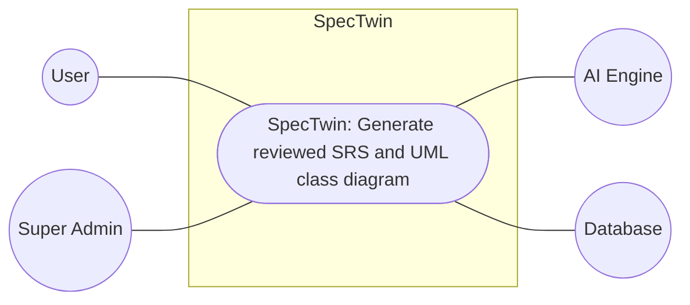

## Figure 2: Level 1 Use Case Diagram of SpecTwin


## Figure 3: Level 1.1 Authentication


## Figure 4: Level 1.2 Workspace and Project Management


## Figure 5: Level 1.3 SRS Generation Pipeline

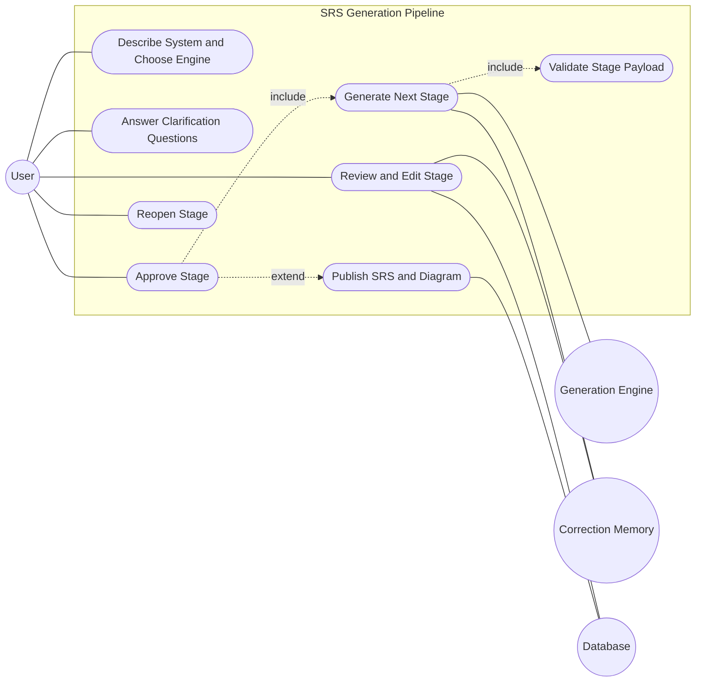

## Figure 6: Level 1.4 Class Modeler


## Figure 7: Level 1.5 Document and Diagram Management

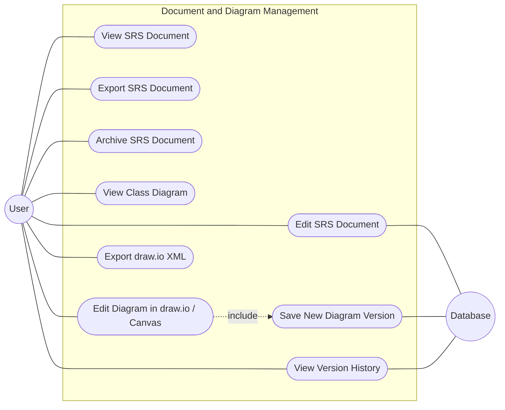

## Figure 8: Level 1.6 Platform Administration and AI Settings


## Figure 9: ER Diagram of SpecTwin

Entities are rectangles, relationships are diamonds, and edge labels give the cardinality.

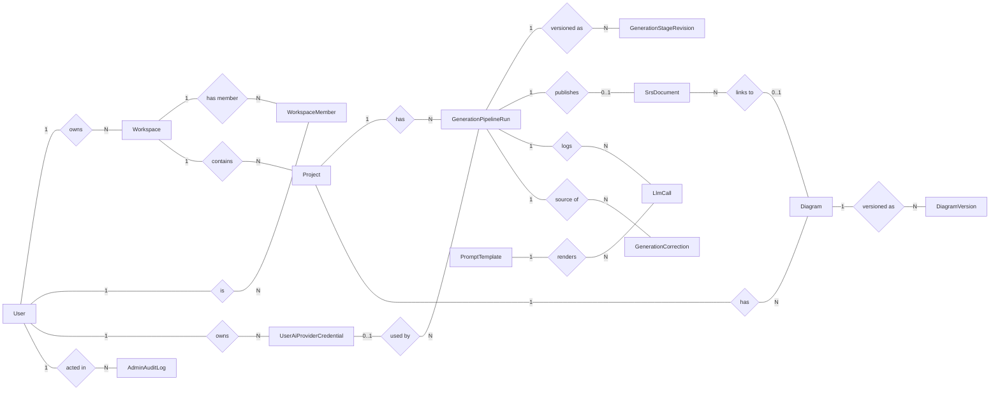

## Figure 10: CRC / Class Diagram of SpecTwin


## Figure 11: Activity Diagram of the Generation Pipeline

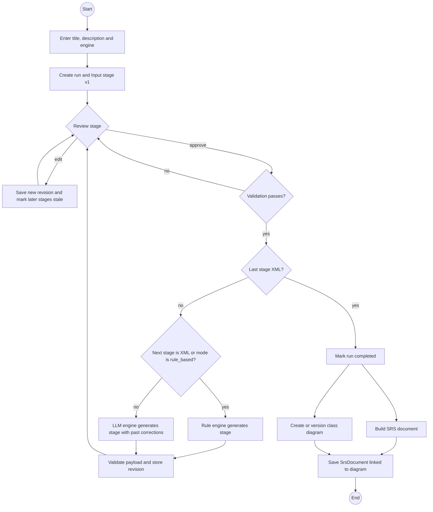

## Figure 12: Sequence Diagram of a Pipeline Run

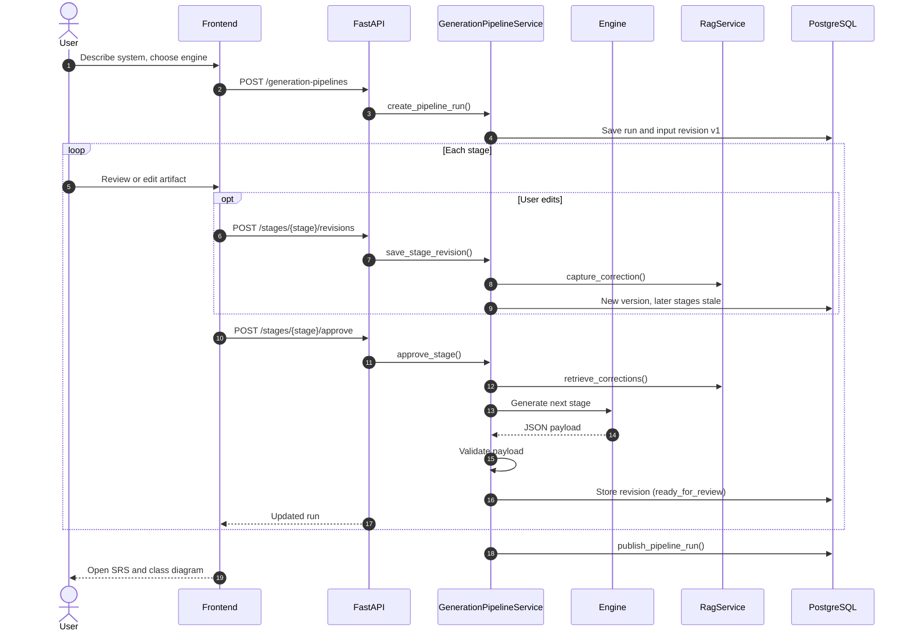

## Figure 13: State Diagram of the Generation Pipeline

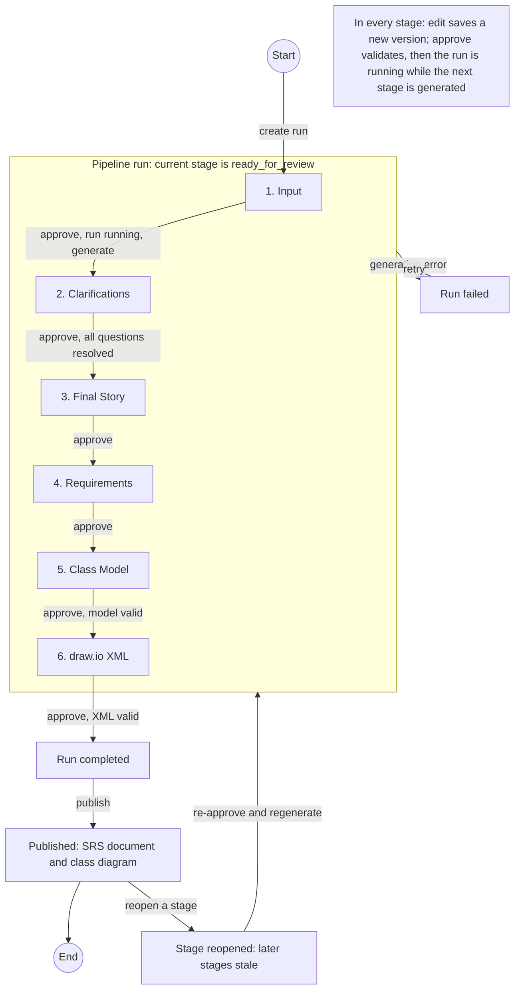

## Figure 14: Architectural Context Diagram

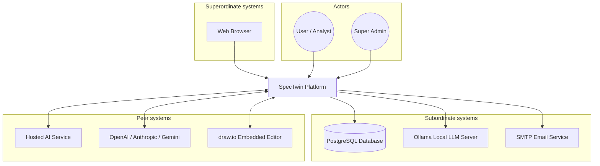

## Figure 15: Archetypes of SpecTwin (Layered View)

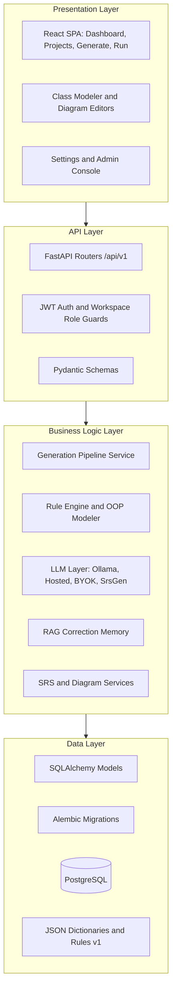

## Figure 16: Top-Level Components

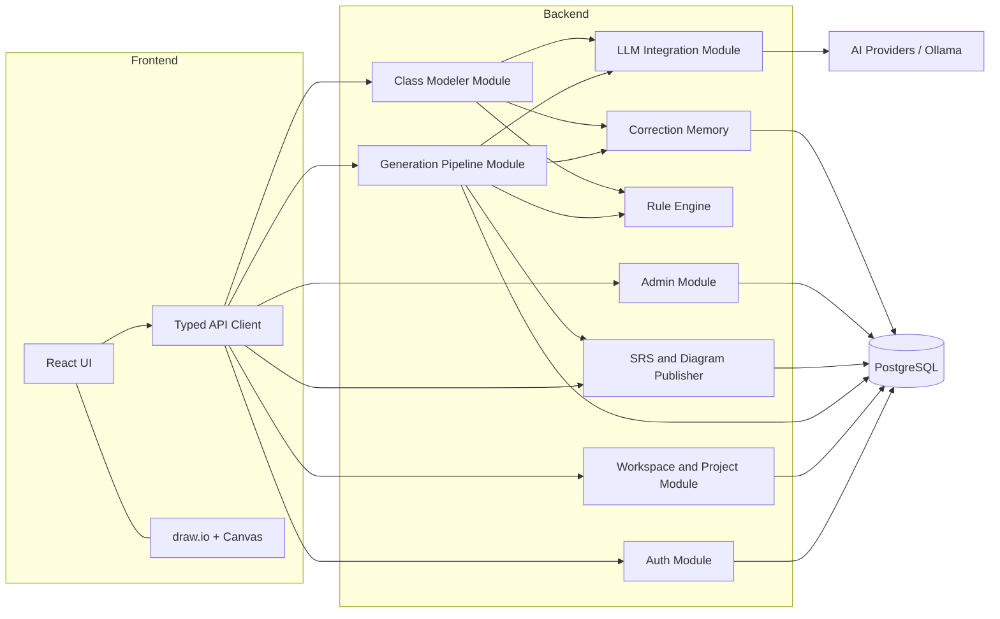

## Figure 17: Rule-Based Engine Pipeline and Rules

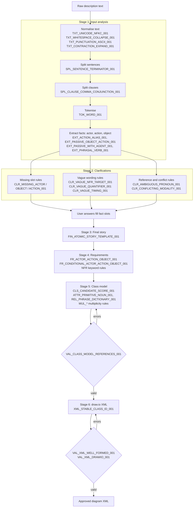

## Figure 18: Diagram-Only Generation Pipeline (Class Modeler)

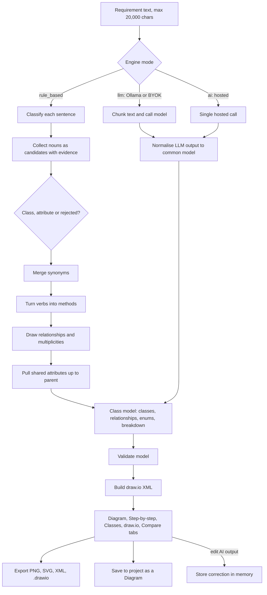

## Figure 19: Diagram Editing: One Model, Three Editors

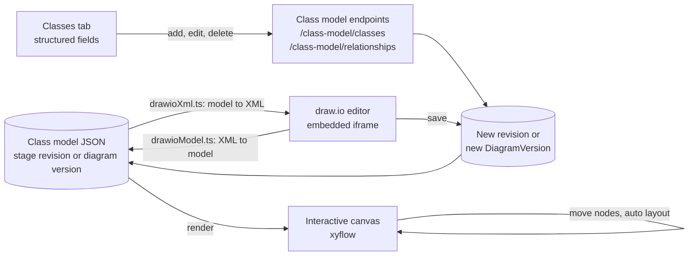

## Figure 20: Exportability of SpecTwin

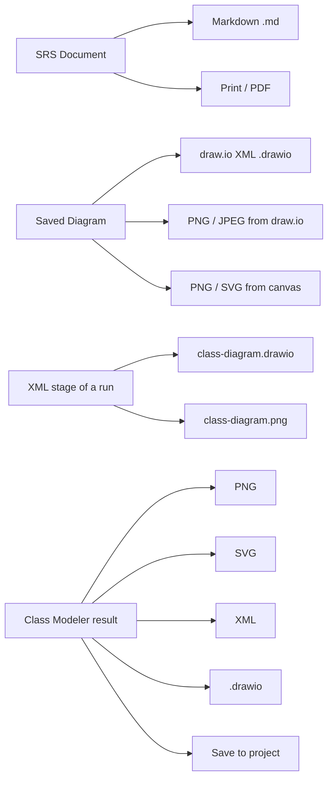

## Figure 21: AI Engineering Architecture

```mermaid
flowchart TD
    REQ[Stage generation request] --> SEL{generation_mode}
    SEL -->|rule_based or xml stage| RULE[Rule engine]
    SEL -->|ollama| OT[Ollama task layer<br/>chunking, JSON schema, retries]
    SEL -->|ai| HA[Hosted AI client<br/>platform key]
    SEL -->|byok| BY[Provider client<br/>OpenAI, Anthropic, Gemini]
    SEL -->|srsgen| SG[SrsGen client<br/>Qwen1.5 + LoRA]

    subgraph PROMPT["Prompt construction"]
        CT[Stage contract: exact keys and values]
        UP[Upstream artifacts: raw text, previous stage, facts]
        PC[Past corrections from RAG]
        GU[Untrusted data guard]
    end
    PROMPT --> HA
    PROMPT --> BY
    PROMPT --> SG
    PROMPT --> OT

    RAGS[(RAG correction memory)] --> PC
    OT --> OL[Ollama server]
    HA --> PARSE
    BY --> PARSE
    SG --> PARSE
    OL --> PARSE[Tolerant JSON parser and repair]
    PARSE -->|fails| FB[Plain-text fallback payload]
    PARSE --> VAL[Stage payload validation]
    FB --> VAL
    RULE --> VAL
    VAL --> REV[(Stage revision)]
    HA --> LOG[(llm_calls audit log)]
    BY --> LOG
    OT --> LOG
```

## Figure 22: Ollama Chunked Generation Flow

```mermaid
flowchart TD
    IN[Stage input] --> SPLIT[split_text / pack_items<br/>chunks sized to num_ctx]
    SPLIT --> CALL[json_task: schema-constrained call<br/>with past corrections]
    CALL --> P{Parses as JSON?}
    P -->|yes| TR{Cut off by num_predict?}
    P -->|no, text returned| REF[Ask model to reformat once]
    REF --> P2{Parses now?}
    P2 -->|yes| OK[Keep chunk result]
    P2 -->|no| FB[Plain-text fallback or clear error]
    TR -->|no| OK
    TR -->|yes| HALF[Split chunk in half, retry up to depth 2]
    HALF --> CALL
    OK --> MERGE[Merge and dedupe chunk results]
    MERGE --> NORM[Normalise into stage payload]
```

## Figure 23: RAG Correction Memory

```mermaid
sequenceDiagram
    autonumber
    actor U as User
    participant GPS as Pipeline / Class Modeler
    participant RAG as RagService
    participant EMB as Embedder
    participant DB as generation_corrections

    U->>GPS: Edit AI-generated stage and save
    GPS->>RAG: capture_correction(wrong, corrected)
    RAG->>EMB: embed(raw input text)
    EMB-->>RAG: vector + embedder id
    RAG->>DB: store row
    Note over GPS,DB: Later run with similar text
    GPS->>RAG: retrieve_corrections(stage, raw text)
    RAG->>EMB: embed(raw text)
    RAG->>DB: cosine search, same workspace, stage, embedder
    DB-->>RAG: top-k above min similarity
    RAG-->>GPS: past corrections
    GPS->>GPS: add to prompt, trimmed to budget
```

## Figure 24: Deployment Diagram

```mermaid
flowchart LR
    BR[User Browser]
    subgraph HOST["Docker host (docker compose project spl3)"]
        subgraph FEC["frontend container<br/>nginx 1.27-alpine :80"]
            SPA[React build<br/>static files]
        end
        subgraph BEC["backend container<br/>python 3.12-slim :8000"]
            EP[entrypoint: alembic upgrade head<br/>seed super admin]
            API[uvicorn FastAPI app]
        end
        subgraph DBC["db container<br/>postgres 16-alpine :5432"]
            PG[(srs_diagram_platform)]
        end
        subgraph OLC["ollama container :11434<br/>profile docker-ollama"]
            OLM[Ollama models]
        end
        INIT[ollama-init<br/>pulls default model once]
        V1[(volume pgdata)]
        V2[(volume ollama-models)]
    end
    EXT[Hosted AI / OpenAI / Anthropic / Gemini]
    SMTP[SMTP server]

    BR -->|HTTP :5173| SPA
    BR -->|REST /api/v1 :8000| API
    EP --> API
    API --> PG
    PG --- V1
    API -->|host.docker.internal or ollama| OLM
    OLM --- V2
    INIT --> OLM
    API --> EXT
    API --> SMTP
```
