# SpecTwin report: Mermaid diagrams

Each block matches a figure placeholder in `SpecTwin_Technical_Report.docx`.
All diagrams use `flowchart`, `sequenceDiagram` or `classDiagram`, which Excalidraw
(Mermaid to Excalidraw) imports as editable shapes.

---

## Figure 1: Level 0 Use Case Diagram of SpecTwin

## Figure 2: Level 1 Use Case Diagram of SpecTwin

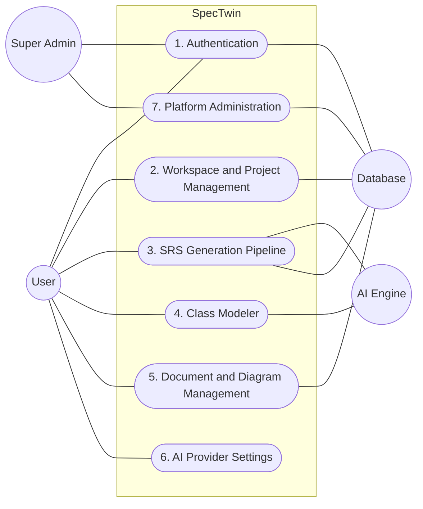

## Figure 3: Level 1.1 Authentication

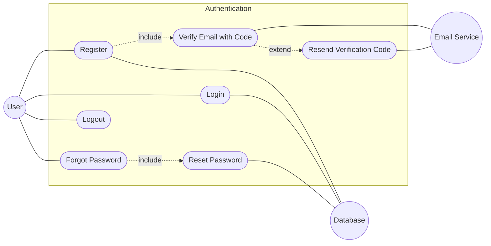

## Figure 4: Level 1.2 Workspace and Project Management

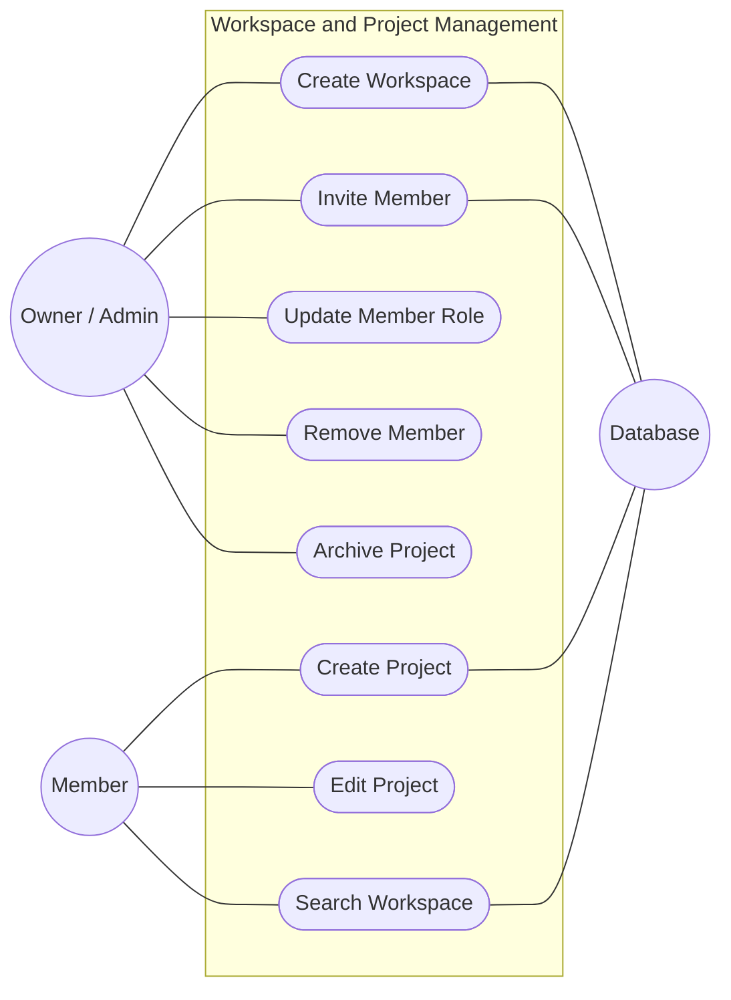

## Figure 5: Level 1.3 SRS Generation Pipeline

## Figure 6: Level 1.4 Class Modeler

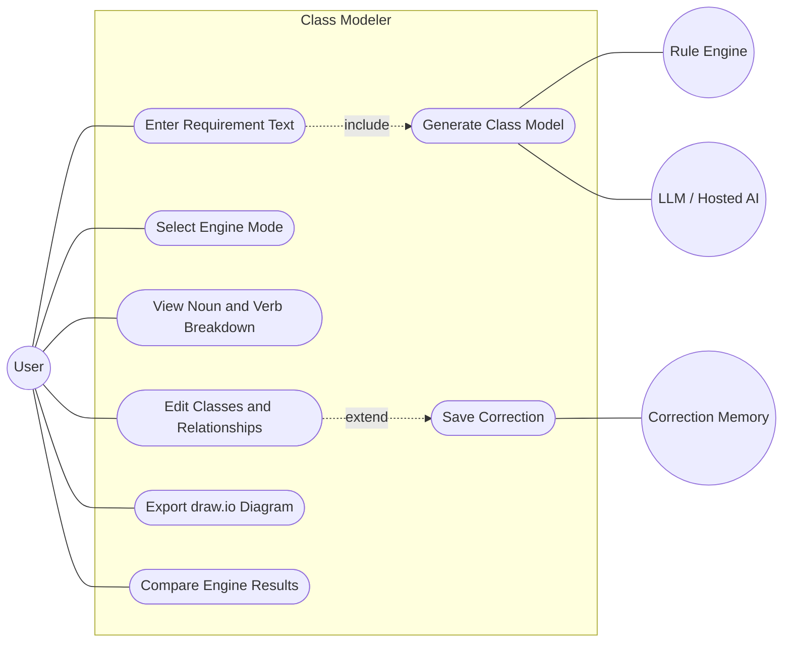

## Figure 7: Level 1.5 Document and Diagram Management

## Figure 8: Level 1.6 Platform Administration and AI Settings

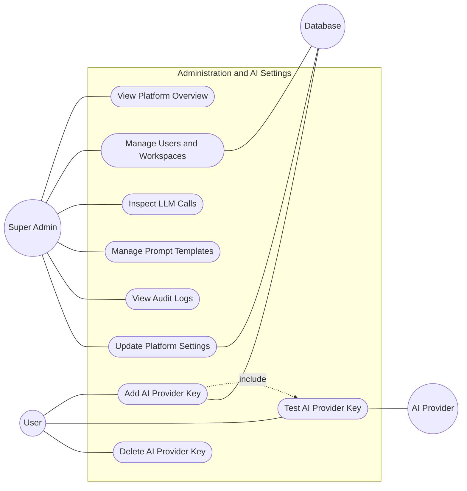

## Figure 9: ER Diagram of SpecTwin

Entities are rectangles, relationships are diamonds, and edge labels give the cardinality.

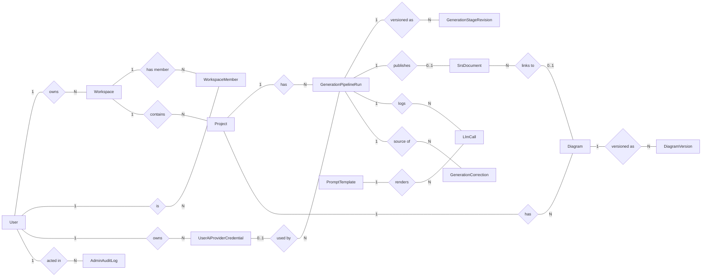

## Figure 10: CRC / Class Diagram of SpecTwin

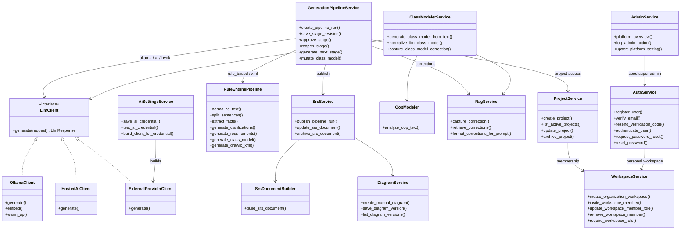

## Figure 11: Activity Diagram of the Generation Pipeline

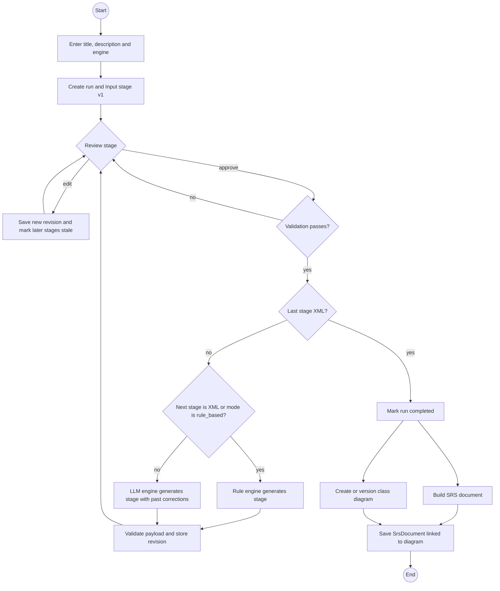

## Figure 12: Sequence Diagram of a Pipeline Run

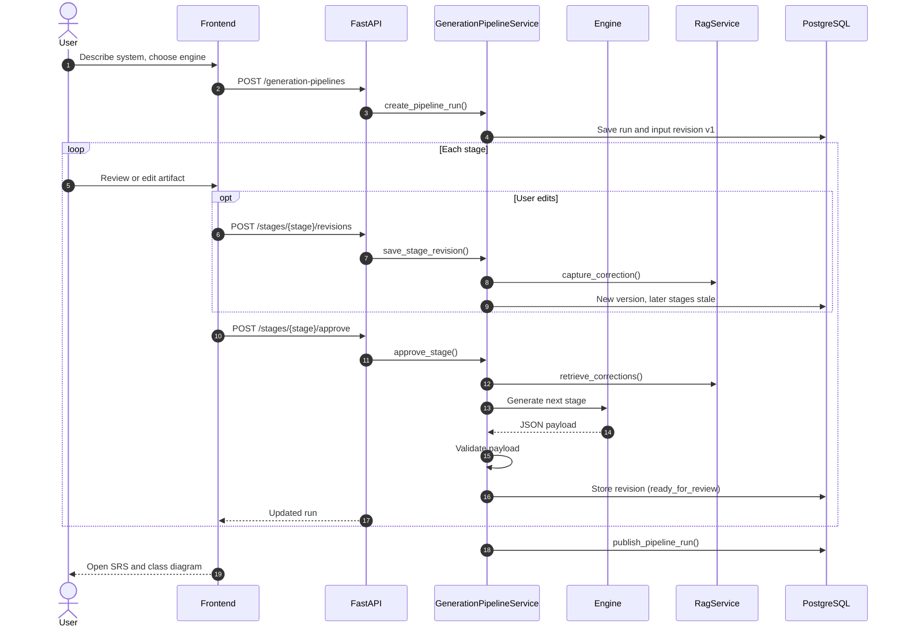

## Figure 13: State Diagram of a Stage Revision

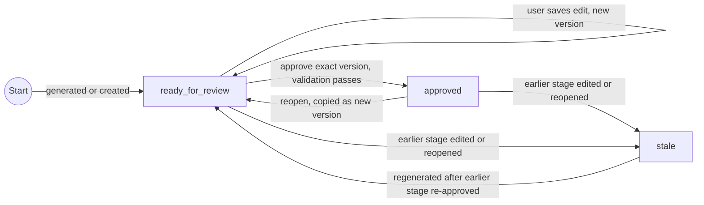

## Figure 14: Architectural Context Diagram

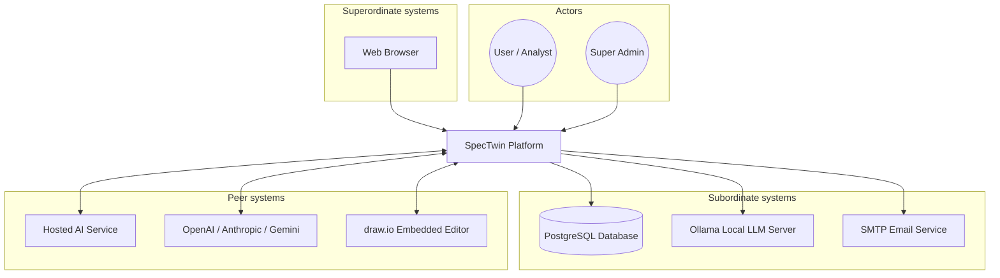

## Figure 15: Archetypes of SpecTwin (Layered View)

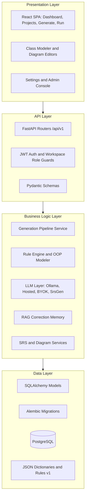

## Figure 16: Top-Level Components

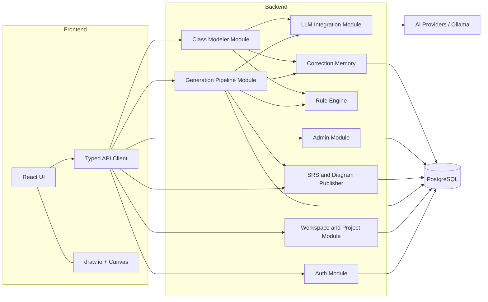
